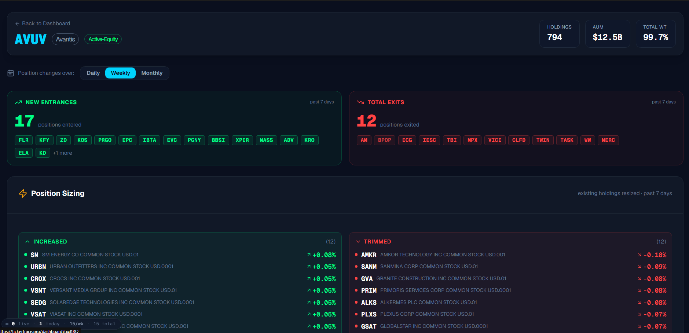

# Substack post: What I build after the market closes (working draft)

> mphinance.substack.com, in MPH voice. One combined post covering the whole
> build-night: Third Settler and freshshot (both new), plus updates to
> TraderDaddy.Pro and tickertrace.pro. Images in this folder.

---

**Title:** What I build after the market closes

**Subtitle:** Market shut, no meetings, one evening. By the time I closed the laptop I had touched four products. Two of them did not exist that morning.

I write here about algorithms that move money. Machines, models, the actual decisions. This one is different. This one is about a night.

The market closes. There are no meetings. It is just an evening, and the question every builder has to answer eventually: what do you actually do with it?

I build things. And tonight I can show you exactly what that looks like, because git keeps the receipts. The commit log runs from late afternoon until well past midnight, and by the end of it I had touched four separate products. Two of them did not exist when I woke up. The very last commit is stamped after midnight, and I did not make that one. Stay with me.

It started with my son.

A board game has been sitting on our shelf for weeks. Big box, wooden pieces, hexagons. It wants three or four players. Most nights it is just me and him. The math does not work, so the box stays shut.

A few weeks ago my almost-eight-year-old asked, again, if we could play. I started to say no, again. Then I remembered I have this fancy Claude thing.

So we built the missing player. It is called Third Settler, and the missing player is a Ghost.

You still play on your real board, with your real pieces, at your real table. The app just runs the empty chair. It deals a balanced board, rolls the dice, takes the Ghost's turns, keeps score. The Ghost is a friendly pain in the neck who hogs the good spots and never argues about whose turn it is.

Third Settler is not a video game. It is the friend who said he would come over and bailed. It is live, it is free, and it will stay free.

Here is where the night forked.

I wanted Third Settler done properly, and done properly meant its homepage needed screenshots. Screenshots that would not quietly go stale the first time I moved a button. So I went to automate them, and I hit a wall that everyone hits and almost nobody bothers to fix.

Automated screenshots commit noise. Every run spits out a slightly different image, the repository history fills with junk, and you stop trusting it. So most people just let their screenshots rot.

That bothered me more than it should have. So I set the board game down for a bit, and I solved that one too. It is called freshshot. It captures screenshots, compares them the way an eye would instead of byte by byte, and saves only the ones that actually changed. It is on npm now. Anyone can install it. Free, open, the works.

And then, in the same sitting, I went back to the day job.

Here is what the commit log gives away. The board game and the screenshot tool were the new arrivals that night, but they were not the only things I shipped. Between the ghost and the npm release, I pushed a stack of updates to the two trading products I actually run.

The first is tickertrace.pro. It watches what funds actually did, not what they said in a letter. Point it at a fund and it shows you exactly what changed: who got bought in, who got kicked out, who got a bigger slice, and who got trimmed.

The second is TraderDaddy.Pro. An options scanner that tracks every optionable name on the CBOE and flags what just became tradable, before the open. A watchlist that is not stupid: it asks what kind of trade you are running, swing or day trade or cash-secured put, then shows only the columns that matter for that job.

Those two pay the bills. They got better that night too.

Here is the truth. This is just what I do.

One night. A board game for my eight-year-old. A tool I gave away to strangers. And improvements for the traders who actually pay me. Three different audiences, one sitting, one commit log. I did not plan it that way. I just kept pulling threads, and the good nights are the ones where you pull all of them. I like solving problems. I like solving several at once even more.

That last commit, the one stamped after midnight that I did not make. Third Settler's screenshot automation made that, on its own, while I was asleep. The same little automation that became freshshot. I wrote it in the afternoon for a board game, and by morning it was its own tool, still working without me.

My son does not know what any of that means. He does not know what a service worker is, or that his dad rewrote the dice logic twice. Here is what he saw: he asked for something, and it became real. The Ghost was his idea, more or less. He loves Halloween.

I spent a lot of years taking things apart. Myself, mostly. A night that ends with four things better than they were that morning beats every kind of night I used to be good at.

So. No paywall on the story. Here is where all of it lives.

Third Settler is at third-settler.vercel.app. Play it with someone tonight, on a real table, with real pieces.

freshshot is on npm and on GitHub. Free and open, if you build things and you are tired of your screenshots rotting.

TraderDaddy.Pro and tickertrace.pro are the trading tools, the ones that keep the lights on. Some of what is there is free, because honest market data should be.

Four products. One evening. The chair is not empty anymore, the screenshots hold still, and the market has a harder time hiding from me.

Not a bad way to spend a night with no meetings.
