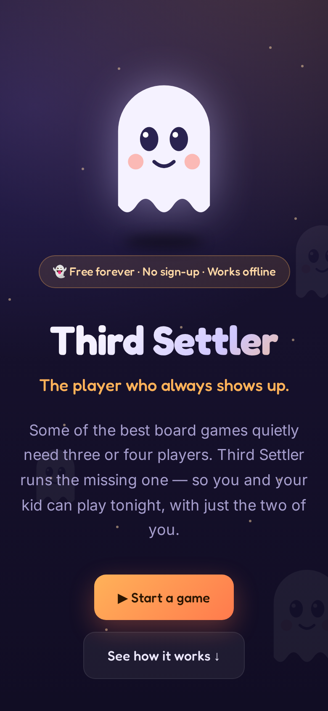
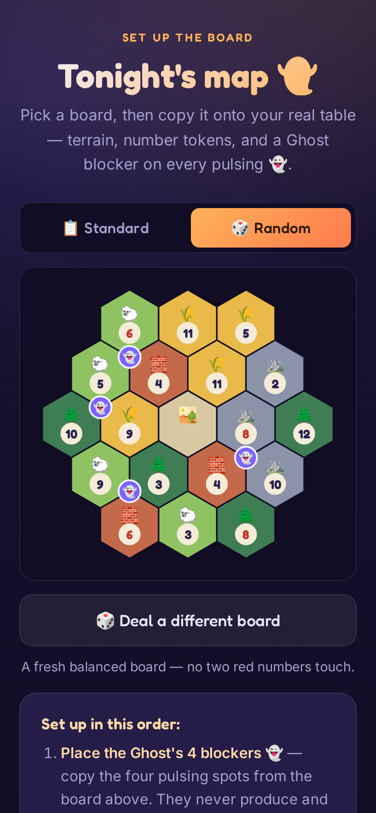
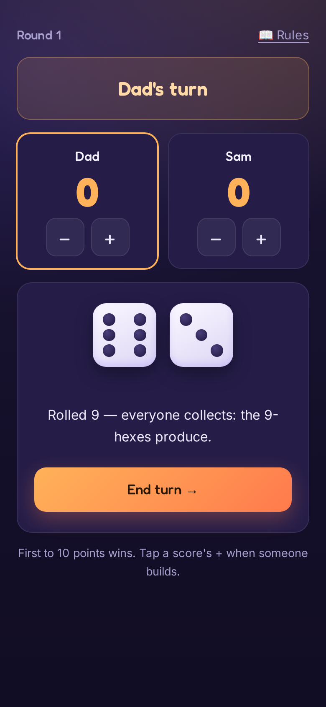

# Substack launch post: Third Settler (working draft)

> mphinance.substack.com, in MPH voice. Images live in this folder (hero.png,
> board.png, game.png). Give it one read aloud before publishing.

---

**Title:** My son and I built a ghost

**Subtitle:** Off my usual beat. A free thing, for anyone who has ever put a board game back on the shelf.

I write here about algorithms that move money. Machines, models, the actual decisions. Today I want to tell you about a ghost.

Tonight it is just me and my son. We want to play the big box game, the one with the wooden pieces and the hexagons. We cannot. That game wants three or four players. We are two.

Back on the shelf it goes. Again.

If you are a single parent, you know this shelf. The games are right there. The kid is right there. The math just does not work.

A few weeks ago my almost-eight-year-old asked, again, if we could play. I started to say no, again. Then I remembered I have this fancy Claude thing.

So we did not buy anything. We did not download anything. We built the missing player.

It is called Third Settler. The missing player is the Ghost.

You still play on your real board, with your real pieces, at your real table. The app just runs the empty chair. It deals you a balanced board. It rolls the dice. It takes the Ghost's turns. It keeps score. The Ghost is a friendly pain in the neck who hogs the good spots and never argues about whose turn it is.

Third Settler is not a video game. It is the friend who said he would come over and bailed.

Here is the truth. This was never really about the board game.

My son does not know what a service worker is. He does not care that his dad rewrote the dice code twice in one night. Here is what he saw. He asked for something, and then it was real. The Ghost was basically his casting call. He loves Halloween, so the missing player became a friendly little ghost.

That is the thing I actually wanted him to have. Not the game night itself, although that one is coming. The lesson underneath it. You want a thing, so you make the thing.

I spent a lot of years taking things apart. Myself, mostly. Building something with my kid beats every kind of night I used to be good at.

So here is the part where I usually tell you about a paywall.

Not this time. Third Settler is live right now at third-settler.vercel.app. It is free. It will stay free. No sign-up, no app store, no paid tier. I know. Out of character.

It is open source too. The whole thing is on GitHub, so if you build things, take it apart and make it better.

If you are a single parent, or just two people who own too many games made for four, go play tonight. Then send it to one more parent who has that same shelf.

The game was never the problem. The empty chair was. We built something to sit in it.
