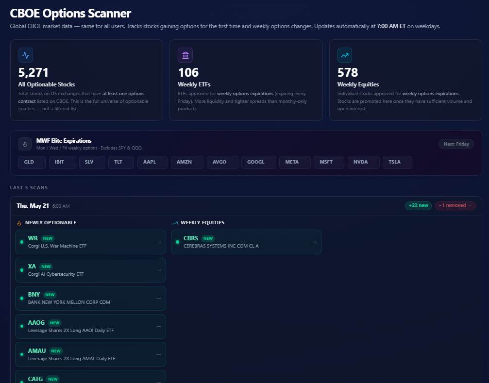
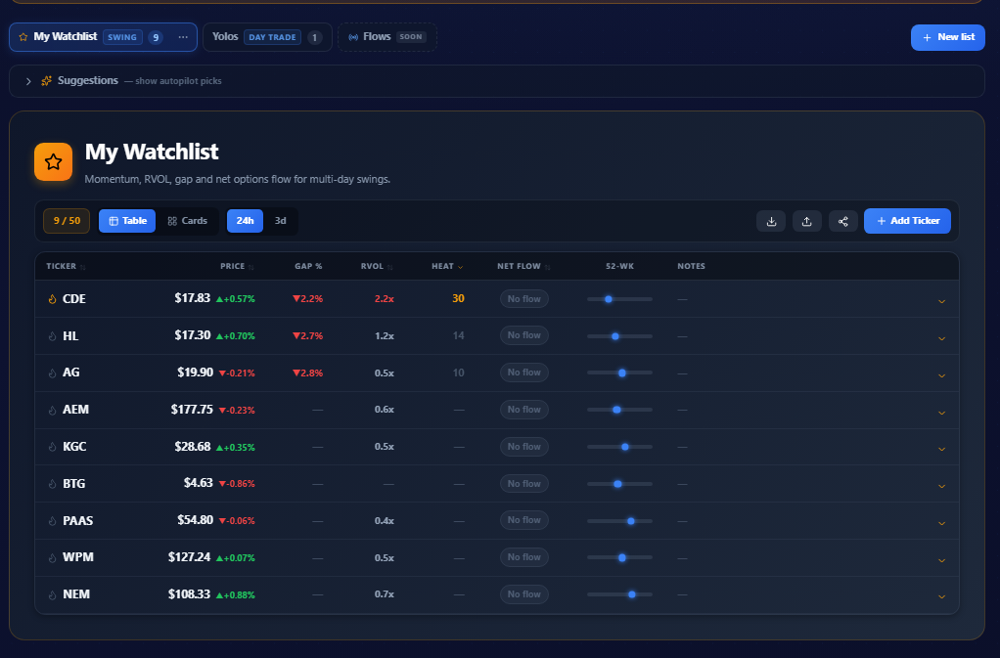

# Substack post: I built my own trading terminal (working draft)

> mphinance.substack.com, in MPH voice. Companion piece to the Third Settler /
> freshshot build-night post.
> CHECK BEFORE PUBLISHING: product names/branding. The tools are described by
> what they do (accurate to the screenshots); confirm which is TickerTrace vs
> TraderDaddy. No fabricated "next trades" section. Add real picks if you want one.

---

**Title:** I built my own trading terminal

**Subtitle:** Wall Street rents you a terminal that costs more than a car and still shows you yesterday. I got stubborn instead. Three tools, built by me, for me.

I write about algorithms that move money. Here is one I do not talk about enough: the software itself.

A professional trading terminal runs tens of thousands of dollars a year. And for that money, it shows you the same screen it shows everyone else. The same feed, the same alerts, the same lag. You are not buying an edge. You are renting a very expensive window that everybody is looking through.

I am cheap, and I am stubborn, and I do not trust software I cannot read. So a while back I stopped renting the window. I started building my own.

Here are three of them.

**The first one watches what the funds actually did.**

Not what they said in a letter. What they did. This one takes a fund, AVUV in the shot above, and shows me exactly what changed: who got bought in, who got kicked out, who got a bigger slice, and who got trimmed. Seventeen new names this week. Twelve gone.

Talk is cheap. The holdings file is not. I would rather read the receipts than the press release.

**The second one watches what just became tradable.**

This is an options scanner. It tracks every optionable stock on the CBOE, all 5,271 of them, and it tells me one specific thing: what is new. A stock getting listed options for the very first time is a signal. So is a name jumping up to weekly expirations. Most people find out weeks late. I find out at 7am, before the open, every weekday, without lifting a finger.

It is the same public data for everyone. The edge is not the data. The edge is noticing it first.

**The third one is a watchlist that is not stupid.**

Every watchlist app hands you a list of tickers and a price. Useless. A swing trade and an earnings play and a cash-secured put are three different jobs, and they need three different dashboards.

So this one asks what kind of list you are building first. Swing, day trade, CSP, LEAPS, earnings. Then it shows only the columns that matter for that job: relative volume, gap, net options flow, heat, expected move. The list bends to fit the trade, instead of making you squint.

Here is the truth.

None of this is a secret indicator. There is no magic number hiding in these screens. Every one of these tools does the same boring thing. It pays very close attention to one thing, every single day, so that I do not have to rely on my memory or my mood.

That is the whole game. The edge was never information. The edge is attention, made automatic, so it survives the days you are tired, or scared, or wrong.

These live under TraderDaddy.Pro. Some of it is free, because some of it should be. Honest market data does not belong behind a wall.

I spent years in recovery learning to take a daily inventory. Searching, fearless, honest, and done whether I felt like doing it or not. Turns out I just built that same habit all over again, pointed at a different ledger. Every morning, before the bell, the tools take the inventory for me. They will not let me lie about what the market actually did.

That is the only kind of terminal I have ever trusted. The one I can read every line of.
