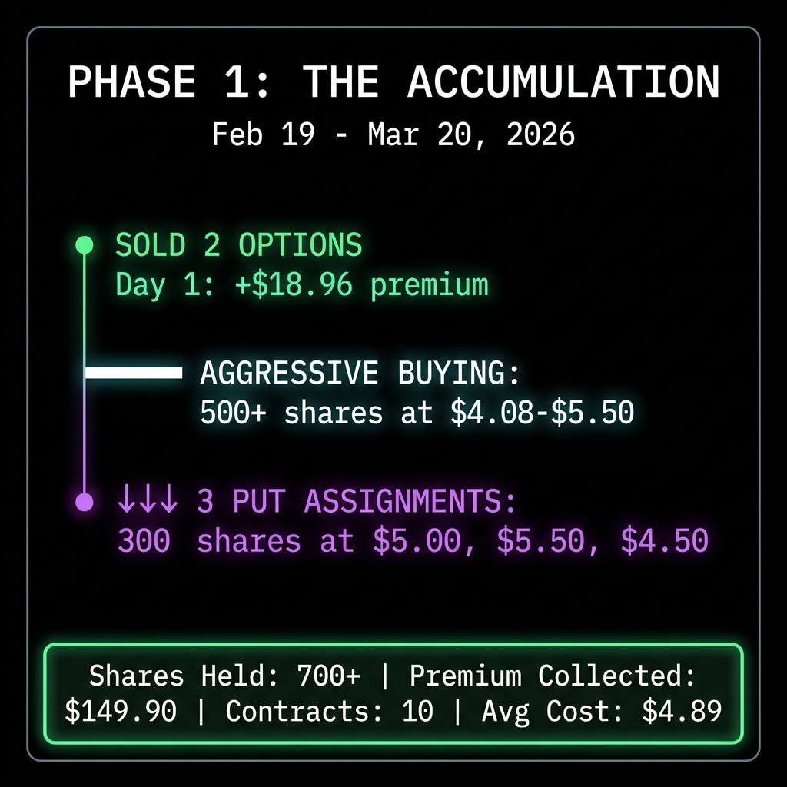
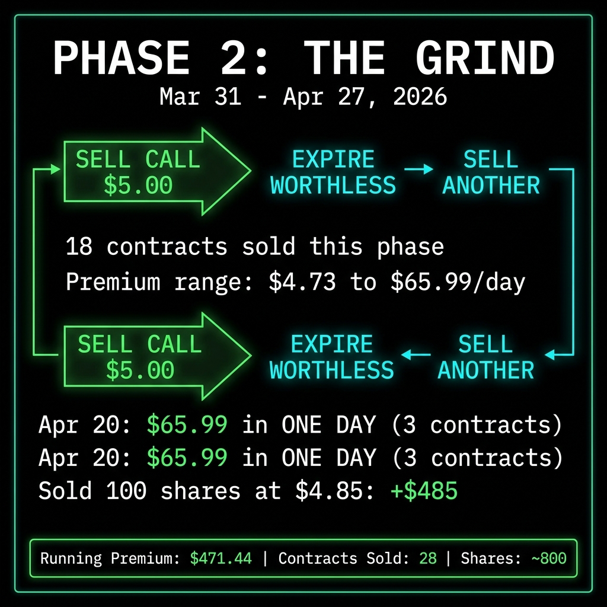
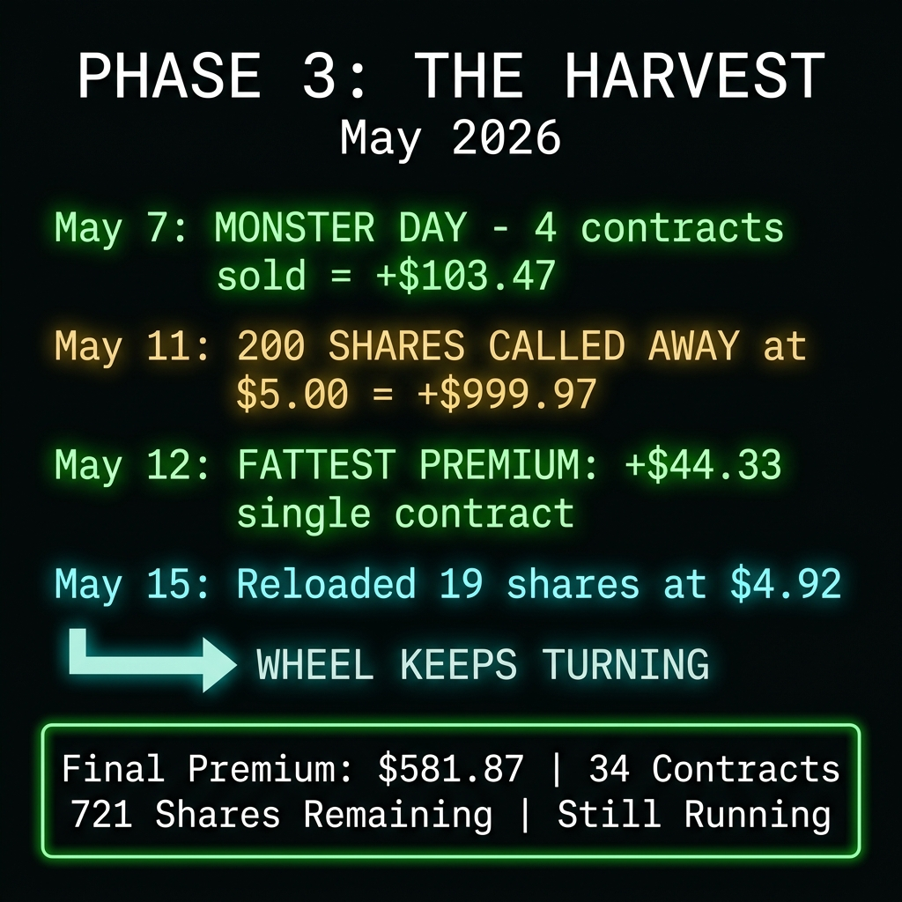
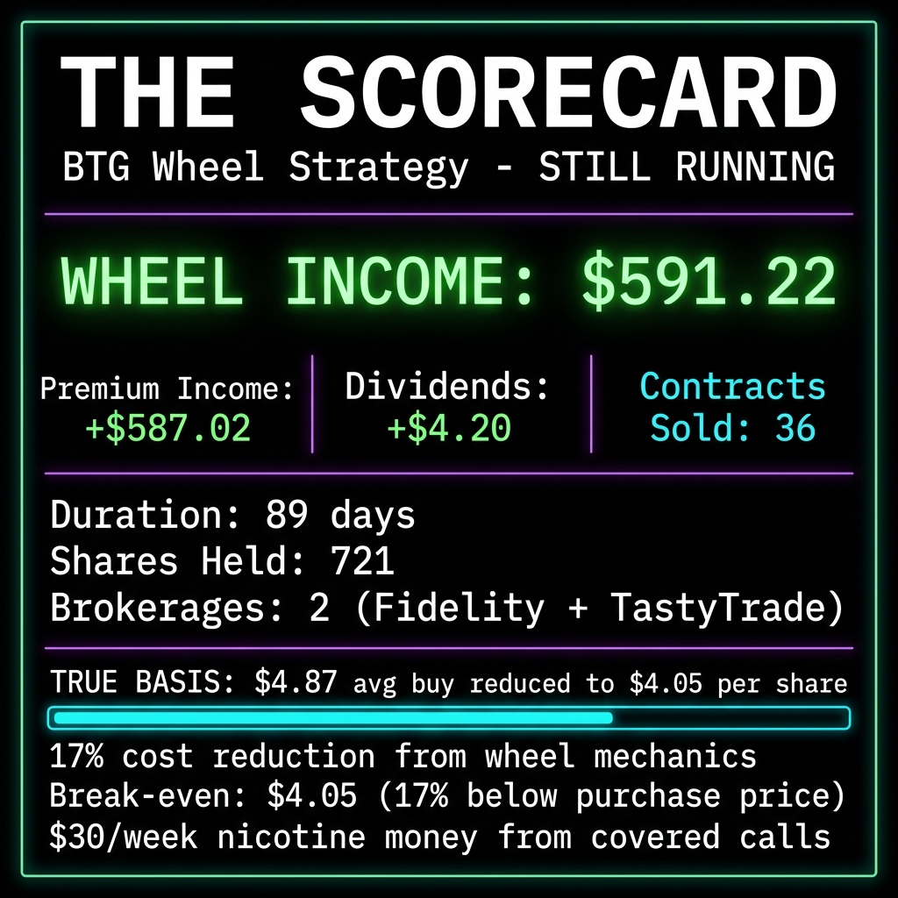

# I've Made $591 Wheeling a $5 Stock. And It's Not Done Yet.

*by Michael Hanko, Managing Partner, The Phund*

Last month I showed you every transaction from my DDD wheel. 113 days, $140.93 in profit, 32% return on a $2 stock. Clean entry, clean exit, zero drama.

A few of you asked: "Cool, but does this work with real money?"

Fair question. DDD was in the Momentum Phund. Subscriber capital. $470 deployed. The whole thing ran through one brokerage on one position and I was basically selling $5 covered calls every two weeks like a kid with a lemonade stand.

BTG is my personal money. Same strategy. Different scale. 36 option contracts across two brokerages. 721 shares still held. And one of those accounts pays for my nicotine every week, so don't tell me the wheel doesn't work.

## BTG: Why a Gold Miner?

B2Gold (BTG) is a Canadian gold miner trading in the $4 to $5.50 range. It pays a dividend. It has $2 billion in annual revenue. And the $5.00 strike options sell for $0.05 to $0.45 depending on the week.

Gold has been ripping. Central banks are buying at record pace. Tariff chaos is pushing safe-haven flows. The dollar looks shaky. But I did not buy BTG because I think gold is going to $5,000. I bought BTG because it is the perfect wheel stock: liquid enough to have weekly options, volatile enough to produce premium, and cheap enough that I can accumulate hundreds of shares without needing a six-figure account.

I have been wheeling BTG across two brokerages since February 19, 2026. Fidelity Rollover IRA is the main operation. TastyTrade ran a smaller satellite wheel. Same stock, same strikes, same grind.

Here's every dollar.

## The TastyTrade Wheel (CLOSED)

This was the baby version. I started buying BTG shares in early March and built a 113-share position at an average cost of $4.72.

Sold 2 covered calls at the $5.00 strike. Collected $32.73 in net premium. Picked up $0.10 in dividends on the March ex-date. Pretty boring.

Then BTG popped above $5 in early May. Sold 13 shares on the open market at $5.18 for $67.32. The remaining 100 shares got called away at $5.00 on the May 8 assignment for $494.96.

**TastyTrade BTG wheel: CLOSED. Net P/L: +$62.06.**

Not a headline-grabber. But that's $62 on a $533 position in about 9 weeks. 11.6% return. Annualized, that's roughly 67%. On a gold miner. With zero leverage. Moving on.

## The Fidelity Rollover IRA (THE MAIN EVENT)

This is where it gets interesting.

I started on February 19 with two moves: sold a covered call at the $5.50 strike for $9.48 and a cash-secured put at the $5.00 strike for $9.48. Two contracts, same day, $18.96 in premium before my first share assignment even hit.

Then I started buying. Aggressively.

## Phase 1: Building the Position (Feb 19 to Mar 20)

The first month was pure accumulation. BTG was trading between $5.50 and $4.00, and every time it dipped I bought more shares. I was not trying to time the bottom. I was averaging into a position I planned to wheel for months.

The share buying was relentless. 5 shares here, 34 shares there, 45 shares on a big dip day. By March 20, I had bought over 500 shares across dozens of transactions.

Meanwhile, I was selling premium the whole time.

**Feb 19:** Sold 1 Call $5.50 for $9.48. Sold 1 Put $5.00 for $9.48.

**Feb 20:** Sold 1 Call $5.50 for $9.48.

**Feb 25:** Sold 1 Put $5.50 for $14.33.

**Mar 10:** Sold 1 Call $5.50 for $19.33.

**Mar 13:** Sold 1 Put $5.00 for $19.33.

**Mar 20:** Sold 1 Put $4.50 for $44.33. This was the fattest put premium of the whole run. BTG was pulling back hard and the volatility was paying me.

In March, two of my puts got assigned on the same day. 100 shares at $5.00 and 100 shares at $5.50. One week later, another 100 shares got assigned at $4.50.

I did not panic. I wanted those shares. That is the whole point.

**Running premium total through March: $149.90 on 10 contracts.**

## Phase 2: The Grind (Mar 31 to Apr 27)

Now I had over 700 shares and a wall of covered calls to sell.

The pattern became mechanical. Sell calls at the $5.00 strike every week or two. Collect $4.73 to $24.33 per contract. If a call expires worthless, sell another one. If a call gets tested, buy it back cheap and resell at a later date.

**Mar 31:** Sold 3 Calls at $5.00. Three separate contracts: $4.73, $9.48, and $9.48. Total: $23.69 in one day.

**Apr 6-8:** Sold 2 more Calls at $5.00. Another $16.11.

**Apr 9-10:** Sold 1 Call at $5.50 and 1 at $5.00. Another $33.66.

**Apr 14-17:** Sold 2 more Calls at $5.00. Another $22.76.

**Apr 20:** Big day. Sold 3 Calls at the $5.00 strike across the same expiration. $24.33, $24.33, and $17.33. That's $65.99 in premium on a single day. The stock was bouncing around $4.80 and I was getting paid to wait.

**Apr 21:** Sold 1 Call at $5.00 ($14.33) and 1 Put at $5.00 ($23.33). Running both sides of the wheel simultaneously.

**Apr 27:** Sold 1 Call at $5.00 ($9.48) and 1 Put at $4.50 ($24.33). Another $33.81 in a day.

**Running premium total through April: $471.44 on 28 contracts.**

During this stretch I also sold 100 shares at $4.85 on April 13 for $485.02. Trimming the position when I had too much exposure, then reloading on dips. Active management, not passive holding.

## Phase 3: The Harvest (May 2026)

BTG started running. Gold was moving. And my covered calls started getting tested.

**May 4:** Sold 1 Call at $5.00 for $4.73.

**May 6:** Sold 1 Call at $5.00 for $10.43. Same day, bought 104 more shares on a dip at $4.45 average. Reloading for the next wave.

**May 7:** Monster day. Sold 4 contracts in a single session: two at the $5.00 strike ($31.33 and $33.33), one at $5.50 ($9.48), and one more at $5.00 ($29.33). That's $103.47 in premium on one day.

**May 11:** BTG was above $5. Two of my calls got assigned. 200 shares called away at $5.00. Proceeds: $999.97. The wheel doing exactly what it is supposed to do. I let them go, no FOMO.

Same day I sold 1 more Call at $5.50 for $16.33.

**May 12:** Sold 1 Call at $5.00 for $44.33. This was the single largest premium of the entire Fidelity wheel.

**May 15:** Bought 19 more shares at $4.92 average. Reloading after the assignment.

**May 18:** Three more calls and a put expired worthless across Fidelity accounts. Premium retained.

Also on May 18: 100 shares got called away in the Wheely Roth at $4.50. Different account, same stock, same strategy.

**Final premium total: $581.87 on 34 contracts sold.**

<!--paywall-->

## The Receipts

I am not going to sugarcoat this. I also bought some options. Four short-term calls and a put for $27.58 total, mostly closing positions that were about to go in-the-money to avoid unwanted assignments on specific lots. Think of it as maintenance. Cost of doing business.

**Net wheel premium (sold minus bought, excluding long-term positions): $554.29**

Here are the combined numbers across every account that ran the BTG wheel.

**Share Activity (All Accounts Combined)**

Total shares bought: 1,352

Total shares sold: 631

Net shares still held: 721

Total capital deployed: $6,589.93

Total proceeds from sales: $3,081.95

**Options Activity**

Contracts sold: 36 (34 Fidelity + 2 TastyTrade)

Gross premium received: $614.60

Short-term options bought back: $27.58

Net wheel premium: $587.02

**Dividends**

$4.20 (collected on March 19 ex-date across accounts)

**Total Realized Wheel Income: $591.22**

## The True Basis Math

This is the part that matters. This is why the wheel works.

I bought 1,352 shares of BTG at an average price of $4.87. If I just held those shares and did nothing, my break-even would be $4.87 and I would be hoping gold goes up.

But I did not just hold. I sold 36 option contracts. I collected $591.22 in premium and dividends. I sold 631 shares for $3,081.95 along the way.

My True Basis on the remaining 721 shares is **$4.05 per share**.

That is $0.82 below my average purchase price. The wheel ground my cost down by 17% in 89 days.

At BTG's current price of roughly $4.90, my 721 shares are sitting on approximately $616 in unrealized profit. Not because the stock went up dramatically. Because my cost went down dramatically.

BTG could drop to $4.05 and I would still break even. That is 17% below where I started buying. That is the margin of safety the wheel creates.

## The Nicotine Math

Here is the part I actually care about.

One of my accounts generates roughly $30 a week in covered call premium on BTG. That is with about 300 shares and a $5.00 strike call rolling every 7 to 10 days.

$30 a week. That is my nicotine budget. Zyn pouches, to be specific. A gold miner in my IRA is funding a mild vice that I picked up in recovery because it was better than the alternative.

You know what is wild about that? I am not selling shares. I am not touching the position. I am not reducing my gold exposure. I am just renting out the upside for a week at a time and using the income to buy nicotine pouches.

Is it glamorous? No. Does it work? Every single week.

## DDD vs. BTG: The Scale-Up

DDD was the proof of concept. 12 contracts, $140.93, done.

BTG is the production version. 36 contracts, $591.22 and counting. Still running.

DDD was subscriber money in a baby account. BTG is my Rollover IRA. My actual retirement savings being put to work with the same mechanical system.

DDD ran for 113 days and closed. BTG has been running for 89 days and I have 721 shares left to wheel. I am not closing this one. I am going to keep grinding $30 a week until gold either moons or I get bored. Neither seems likely.

The point is this: the strategy does not change when you add a zero. Sell premium. Collect income. Lower your basis. Let the wheel turn. The only thing that changes is how many Zyns it buys you.

## What's Next

The DDD capital ($495) got redeployed. The BTG wheel keeps turning. I have open calls at the $5.00, $5.50, and $5.00 strikes expiring over the next two weeks. If they expire worthless, that is another $30 to $50 in premium. If they get assigned, I pocket the gain and sell puts to reload.

I also have 721 shares that pay a dividend every quarter. So while I am waiting for call premiums, BTG is also just paying me to hold it. A gold miner backed by reserves, producing cash flow, in a macro environment that favors precious metals. And I am wheeling it.

This is not exciting. It is not going to make the front page of Reddit. But it is paying for my nicotine every week and lowering my cost basis every month. And honestly? That is all I need it to do.

Drink water. Sell premium. Call your sponsor. Buy Zyns.

*Not financial advice. I am a felon with a brokerage account, a gold miner, and a nicotine habit. But the math is real and every number in this article came directly from Fidelity and TastyTrade account history exports. Fork the code on GitHub if you don't believe me.*

---

**Subscribe to Momentum Phinance for the live wheel tracker, weekly premium updates, and the ongoing BTG saga. Half of every paid subscription goes directly into the brokerage account. You are literally funding the machine.**

- Michael Hanko
