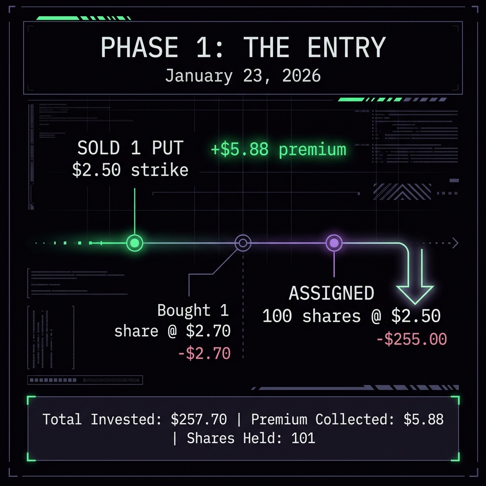
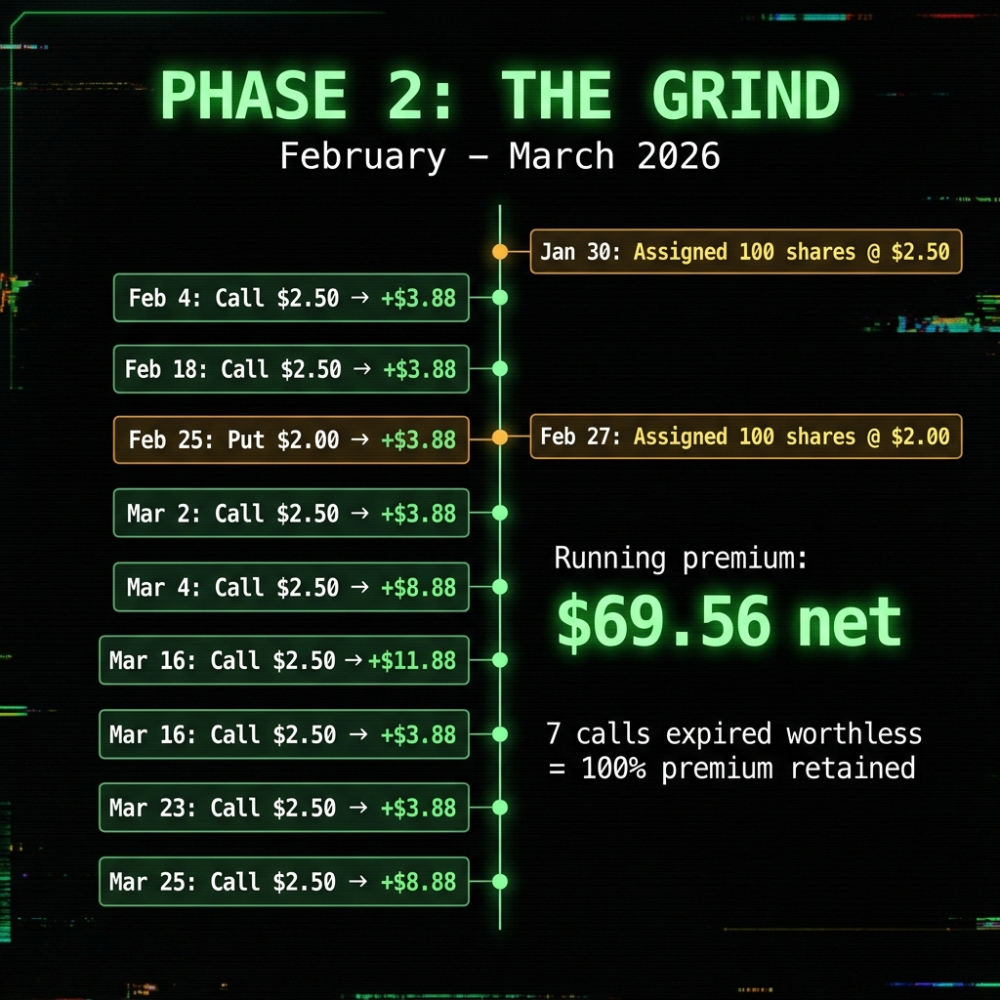
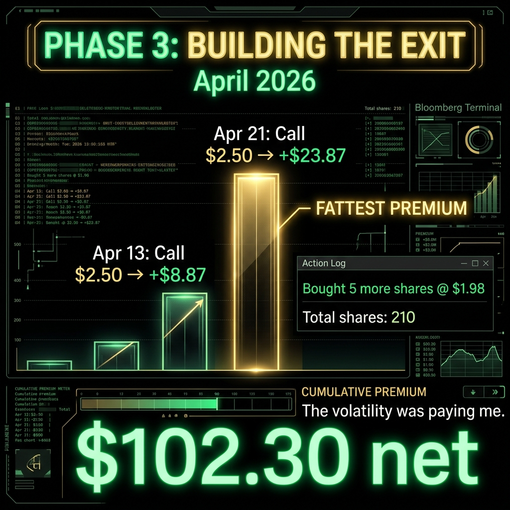
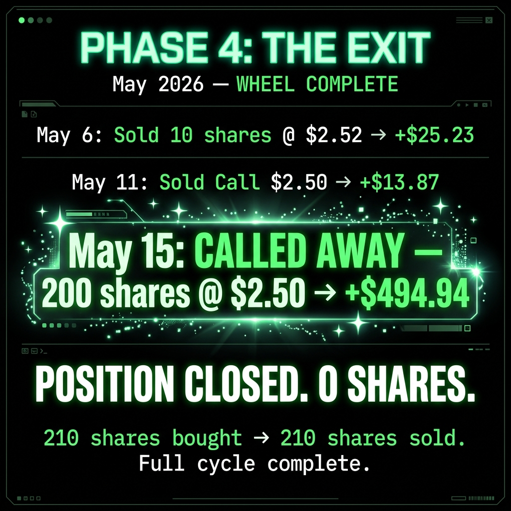
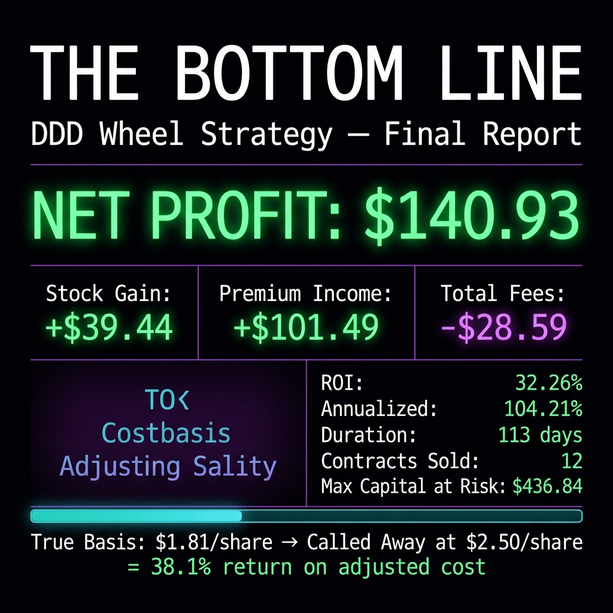

# I Made $140.93 Wheeling a $2 Stock. Here's Every Single Transaction.

*by Michael Hanko, Managing Partner, The Phund*

Most people hear "options trading" and think of some guy on Reddit turning $500 into $80,000 on a Wednesday. Good for that guy. This is not that story.

This is the story of how I spent 113 days grinding $5 and $10 at a time on a stock that trades for two dollars, and walked away with a 32% return on capital. No YOLO. No leverage. No margin. Just the wheel, a $2 stock, and a lot of patience.

DDD (3D Systems) was my first wheel. It is now my first completed wheel. Every transaction pulled directly from the TastyTrade API. No rounding. No hiding the fees. No "approximately." The receipts are here.

## What Is The Wheel (30-Second Version)

Sell a cash-secured put. Collect the premium. If the stock drops below your strike, you get assigned shares. Start selling covered calls on those shares. Collect more premium. If the stock rises above your call strike, your shares get called away. You keep the premium AND the capital gain. Go back to step one.

That's it. You're getting paid to buy low and sell high. The premiums you collect along the way lower your cost basis until the stock would have to absolutely crater for you to lose money.

I call this your **True Basis**: not what you paid for the stock, but what you paid minus every dollar of premium you've collected.

## Phase 1: The Entry (January 23, 2026)

I started with two trades on the same day.

Bought 1 share of DDD at $2.70. Just a toe in the water.

Then I sold my first put: 1 DDD Jan 30 $2.50 Put for $0.07. That's $7.00 gross, $5.88 after the $1.00 commission and fees. Not exactly life-changing. But it was the first drop in the bucket.

Seven days later, DDD dropped below $2.50. The put got assigned. I now owned 101 shares (the original 1 plus 100 from assignment) at a cost of $255 for the assignment lot.

Total invested so far: $257.70 for 101 shares.

Premium collected: $5.88 net.

## Phase 2: The Grind (February to March 2026)

This is where the wheel starts doing its thing. Every week or two, I sold a covered call at the $2.50 strike. DDD just hung around the $2.00 to $2.30 range, which meant every call expired worthless. I kept the premium and sold another one.

Here's every call and put I sold during this phase:

**Feb 4:** Sold 1 DDD Feb 13 Call $2.50 for $0.05. Net: $3.88

**Feb 5:** Bought 1 more share at $2.00. Building the position on dips.

**Feb 13:** DDD Feb 13 Call $2.50 expired worthless. Premium retained. Bought 1 more share at $2.08.

**Feb 18:** Sold 1 DDD Feb 27 Call $2.50 for $0.05. Net: $3.88

**Feb 25:** Sold 1 DDD Feb 27 Put $2.00 for $0.05. Net: $3.88. Also bought 1 share at $2.07. I was aggressively adding shares on dips.

**Feb 27:** Two things happened. The $2.50 call expired worthless (retained premium). The $2.00 put got assigned, giving me 100 more shares at $2.00. Now holding 204 shares.

**Mar 2:** Sold 1 DDD Mar 13 Call $2.50 for $0.05. Net: $3.88

**Mar 4:** Sold 1 DDD Mar 20 Call $2.50 for $0.10. Net: $8.88. I was getting more aggressive, selling calls with more time value when the stock bounced.

**Mar 13:** Mar 13 Call expired. Money in the bank.

**Mar 16:** Sold another 1 DDD Mar 20 Call $2.50 for $0.13. Net: $11.88. Two covered calls at the same strike, same expiration. I had 204 shares so I could cover 2 contracts.

**Mar 20:** Both Mar 20 Calls expired worthless. Total retained from that round: $20.76 net.

**Mar 23:** Sold 1 DDD Apr 10 Call $2.50 for $0.05. Net: $3.88

**Mar 25:** Sold 1 DDD Apr 17 Call $2.50 for $0.10. Net: $8.88

**Mar 27:** Bought 1 more share at $1.98. Position now 205 shares.

Running premium total by end of March: **$69.56 net** across 10 options contracts.

## Phase 3: Building the Exit (April 2026)

The premiums started getting fatter. DDD was moving up. The calls were getting more expensive, which meant more premium for me.

**Apr 10:** Apr 10 Call expired. Retained.

**Apr 13:** Sold 1 DDD May 8 Call $2.50 for $0.10. Net: $8.87. Same day, bought 5 more shares at $1.98 ($9.90). Total shares: 210.

**Apr 17:** Apr 17 Call expired. Retained.

**Apr 21:** Sold 1 DDD May 15 Call $2.50 for **$0.25**. Net: **$23.87**. This was the fattest premium of the entire wheel. DDD was pushing toward $2.40. The volatility was paying me.

By end of April, my net premium total was **$102.30** across 12 contracts.

## Phase 4: The Exit (May 2026)

And then DDD cooperated.

**May 6:** DDD broke above $2.50. I sold 10 shares at $2.525. Net proceeds: $25.23. That trimmed my position to 200 shares.

**May 8:** May 8 Call expired worthless. One more premium retained.

**May 11:** Sold 1 DDD May 15 Call $2.50 for $0.15. Net: $13.87. I knew DDD was running. I sold this call knowing assignment was likely.

**May 15:** DDD was above $2.50 at expiration. Both May 15 Calls got assigned. 200 shares called away at $2.50. Net proceeds: $494.94.

Position closed. Zero shares remaining.

## The Final Numbers

Here's the truth. Every dollar. Every fee.

**Stock Activity:**

Total shares purchased: 210 (across 8 buy transactions)

Total cost of shares: $470.72 (gross) / $480.73 (net, after clearing fees)

Total shares sold: 210 (10 sold on market + 200 called away)

Total proceeds from sales: $525.25 (gross) / $520.17 (net)

Stock capital gain (net): **+$39.44**

**Options Activity:**

Put premiums sold: 2 contracts, $12.00 gross / $9.75 net

Call premiums sold: 10 contracts, $103.00 gross / $91.74 net

Total premiums (net after commissions + fees): **$101.49**

**Fees Paid:**

Options commissions: $12.00 ($1.00 per contract x 12)

Clearing fees on stock: $10.07 ($5.00 per 100-share assignment x 2, plus small per-share fees)

Regulatory fees: $0.52

Other clearing: $1.20

Total fees: **$28.59**

<!--paywall-->

## The Bottom Line

**Total net profit: $140.93**

That's $39.44 in stock appreciation plus $101.49 in net premium income.

On a maximum capital at risk of $436.84 (the peak invested amount while holding 210 shares).

**Return on capital: 32.26%**

**Duration: 113 days** (January 23 to May 15, 2026)

**Annualized return: 104.21%**

Let that sink in. A 32% return. On a $2 stock. In less than four months. With zero leverage. Zero margin. Zero risk of catastrophic loss beyond the stock going to zero (in which case you're out $470, not $47,000).

The most I made on any single trade was $23.87 (the Apr 21 call). The least was $3.88 (which happened six separate times). Grinding, not sprinting.

## What Actually Matters: The True Basis Math

When I started this wheel, my average cost per share was $2.25 (assignment at $2.50, then averaged down with dip buys at $2.00 to $2.08).

After collecting $101.49 in net premium on 210 shares, my True Basis dropped to **$1.81 per share**.

At that True Basis, DDD could have dropped to $1.81 and I would still break even. That's 27% below my original purchase price. That's the margin of safety the wheel creates.

When DDD got called away at $2.50, I collected $2.50 per share on stock with a True Basis of $1.81. That's a **38.1% return** on the adjusted cost.

## The Lesson

The wheel is not sexy. Nobody is posting their $3.88 covered call premium on social media. There are no fireworks, no "I called the top," no dopamine hits.

But here's what happened while everyone else was trying to time the market on DDD:

I collected 12 separate option premiums. I got assigned twice and didn't panic. I sold covered calls into every boring sideways week. And when the stock finally popped above my strike, I let it go. No FOMO. No "what if it goes to $5." The system said sell, so I sold.

113 days. $140.93. Done. Moving on to the next wheel.

## What's Next

The $495 from the DDD exit is sitting in the TastyTrade account right now as buying power. I'm already looking at the next wheel candidate. BTG (B2Gold) is still running its wheel. RR is still grinding. And I have fresh capital to deploy.

If you want to see where that $495 goes, subscribe. Half of every paid subscription goes directly into this brokerage account. You're literally funding the next wheel.

Drink water. Sell premium. Call your sponsor.

*Not financial advice. I am a felon with a brokerage account and an AI who keeps receipts. But the math is real and every number in this article came directly from the TastyTrade API. Fork the code on GitHub if you don't believe me.*

---

**Subscribe to Momentum Phinance for the live wheel tracker, weekly premium updates, and whatever degenerate money glitch I'm building next. Every subscriber accelerates the machine.**

- Michael Hanko
