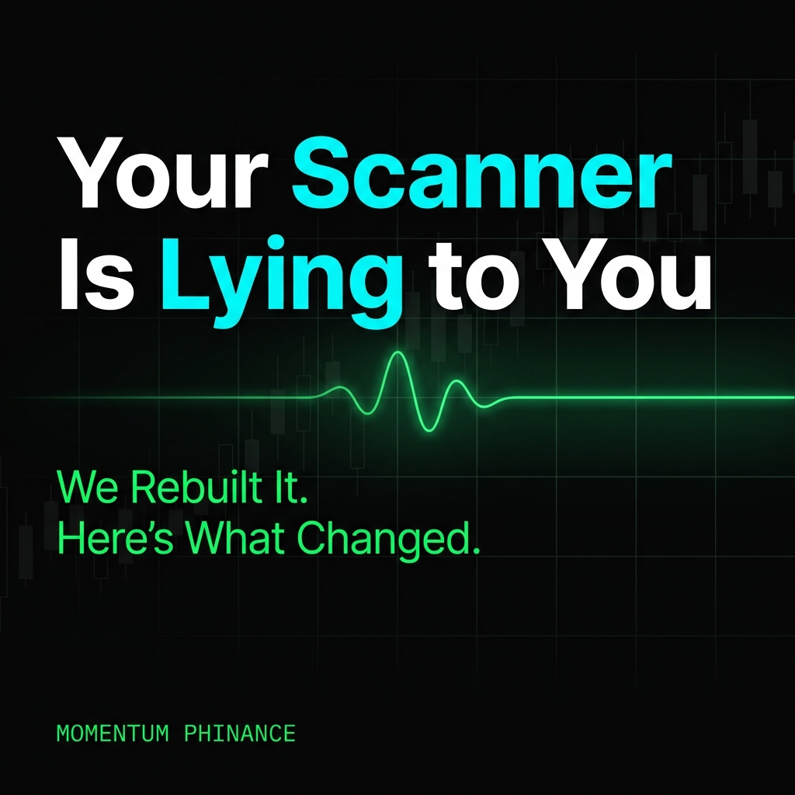
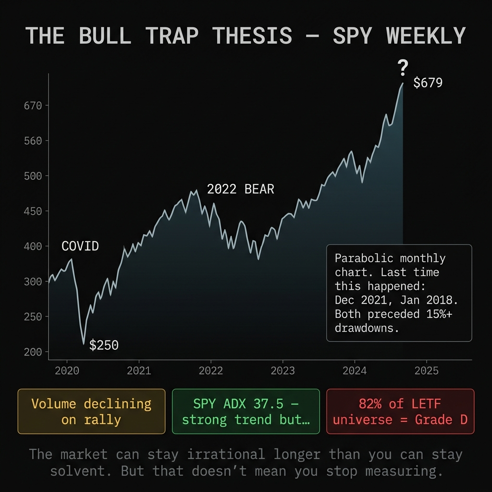
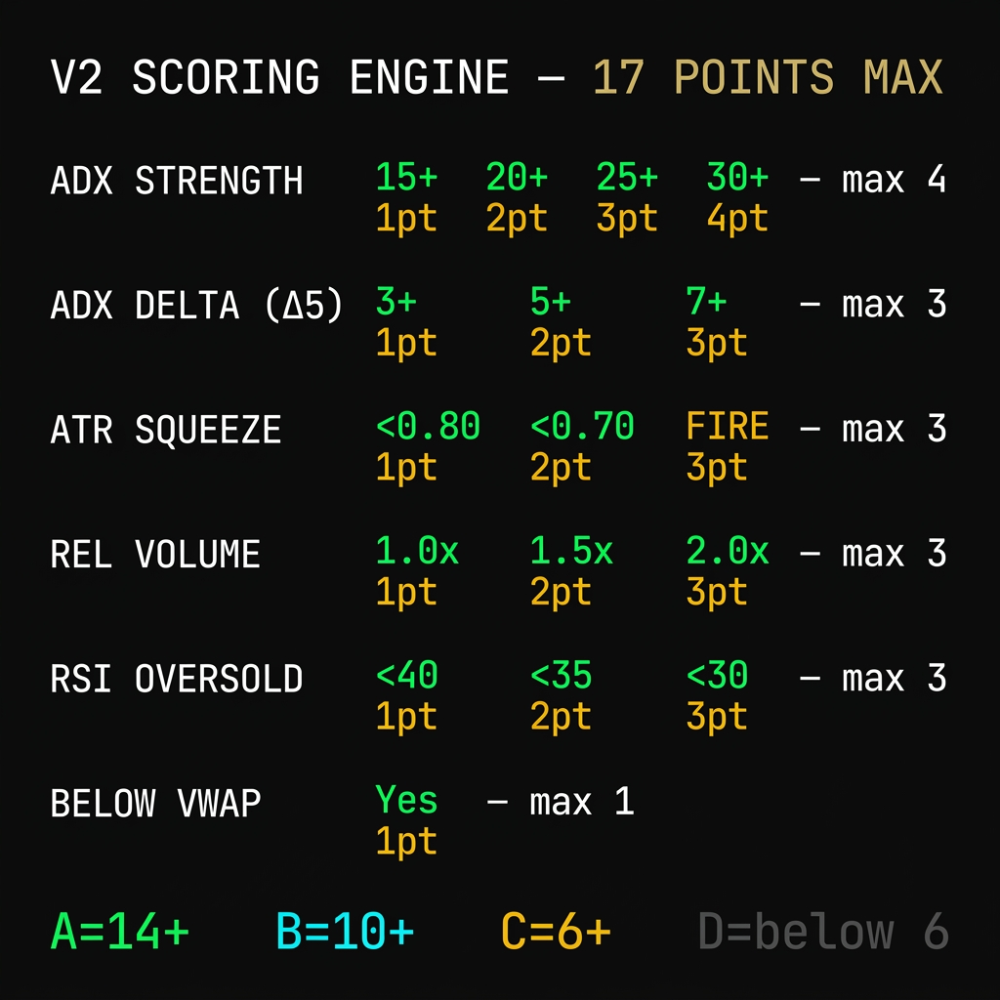
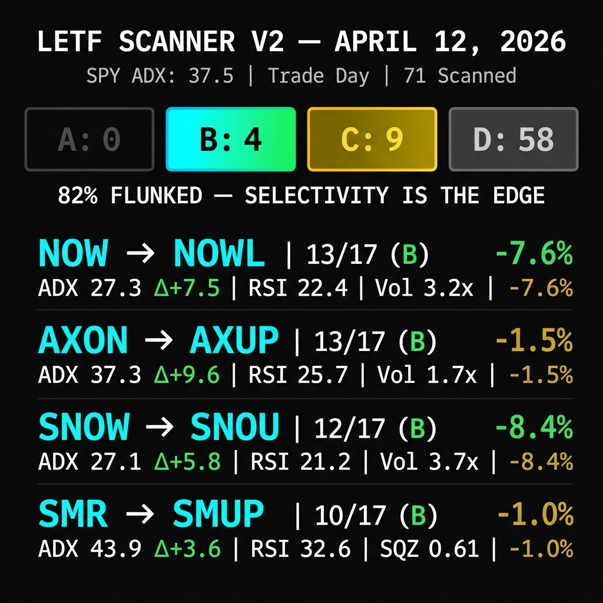
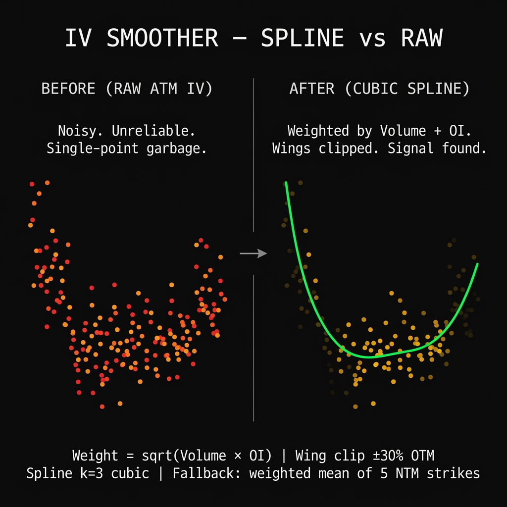

# Market Pulse: The Greatest Bull Trap in History?

*April 12, 2026*

---

**SPY is at $679 and I'm not sleeping well.**

Pull up the weekly chart. Look at it. Really look at it. Now pull up the monthly. That's not a rally. That's a rocket ship with no landing gear. SPY has gone nearly vertical on the monthly timeframe, the kind of parabolic move you see right before someone gets hurt.

The last time the monthly chart looked like this was late 2021. SPY peaked at $479 in early January 2022 and dropped 25% to $349 by October. Before that, January 2018 went parabolic and gave back 10% in two weeks during Volmageddon, then recovered, then dropped another 20% into the Christmas Eve crash later that year. I'm not calling a top. I'm saying parabolic monthly charts have a shelf life, and pretending they don't is the kind of denial that costs people money.

Here's what tipped me off. I sent Sam a screenshot of three SPY charts this morning: weekly, monthly, and the TradingView overview. She said: "Michael, that's either the greatest bull trap in history or the start of another leg up. Either way, you should probably write about it." So here we are.

---

## What Happened This Week

The tariff saga continued doing what it does best: making everything feel unstable while the indices somehow grind higher. The market spent Monday through Wednesday pretending the macro environment doesn't exist, ripped to new highs, then started leaking on Thursday and Friday.

That $679 SPY close looks strong until you notice the volume. Volume has been declining on the rally. Price going up on decreasing volume is a textbook divergence. It means fewer and fewer participants are driving the move higher. The people still buying are getting more aggressive. The people who already own shares are quietly not adding. That's the quiet before the quiet before the storm.

**SPY ADX: 37.5.** Strong trend. The scanner says it's a trade day. But look underneath the hood.

I ran the scanner across 71 leveraged ETF underlyings today. **82% scored a D.** Four out of 71 earned a B. Zero A-grades. When the index is screaming higher but 82% of individual stocks can't produce a setup, who is actually pushing this thing up? A handful of mega-caps dragging the index while everything else treads water.

That's not a healthy rally. That's a narrow rally wearing a healthy rally's clothes.

---

## Why I Haven't Been Throwing Picks Around

Some of you have noticed I've been quieter on stock picks lately. There's a reason for that and it's not laziness. It's self-preservation.

This week was a perfect example. Monday through Wednesday the market ripped higher on what felt like pure vibes and tariff-pause hopium. Then Iran happened. The ceasefire talks paused Thursday, markets started leaking, Friday bled more. And as I write this Saturday morning, the Iran situation is escalating again, which means Monday is going to be... something.

**High volatility breeds bad picks.** Full stop.

When the geopolitical backdrop changes direction every 48 hours, any directional stock call I make on Monday is obsolete by Wednesday. The tariff saga, the Iran escalation cycle, the constant headline risk. None of that is tradeable with conviction. You can't build a thesis around "will the President tweet something at 2 AM that reverses yesterday's rally?" That's not trading. That's gambling with a Bloomberg terminal open.

The scanner is proving the point in real time. **82% of the LETF universe scored a D today.** Zero A-grades. The machine is saying what I'm saying: this is not an environment where you swing at everything. The setups that exist are narrow, specific, and driven by individual stock catalysts (earnings misses, extreme oversold readings), not by macro tailwinds.

I would rather publish zero picks than publish ten bad ones. When the VIX is elevated and the headlines change twice a day, the edge isn't in finding trades. The edge is in *not* trading. The scanner's job isn't to find you entries. It's to keep you out of traps. And right now, 82% of the market IS the trap.

When the regime settles, the picks will flow. Until then, I'm going to keep showing you exactly what the data says, even when what it says is "sit on your hands."

---

## The Scanner Got an Upgrade (And It Found Things)

OK, the R&D section. This is the part where I tell you what we built this week and why it matters for your trading.

**V1 of the LETF scanner was basically a coin flip with extra steps.** Static thresholds. RSI below 35? Green light. ADX above 20? Green light. Three green lights and you're "in." The problem is obvious: a stock with RSI 34.9 and ADX 19.8 scores zero on everything, but an RSI of 35.1 and ADX 20.1 is suddenly a "buy." That's not analysis. That's noise with a GUI.

**V2 uses a 17-point scoring system.** Every signal contributes proportionally. No binary gates. The more conditions you hit, and the harder you hit them, the higher your score.

The two biggest additions:

**ADX Delta (0-3 pts).** This is the game changer. We stopped looking at ADX as a snapshot and started looking at it as a velocity. A 5-bar lookback compares today's ADX to where it was a week ago. An ADX of 24 that was 16 last week has a delta of +8. That's a trend *accelerating*. The rubber band is pulled back. The old scanner would have ignored an ADX of 24. The new scanner sees the kinetic energy building and rewards it.

**ATR Squeeze (0-3 pts).** Volatility compression. When the short-term ATR falls below 80% of the long-term ATR, the stock is coiling. Below 70%, it's a tight spring. When the ratio crosses back above 0.75 from below, that's the "fire" signal. Springs snap.

Here's what the new scanner found today:

**NOW (ServiceNow):** Dropped 7.6% on Friday. RSI cratered to 22.4. Volume surged to 3.24x its 20-day average. The ADX delta is +7.5, meaning trend strength nearly doubled in five sessions. This is what the old scanner would have missed: the acceleration. It's not just oversold. It's oversold *and* gaining momentum. Score: 13/17, Grade B.

**AXON:** The highest ADX delta in the batch at +9.6. Trend strengthening faster than anything else in the universe. RSI at 25.7. Every scoring category lit up. Score: 13/17, Grade B.

**SNOW (Snowflake):** Destroyed on Friday, down 8.4% with volume at nearly 4x normal. RSI at 21.2. That's panic selling on real volume. The ADX delta of +5.8 says a new trend direction is picking up steam, regardless of whether you agree with it. Score: 12/17, Grade B.

**SMR:** The interesting one. ADX is the highest in the group at 43.9 (sustained strong trend), and the ATR squeeze ratio is 0.61 (tightly coiled). Volatility has compressed to 61% of its normal range. This is the "quiet before the breakout" setup that gets amplified by 2x leverage. Score: 10/17, Grade B.

---

## The Options Pipeline Got Smarter Too

One more R&D update, then I'll let you go.

We rebuilt how the options scanner handles implied volatility. If you've ever pulled a raw IV number off your broker and thought "that seems off," it is. Raw ATM IV is one data point from one strike. It's noisy, it's affected by wide bid-ask spreads, and on illiquid names it's basically random.

We built a cubic spline smoother. Instead of one IV number from one strike, we fit a curve through the entire options chain, weighted by the square root of volume times open interest. Liquid, near-the-money strikes dominate. Illiquid deep OTM garbage fades out.

This feeds directly into the gamma pin screener, where the OI sandwich analysis depends on accurate put-vs-call IV to detect institutional hedging. Noisy IV was making the skew signals unreliable. Now they're not.

This is the kind of upgrade nobody sees but everybody benefits from. The plumbing matters.

---

## So What Do You Do With All This?

Here's how I'm thinking about it.

SPY at $679 with a parabolic monthly chart and 82% of individual stocks failing the scanner. That's not a "back up the truck" setup. That's a "be selective and keep your stops tight" setup.

The four B-grade picks are interesting because they're all showing the same pattern: strong trend acceleration (ADX delta positive) combined with oversold RSI and elevated volume. That's institutional money repositioning, not retail panic. When the big money is getting aggressive on specific names while the broad market thins out, those specific names are where the setups live.

Am I calling a top? No. I'm saying the data looks the way it looks. Breadth is narrowing. The scanner can't find A-grade setups anywhere. Either the model is too conservative or the market is genuinely not offering clean entries. I'd rather have a scanner that says "nothing looks great" on 82% of the universe than one that lights up 20 buy signals that crater by Wednesday.

**When most of the universe flunks, the ones that pass deserve your attention.**

---

*This is what the subscription gets you. The actual tools, the actual data, and the scanner that tells you when NOT to trade. Not hypotheticals. Not paper trades. Real signals on real tickers, updated daily at 5AM.*

*[Subscribe to Momentum Phinance](https://mphinance.substack.com)*

---

*God, grant me the serenity to accept the trades I cannot change, the courage to cut the ones I should, and the wisdom to see the volume divergence before it costs me money.*

**- Michael Hanko**
