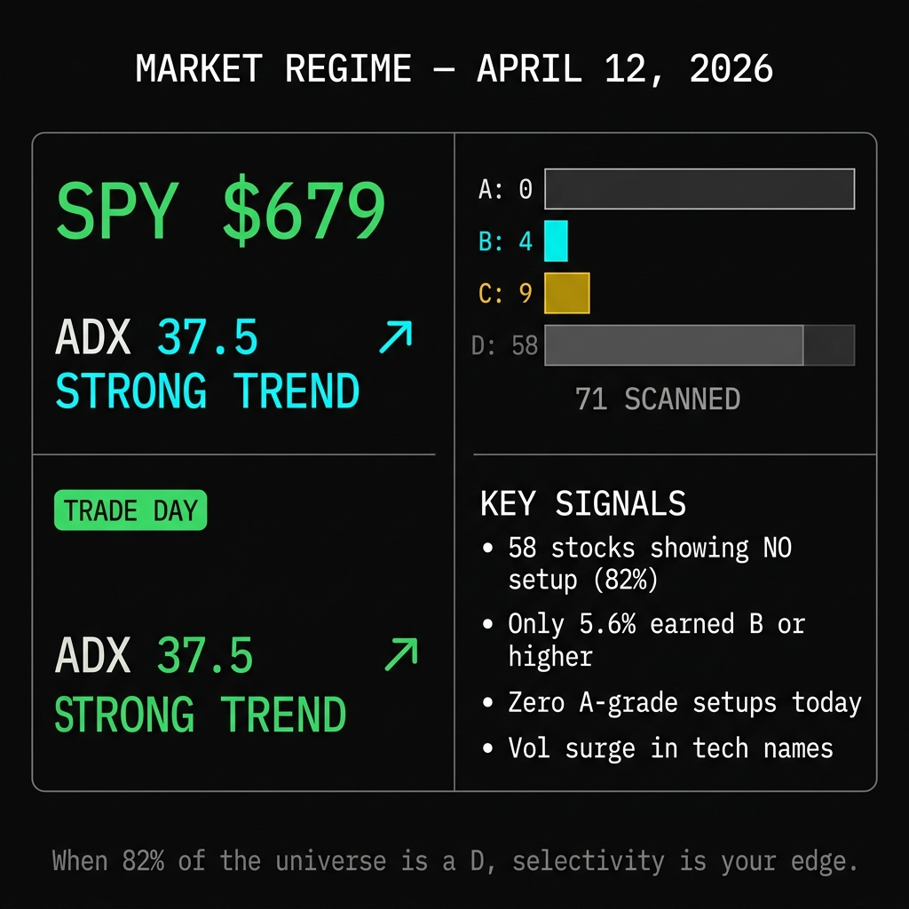
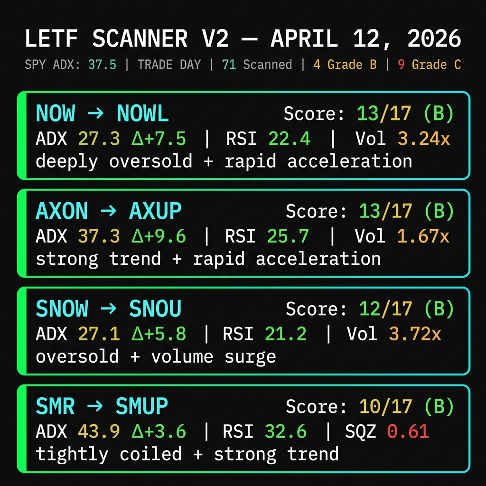

# Your Scanner Is Lying to You

*April 12, 2026*

---

**Most stock screeners are just vibes with a filter on top.**

RSI below 30? Buy. ADX above 25? "Strong trend." That's the level of analysis you get from a $0 Finviz screen. And honestly, it's the level of analysis I was running until about a week ago when Sam looked at the output and said, "Michael, this is basically a coin flip with extra steps."

She wasn't wrong.

Here's the problem: static thresholds are dumb. An ADX of 24 sitting still is completely different from an ADX of 24 that was 16 five days ago. One is a nothing burger. The other is a coiled spring about to snap your face off. And every scanner I've seen, including the one I built, treated them exactly the same.

So we burned it down and rebuilt it.

---

## The Market Right Now

Before I show you what changed, let me show you what the scanner found today.

SPY is sitting at **$679**. The ADX on SPY is **37.5**, which is a strong trend day. The machine says it's a trade day. Good. Let's see what it found.

Out of 71 leveraged ETF underlyings scanned: **zero A-grade setups. Four B-grades. Nine C-grades. And 58 D-grades.**

Read that again. **82% of the universe scored a D.** That's not a market where you swing at everything. That's a market where you wait for the pitch. The scanner's job isn't to find you trades. It's to keep you out of bad ones. When 82% of stocks don't qualify, the scanner is doing its damn job.

---

## What We Changed (And Why It Matters)

The old scanner used hard cutoffs. RSI below 35? Check. ADX above 20? Check. Volume above average? Check. Three green lights and you're in. 

The problem is obvious when you say it out loud: a stock with RSI 34.9, ADX 19.8, and volume at 0.99x its average scores **zero** on all three. Move each number by 0.2 and suddenly it's a "buy." That's not analysis. That's noise.

**V2 uses a 17-point scoring system.** Every signal contributes proportionally. No more binary gates. The more criteria you hit, and the harder you hit them, the higher your score. Think of it like a credit score for momentum setups.

Six categories. Seventeen possible points. Here's why each one matters:

**ADX Strength (0-4 pts):** This is the trend filter. ADX above 15 says "something is happening." Above 30 says "get on or get out of the way." Four tiers instead of a single cutoff.

**ADX Delta (0-3 pts):** This is the new one. The one that changes everything. We look at the ADX five bars ago versus today. If the delta is +7 or higher, the trend is accelerating rapidly. The rubber band is getting pulled back. This is where consolidation breakouts live. An ADX of 24 that was 16 last week is a completely different animal than an ADX of 24 that's been 24 for a month.

**ATR Squeeze (0-3 pts):** Volatility compression. When the short-term ATR drops below 80% of the long-term ATR, volatility is coiling up. Below 70%, it's getting tight. And when it crosses back above 0.75 from below, that's the "fire" signal. Springs snap.

**Relative Volume (0-3 pts):** Volume doesn't lie. When a stock is trading at 2x its 20-day average, somebody knows something. Or they think they do. Either way, the move is being funded.

**RSI Oversold (0-3 pts):** Classic, but graduated. RSI 39 gets 1 point. RSI 29 gets 3. The deeper the oversold reading, the more likely the bounce. But it's never enough on its own.

**Below VWAP (0-1 pt):** Simple. Is the stock below its volume-weighted average price? If yes, you're buying the dip, not chasing the rip. One point, but it matters.

**A = 14+. B = 10+. C = 6+. D = below 6.**

---

## Today's Grade-B Picks

Four stocks earned a B today. Here they are, with the actual data from the scanner.

**NOW → NOWL (Score: 13/17)**
ServiceNow dropped 7.6% today. RSI cratered to 22.4. Volume surged to 3.24x normal. The ADX delta is +7.5, meaning trend strength nearly doubled in five sessions. This is what the old scanner would have missed: the acceleration. It's not just oversold. It's oversold *and* accelerating into a new move. That's the whole thesis.

**AXON → AXUP (Score: 13/17)**
The highest ADX delta in the batch at +9.6. Axon's trend is strengthening faster than anything else in the universe today. RSI at 25.7, volume at 1.67x. Every single scoring category lit up. This is the kind of setup that makes the 17-point system worth building.

**SNOW → SNOU (Score: 12/17)**
Snowflake got destroyed, down 8.4% with volume at almost 4x normal. RSI at 21.2. That's panic selling on real volume. The ADX delta of +5.8 says the trend is picking up steam. Whether it bounces Monday or grinds lower, the conditions are aligned for a leveraged play.

**SMR → SMUP (Score: 10/17)**
This one is interesting because it scores differently from the others. The ADX is the highest in the group at 43.9 (strong sustained trend), and it has the lowest ATR squeeze ratio at 0.61. That means volatility is compressed to 61% of its normal range. The spring is coiled. When it snaps, the 2x leverage amplifies the move. This is the "quiet before the breakout" setup.

---

## The Options Upgrade: Stop Trusting Raw IV

Here's the other thing we fixed this week, and this one is for the options nerds.

If you've ever pulled an implied volatility number off your broker and thought "that looks weird," you're right. It is weird. Raw ATM IV is a single data point from a single strike. It's noisy, it's affected by wide bid-ask spreads, and on illiquid names it's basically useless.

We built a cubic spline smoother. Instead of grabbing one IV number from the ATM strike, we fit a curve through the entire options chain. Each strike gets weighted by the square root of its volume times open interest. Liquid, near-the-money strikes dominate the curve. Illiquid deep OTM garbage gets faded out.

The result: a smoothed ATM IV that actually reflects where the market is pricing risk, not where one market maker left a wide quote on a $0.05 option nobody trades.

We also extract the IV skew from the fitted curve. Put IV centroid minus call IV centroid. When puts are priced significantly above calls (skew > 5 vol points), that's institutional hedging. When calls are priced above puts (skew < -3), that's bullish flow. The smoother turned our gamma pin screener from "interesting" to "useful."

---

## Here's the Truth

I built these tools because I couldn't find them anywhere else. Not for free, not for $200/month, not anywhere. Every scanner I tried used the same static thresholds that treat all ADX 24s as equal and all RSI 30s as identical. They're not.

The V2 scoring system isn't perfect. Zero A-grade setups today tells me either the model is conservative or the market is genuinely not offering clean entries. Probably both. But I'd rather have a scanner that says "nothing looks great" than one that lights up 20 "buy" signals that all crater by Wednesday.

**When 82% of the universe flunks the test, the four that pass deserve your attention.**

---

*Not subscribed yet? This is what you get: the actual tools, the actual data, and the actual thought process behind every trade. No hypotheticals. No "past performance." Live scanners running on live data with a real human showing you the receipts.*

*[Subscribe to Momentum Phinance](https://mphinance.substack.com)*

---

*God, grant me the serenity to accept the trades I cannot change, the courage to cut the ones I should, and the wisdom to tell the damn difference.*

**- Michael Hanko**
