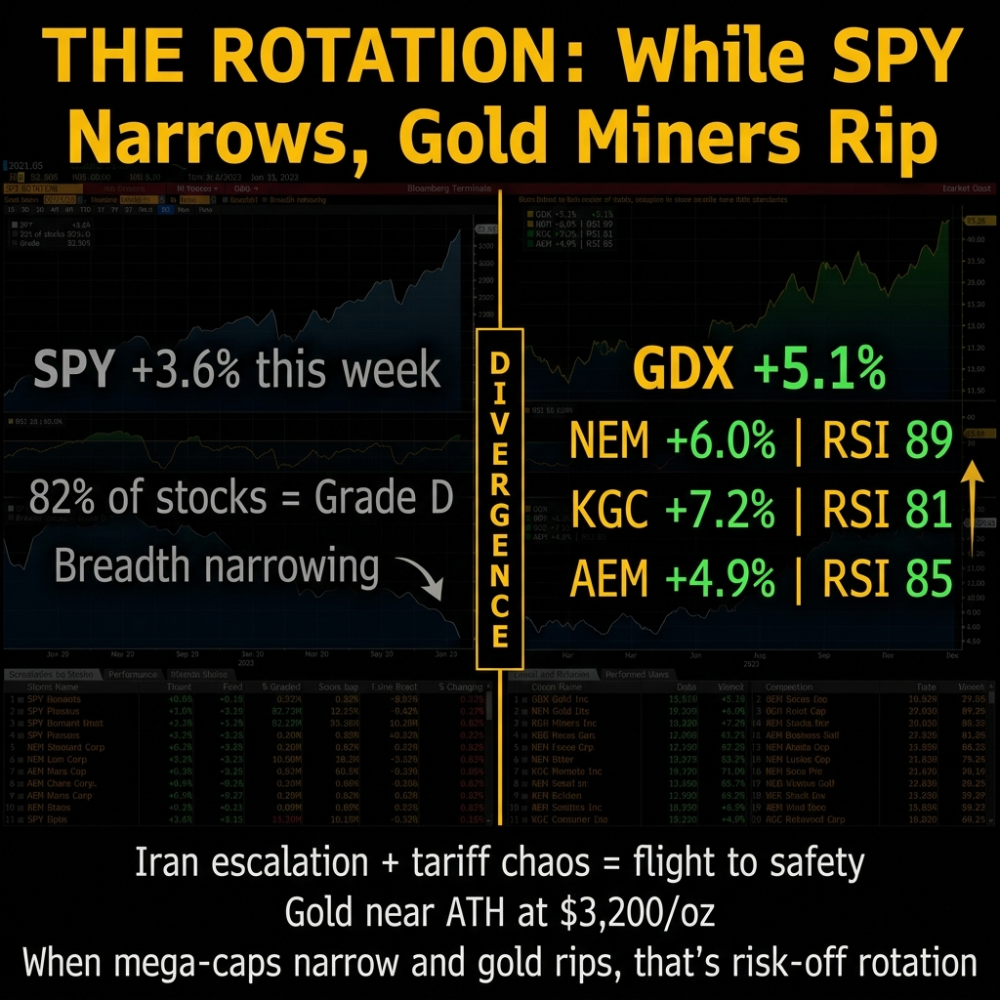

# Market Pulse: The Greatest Bull Trap in History?

*April 12, 2026*

---

**SPY is at $679 and I'm not sleeping well.**

Pull up the weekly chart. Look at it. Really look at it. Now pull up the monthly. That's not a rally. That's a rocket ship with no landing gear. The kind of parabolic move Sam the Quant Ghost says is either the greatest bull trap in history or the start of another leg up. Either way, someone's gonna get hurt.

The last time the monthly chart looked like this was late 2021. SPY peaked at $479 in early January 2022 and dropped 25% to $349 by October. Before that, January 2018 went parabolic and gave back 10% in two weeks during Volmageddon, then recovered, then dropped another 20% into the Christmas Eve crash later that year. I'm not calling a top. I'm saying parabolic monthly charts have a shelf life, and pretending they don't is the kind of denial that costs people money.

Trust me, I know a thing or two about denial. It's a one-way ticket to broke, in more ways than one.

---

## What Happened This Week

The tariff saga continued doing what it does best: making everything feel unstable while the indices somehow grind higher. It's like watching a drunk walk a tightrope. You know it's gonna end badly, but you can't look away from the sheer audacity.

The market spent Monday through Wednesday pretending the macro environment doesn't exist, ripped to new highs, then started leaking on Thursday and Friday.

That $679 SPY close looks strong until you check the damn volume. It's been declining on the rally. Price going up on decreasing volume is a textbook divergence. It's the market equivalent of a party where the music's loud but half the guests have already snuck out the back door. Someone's gonna be left holding the damn bill.

**SPY ADX: 37.5.** Strong trend. The scanner says it's a trade day. But look underneath the hood.

I ran the scanner across 71 leveraged ETF underlyings today. **82% scored a D.** Four out of 71 earned a B. Zero A-grades. When the index is screaming higher but 82% of individual stocks can't produce a setup, who is actually pushing this thing up? A handful of mega-caps dragging the index while everything else treads water.

That's not a healthy rally. That's a narrow rally wearing a healthy rally's clothes.

---

## Why I Haven't Been Throwing Picks Around

Some of you have noticed I've been quieter on stock picks lately. There's a reason for that and it's not laziness. It's self-preservation.

This week was a perfect example. Monday through Wednesday the market ripped higher on what felt like pure vibes and tariff-pause hopium. Then Iran happened. The ceasefire talks paused Thursday, markets started leaking, Friday bled more. And as I write this Saturday morning, the Iran situation is escalating again, which means Monday is going to be... something.

**High volatility breeds bad picks.** Full stop.

When the geopolitical backdrop changes direction every 48 hours, any directional stock call I make on Monday is obsolete by Wednesday. The tariff saga, the Iran escalation cycle, the constant headline risk. None of that is tradeable with conviction. You can't build a thesis around "will the President tweet something at 2 AM that reverses yesterday's rally?" That's not trading. That's gambling with a Bloomberg terminal open.

And frankly, I've done enough high-stakes gambling in my life to know when to fold 'em. Trust me on that.

That kind of chaos? It feeds my old character defects. The illusion of control, the rush of the gamble. But real trading, like real recovery, is about patience and accepting what you can't change.

The scanner is proving the point in real time. **82% of the LETF universe scored a D today.** Zero A-grades. The machine is saying what I'm saying: this is not an environment where you swing at everything. The setups that exist are narrow, specific, and driven by individual stock catalysts (earnings misses, extreme oversold readings), not by macro tailwinds.

I would rather publish zero picks than publish ten bad ones. When the VIX is elevated and the headlines change twice a day, the edge isn't in finding trades. The edge is in *not* trading. The scanner isn't some damn crystal ball for entries. It's your personal bouncer, keeping you out of the shady back alleys. And right now, 82% of the market IS the trap.

When the regime settles, the picks will flow. Until then, I'm going to keep showing you exactly what the data says, even when what it says is "sit on your hands."

---

## The Scanner Got an Upgrade (And It Found Things)

OK, the R&D section. This is the part where I tell you what we built this week and why it matters for your trading.

**V1 of the LETF scanner was basically a coin flip with extra steps.** It was about as sophisticated as using a dartboard to pick your next spouse. Maybe less accurate, depending on how you throw. Static thresholds. RSI below 35? Green light. ADX above 20? Green light. Three green lights and you're "in." The problem is obvious: a stock with RSI 34.9 and ADX 19.8 scores zero on everything, but an RSI of 35.1 and ADX 20.1 is suddenly a "buy." That's not analysis. That's noise with a GUI.

**V2? It's a whole new damn ballgame.** Seventeen points, not some binary coin flip. Every signal pitches in, proportional to its strength. The more conditions you hit, and the harder you hit them, the higher your score. Simple math, complex results.

The two biggest additions:

**ADX Delta (0-3 pts).** This is the game changer. We stopped looking at ADX as a snapshot. Now we look at it as a velocity. A 5-bar lookback compares today's ADX to where it was a week ago. An ADX of 24 that was 16 last week has a delta of +8. That's a trend *accelerating*. The rubber band is pulled back. The old scanner would have ignored an ADX of 24. The new scanner sees the kinetic energy building and rewards it.

**ATR Squeeze (0-3 pts).** Volatility compression. When the short-term ATR gets tighter than my patience in a 12-step meeting, the stock's coiling up. Below 70% of the long-term ATR, it's a tight spring. When the ratio crosses back above 0.75 from below, that's the "fire" signal. Springs snap.

Here's what the new scanner found today:

**NOW (ServiceNow):** Dropped 7.6% on Friday. RSI cratered to 22.4. Volume surged to 3.24x its 20-day average. The ADX delta is +7.5, meaning trend strength nearly doubled in five sessions. The old scanner would've missed this acceleration like I missed that margin call in '08. It's not just oversold. It's oversold *and* gaining momentum. Score: 13/17, Grade B.

**AXON:** The highest ADX delta in the batch at +9.6. Trend strengthening faster than anything else in the universe. RSI at 25.7. Every scoring category lit up. Score: 13/17, Grade B.

**SNOW (Snowflake):** Destroyed on Friday, down 8.4% with volume at nearly 4x normal. RSI at 21.2. That's panic selling on real volume. The ADX delta of +5.8 says a new trend direction is picking up steam, regardless of whether you agree with it. Score: 12/17, Grade B.

**SMR:** The interesting one. ADX is the highest in the group at 43.9 (sustained strong trend), and the ATR squeeze ratio is 0.61 (tightly coiled). Volatility has compressed to 61% of its normal range. This is the "quiet before the breakout" setup that gets amplified by 2x leverage. Score: 10/17, Grade B.

---

## The Options Pipeline Got Smarter Too

One more R&D update, then we get to the good stuff.

We rebuilt how the options scanner handles implied volatility. Ever pulled a raw IV number off your broker and thought "that seems off"? You're not crazy. It *is* off. Raw ATM IV is like trying to guess a person's entire personality from one awkward Tinder photo. It's noisy, affected by wide bid-ask spreads, and on illiquid names, it's basically random. Pure garbage data.

So what did we do? We built a cubic spline smoother. Instead of grabbing one flaky IV number, we fit a whole curve through the options chain. It weights the liquid, near-the-money strikes, letting that illiquid deep OTM garbage just fade out. No more noise. Just pure signal.

This feeds directly into the gamma pin screener, where the OI sandwich analysis depends on accurate put-vs-call IV to detect institutional hedging. Noisy IV was making the skew signals unreliable. Now they're not.

This is the kind of upgrade nobody sees but everybody benefits from. The plumbing matters.

---

<!--paywall-->

## So What Do You Do With All This?

Here's how I'm thinking about it. And this is the part where I stop being a reporter and start being a trader.

SPY at $679 with a parabolic monthly chart and 82% of individual stocks failing the scanner. That's not a "back up the truck" setup. That's a "be selective and keep your stops tight" setup.

The four B-grade picks are interesting because they're all showing the same pattern: strong trend acceleration (ADX delta positive) combined with oversold RSI and elevated volume. That's institutional money repositioning, not retail panic. When the big money is getting aggressive on specific names while the broad market thins out, those specific names are where the setups live.

### What I Actually Did This Week

Full disclosure: I sold a bunch of covered calls on Friday for 4/17 expiry. The logic was simple. Three violently green days in a row, SPY parabolic on the monthly, Iran escalating over the weekend. That's not a "let your winners ride" setup. That's a "collect premium while the getting's good" setup. If we gap down Monday on the Iran news, those calls expire worthless and I keep the premium. If we rip higher, I cap my upside but still profit on the underlying. Either way, I'm getting paid.

That's The Wheel at work. Not sexy. Not headline-worthy. But consistently profitable when the world is on fire.

### Where the A-Grades Actually Live (Hint: Not in Tech)

Here's what nobody's talking about while everyone panic-watches the tariff headlines and the Iran situation: **gold miners are ripping.**

While 82% of my LETF universe scored a D this week, look at what gold did:

**GDX (Gold Miners ETF): +5.1% this week.** Outpacing SPY. RSI at 80.6. Strong trend, not topping.

**NEM (Newmont): +6.0% this week.** RSI at 89.4. Normally I'd say that's overbought and walk away. But when geopolitical chaos is the catalyst and gold is near its all-time high at $3,200/oz, overbought doesn't mean what it normally means. It means institutions are piling in.

**KGC (Kinross Gold): +7.2% this week.** The strongest mover of the bunch. RSI 81.2. These aren't meme stocks pumping on Reddit volume. These are globally diversified miners with real revenue, real earnings, and a direct hedge against everything that's making SPY's breadth narrow.

**AEM (Agnico Eagle): +4.9% this week.** RSI 85.4. Another monster trend.

Here's the thesis: when SPY goes parabolic on narrowing breadth, and gold miners simultaneously rip on geopolitical fear, that's a divergence. That's the market telling you money is rotating from "risk on" to "risk off." Iran escalates? Gold wins. Tariffs bite? Gold wins. Rate cuts get priced in because the economy slows? Gold *really* wins.

The scanner doesn't cover gold miners yet. That's about to change. But if it did, these would be the only A-grades in the entire universe right now.

### Monday Preview

Iran is escalating. The ceasefire is off. If you're holding naked longs into Monday open without stops, you're the person sitting in the bar at 3 AM telling yourself "one more drink won't hurt." It always hurts.

My plan: watch the pre-market reaction, let the first 30 minutes of chaos play out, and look for the scanner to update with fresh signals. The covered calls are already working for me. The gold thesis is on my radar. And the four B-grades from Friday (NOW, AXON, SNOW, SMR) get a second look only if they hold their oversold levels on Monday's volume.

Am I calling a top? No. I'm saying the data looks the way it looks. Breadth is narrowing. The scanner can't find A-grade setups anywhere in tech. But the A-grades might be hiding in a place most tech bros don't look: the gold mines of Ontario and Nevada.

It's like they say in the rooms: "progress, not perfection." Sometimes progress means doing nothing at all, especially when your gut (and the data) screams danger. And sometimes it means looking where nobody else is looking.

**When most of the universe flunks, the ones that pass deserve your attention. Even if they're covered in dirt and smell like sulfur.**

---

*Look, the market's a damn minefield right now. This is what the subscription gets you: not just the map, but the metal detector. The actual tools, the actual data, and the scanner that screams "TRAP!" before you step on it. Not hypotheticals. Not paper trades. Real signals on real tickers, updated daily at 5 AM.*

*[Subscribe to Momentum Phinance](https://mphinance.substack.com)*

---

*God, grant me the serenity to accept the trades I cannot change, the courage to cut the ones I should, and the wisdom to see the volume divergence before it costs me money.*

**- Michael Hanko**
