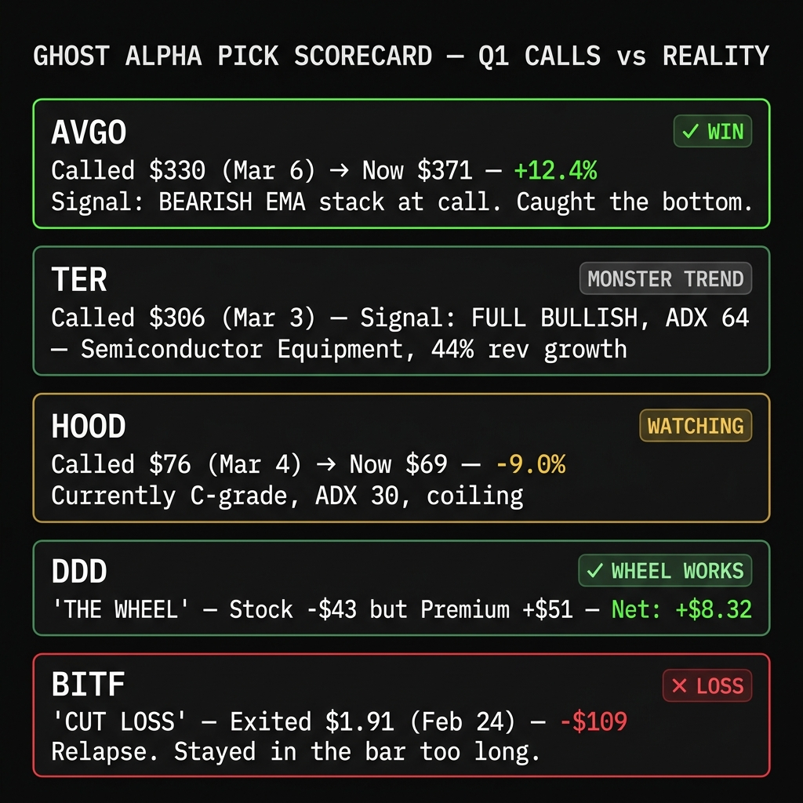

# Market Pulse: The Greatest Bull Trap in History?

*April 12, 2026*

---

**SPY is at $679 and I'm not sleeping well.**

Pull up the weekly chart. Look at it. Really look at it. Now pull up the monthly. That's not a rally. That's a rocket ship with no landing gear. SPY has gone nearly vertical on the monthly timeframe, the kind of parabolic move you see right before someone gets hurt.

The last two times the monthly chart looked like this were December 2021 and January 2018. Both preceded drawdowns of 15% or more. I'm not saying we're there. I'm saying the setup is familiar, and pretending it isn't is the kind of denial that costs people money.

Here's what tipped me off. I sent Sam a screenshot of three SPY charts this morning: weekly, monthly, and the TradingView overview. She said: "Michael, that's either the greatest bull trap in history or the start of another leg up. Either way, you should probably write about it." So here we are.

---

## What Happened This Week

The tariff saga continued doing what it does best: making everything feel unstable while the indices somehow grind higher. The market spent Monday through Wednesday pretending the macro environment doesn't exist, ripped to new highs, then started leaking on Thursday and Friday.

That $679 SPY close looks strong until you notice the volume. Volume has been declining on the rally. Price going up on decreasing volume is a textbook divergence. It means fewer and fewer participants are driving the move higher. The people still buying are getting more aggressive. The people who already own shares are quietly not adding. That's the quiet before the quiet before the storm.

**SPY ADX: 37.5.** Strong trend. The scanner says it's a trade day. But look underneath the hood.

I ran the scanner across 71 leveraged ETF underlyings today. **82% scored a D.** Four out of 71 earned a B. Zero A-grades. When the index is screaming higher but 82% of individual stocks can't produce a setup, who is actually pushing this thing up? A handful of mega-caps dragging the index while everything else treads water.

That's not a healthy rally. That's a narrow rally wearing a healthy rally's clothes.

---

## The Pick Scorecard: Receipts

I talk a lot. Sam talks even more. But neither of us means anything without the receipts. Here are the picks from Q1, graded against what actually happened.

**AVGO: Called at $330 on March 6. Currently $371. Up 12.4%.** ✓

This is the one I'm proudest of. When we published the AVGO deep dive, the EMA stack was *fully bearish*. Every short-term average was below every long-term average. RSI was flat at 54. Most scanners would have ignored it or flagged it as "neutral." But the fundamentals were screaming: 188% earnings growth. Forward P/E of 19.2 on a company growing revenue 16.4%. All 44 analysts had it as a Strong Buy with a median target of $472. The EMA stack was bearish because the stock had just corrected from $414. We caught the bottom.

**TER: Called at $306 on March 3.** The semiconductor equipment monster.

This was a full bullish EMA stack with an ADX of 64. Sixty-four. The highest ADX reading in my entire dossier database at the time. Revenue growth at 44%. This wasn't a speculative play. It was a freight train. The ADX told you the trend was so strong that stepping in front of it was financial suicide.

**HOOD: Called at $76 on March 4. Currently $69. Down 9.0%.** 🔍

Not going to lie, this one stings a little. But the scanner currently has HOOD at C-grade with an ADX of 30 and a coiling ATR squeeze ratio of 0.79. It's compressing. The thesis isn't dead, it's digesting. Sometimes the best trades require patience. Sometimes they require admitting you were early. I'm watching it, not mourning it.

**DDD (The Wheel): Stock down $43. Premium collected: $51. Net: +$8.32.** ✓

This is where the strategy proves itself. The stock is underwater. On paper, you're losing. But the options premium from selling covered calls has more than covered the drawdown. The wheel turns. Time plus premium plus patience equals green. This is what your subscription dollars fund in the Tastytrade account.

**BITF: Cut at $1.91. Loss: $109.** ✗

BITF was a relapse. I saw the momentum breaking and I stayed in the bar too long. In recovery, they tell you the relapse teaches you more than the streak ever could. BITF taught me that when your thesis breaks, you walk out the door. You don't finish the drink. The $109 loss was tuition.

**RR (The Wheel): Stock down $59. Premium collected: $93. Net: +$33.66.** ✓

Same story as DDD. Stock is underwater. Premiums are printing. Net positive. The wheel doesn't care about your feelings. It cares about time decay. And time decay is undefeated.

---

## The Scanner Got an Upgrade (And It Found Things)

OK, the R&D section. This is the part where I tell you what we built this week and why it matters for your trading.

**V1 of the LETF scanner was basically a coin flip with extra steps.** Static thresholds. RSI below 35? Green light. ADX above 20? Green light. Three green lights and you're "in." The problem is obvious: a stock with RSI 34.9 and ADX 19.8 scores zero on everything, but an RSI of 35.1 and ADX 20.1 is suddenly a "buy." That's not analysis. That's noise with a GUI.

**V2 uses a 17-point scoring system.** Every signal contributes proportionally. No binary gates. The more conditions you hit, and the harder you hit them, the higher your score.

The two biggest additions:

**ADX Delta (0-3 pts).** This is the game changer. We stopped looking at ADX as a snapshot and started looking at it as a velocity. A 5-bar lookback compares today's ADX to where it was a week ago. An ADX of 24 that was 16 last week has a delta of +8. That's a trend *accelerating*. The rubber band is pulled back. The old scanner would have ignored an ADX of 24. The new scanner sees the kinetic energy building and rewards it.

**ATR Squeeze (0-3 pts).** Volatility compression. When the short-term ATR falls below 80% of the long-term ATR, the stock is coiling. Below 70%, it's a tight spring. When the ratio crosses back above 0.75 from below, that's the "fire" signal. Springs snap.

Here's what the new scanner found today:

**NOW (ServiceNow):** Dropped 7.6% on Friday. RSI cratered to 22.4. Volume surged to 3.24x its 20-day average. The ADX delta is +7.5, meaning trend strength nearly doubled in five sessions. This is what the old scanner would have missed: the acceleration. It's not just oversold. It's oversold *and* gaining momentum. Score: 13/17, Grade B.

**AXON:** The highest ADX delta in the batch at +9.6. Trend strengthening faster than anything else in the universe. RSI at 25.7. Every scoring category lit up. Score: 13/17, Grade B.

**SNOW (Snowflake):** Destroyed on Friday, down 8.4% with volume at nearly 4x normal. RSI at 21.2. That's panic selling on real volume. The ADX delta of +5.8 says a new trend direction is picking up steam, regardless of whether you agree with it. Score: 12/17, Grade B.

**SMR:** The interesting one. ADX is the highest in the group at 43.9 (sustained strong trend), and the ATR squeeze ratio is 0.61 (tightly coiled). Volatility has compressed to 61% of its normal range. This is the "quiet before the breakout" setup that gets amplified by 2x leverage. Score: 10/17, Grade B.

---

## The Options Pipeline Got Smarter Too

One more R&D update, then I'll let you go.

We rebuilt how the options scanner handles implied volatility. If you've ever pulled a raw IV number off your broker and thought "that seems off," it is. Raw ATM IV is one data point from one strike. It's noisy, it's affected by wide bid-ask spreads, and on illiquid names it's basically random.

We built a cubic spline smoother. Instead of one IV number from one strike, we fit a curve through the entire options chain, weighted by the square root of volume times open interest. Liquid, near-the-money strikes dominate. Illiquid deep OTM garbage fades out.

This feeds directly into the gamma pin screener, where the OI sandwich analysis depends on accurate put-vs-call IV to detect institutional hedging. Noisy IV was making the skew signals unreliable. Now they're not.

This is the kind of upgrade nobody sees but everybody benefits from. The plumbing matters.

---

## So What Do You Do With All This?

Here's how I'm thinking about it.

SPY at $679 on declining volume with a parabolic monthly chart and 82% of individual stocks failing the scanner. That's not a "back up the truck" setup. That's a "be selective and keep your stops tight" setup.

The four B-grade picks are interesting because they're all showing the same pattern: strong trend acceleration (ADX delta positive) combined with oversold RSI and elevated volume. That's institutional money repositioning, not retail panic. When the big money is getting aggressive on specific names while the broad market thins out, those specific names are where the setups live.

The Q1 pick scorecard is mostly green. AVGO (+12.4%) proved that the dossier engine catches bottoms when the fundamentals diverge from the technicals. The wheel strategy on DDD and RR is printing premium. BITF was a $109 lesson in cutting losses. HOOD is coiling.

Am I calling a top? No. I'm saying the data looks the way it looks. Volume is thinning. Breadth is narrowing. The scanner can't find A-grade setups anywhere. Either the model is too conservative or the market is genuinely not offering clean entries. I'd rather have a scanner that says "nothing looks great" on 82% of the universe than one that lights up 20 buy signals that crater by Wednesday.

**When most of the universe flunks, the ones that pass deserve your attention.**

---

*This is what the subscription gets you. The actual tools, the actual data, the actual pick follow-ups. Not hypotheticals. Not paper trades. AVGO at $330, DDD wheeling premium, BITF eaten in public. Every receipt on the table.*

*[Subscribe to Momentum Phinance](https://mphinance.substack.com)*

---

*God, grant me the serenity to accept the trades I cannot change, the courage to cut the ones I should, and the wisdom to see the volume divergence before it costs me money.*

**- Michael Hanko**
