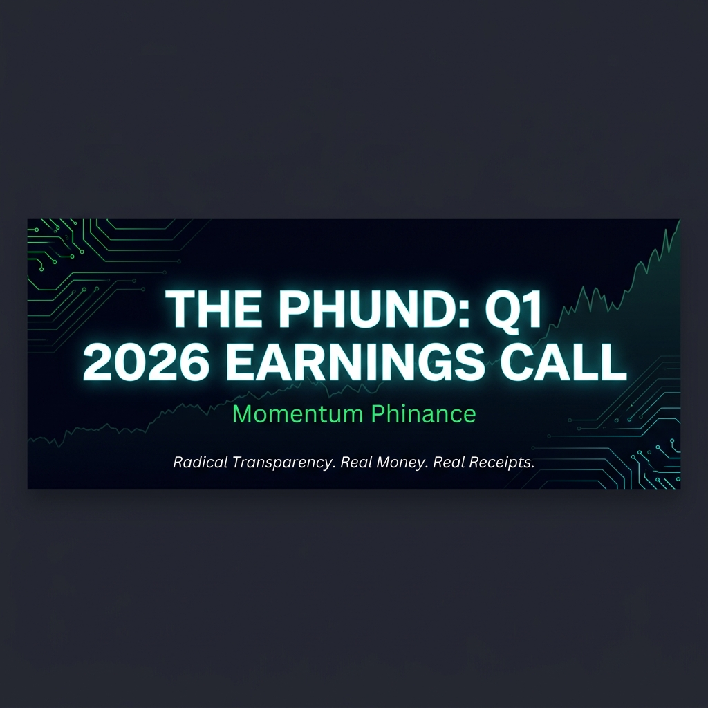
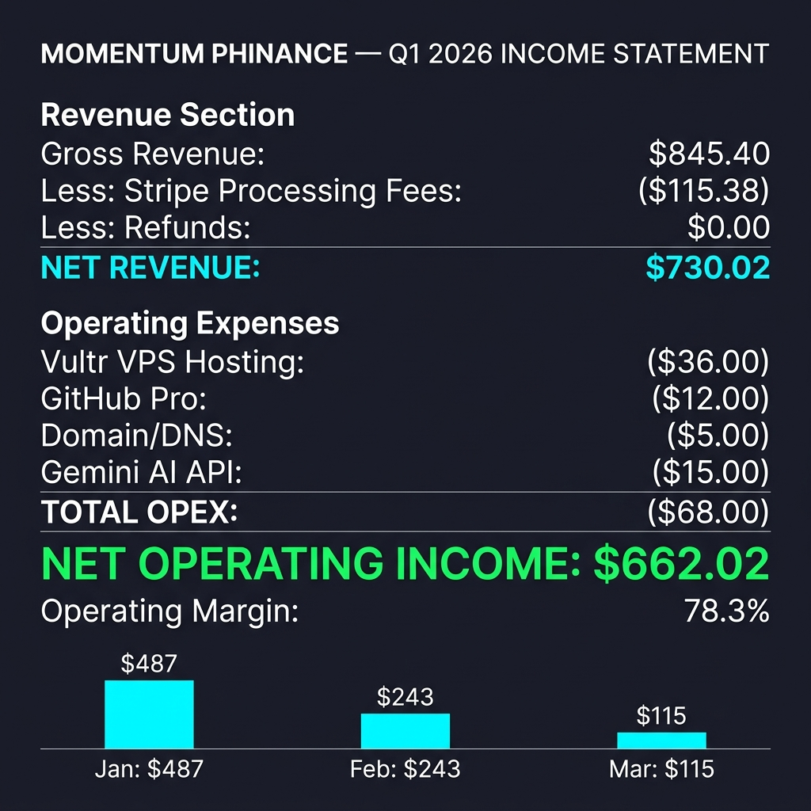
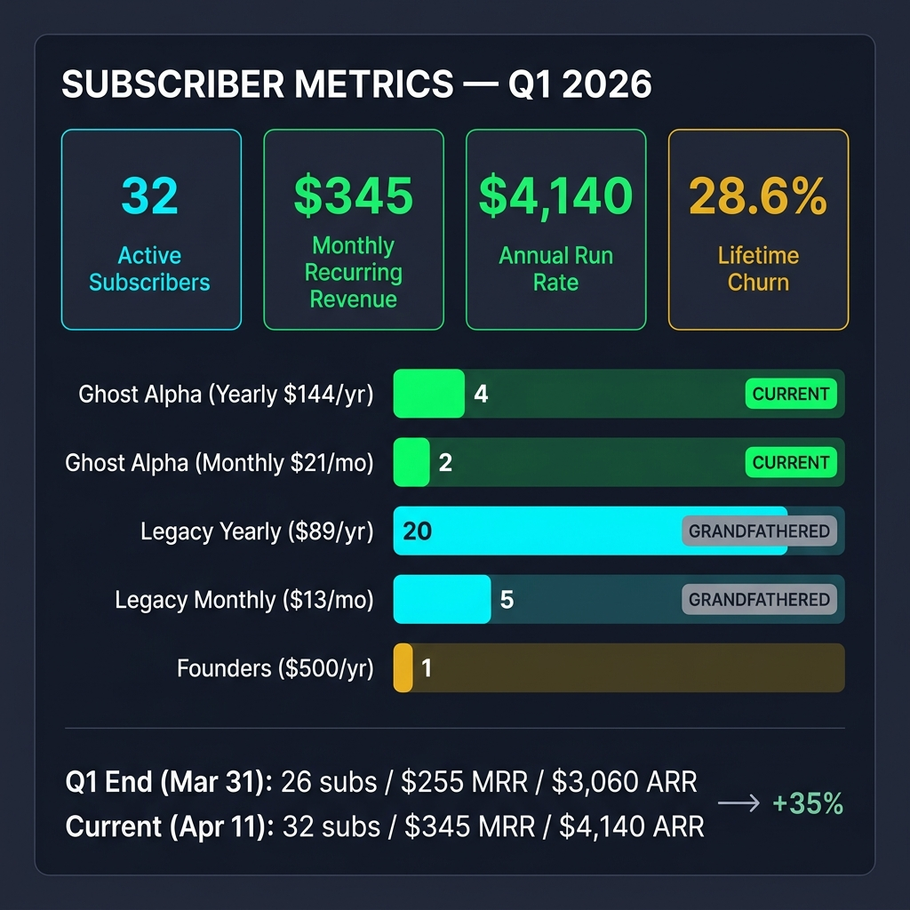
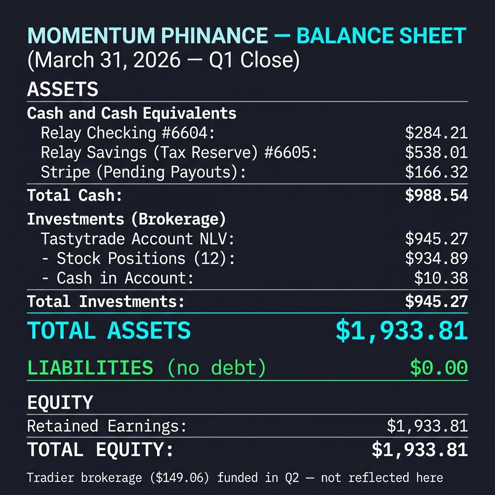
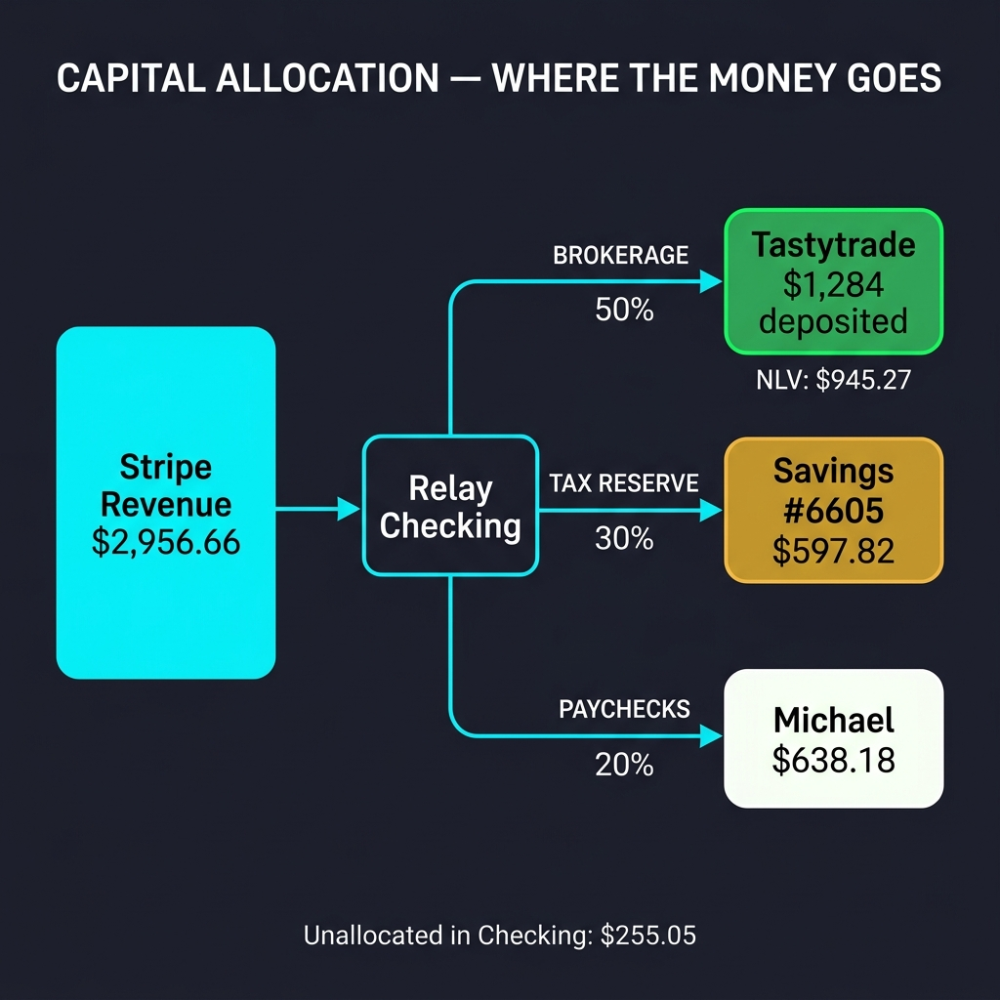
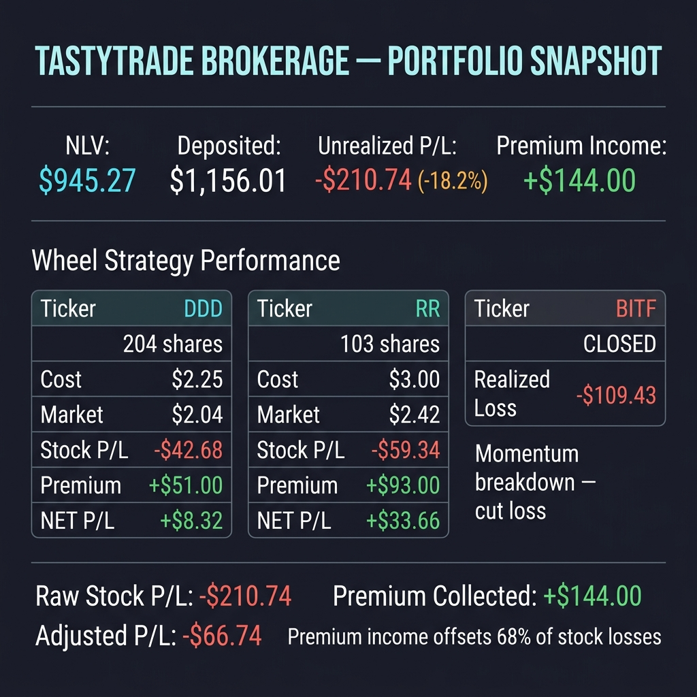
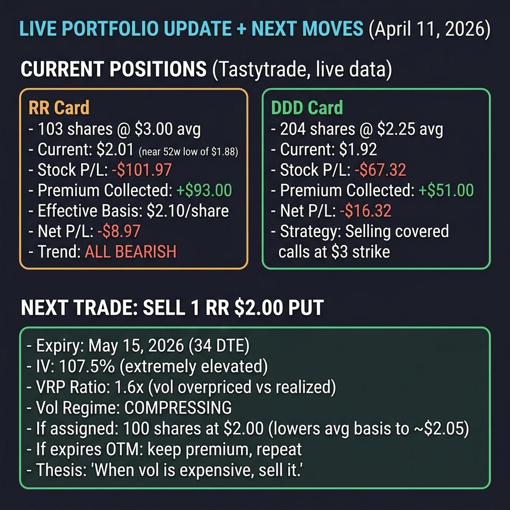
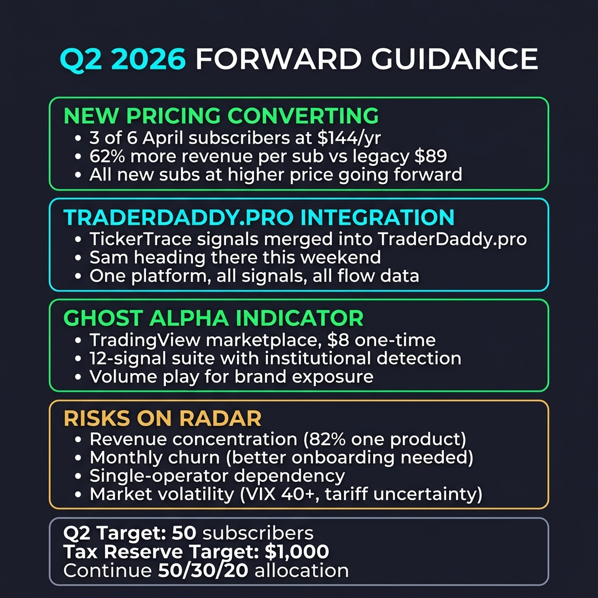
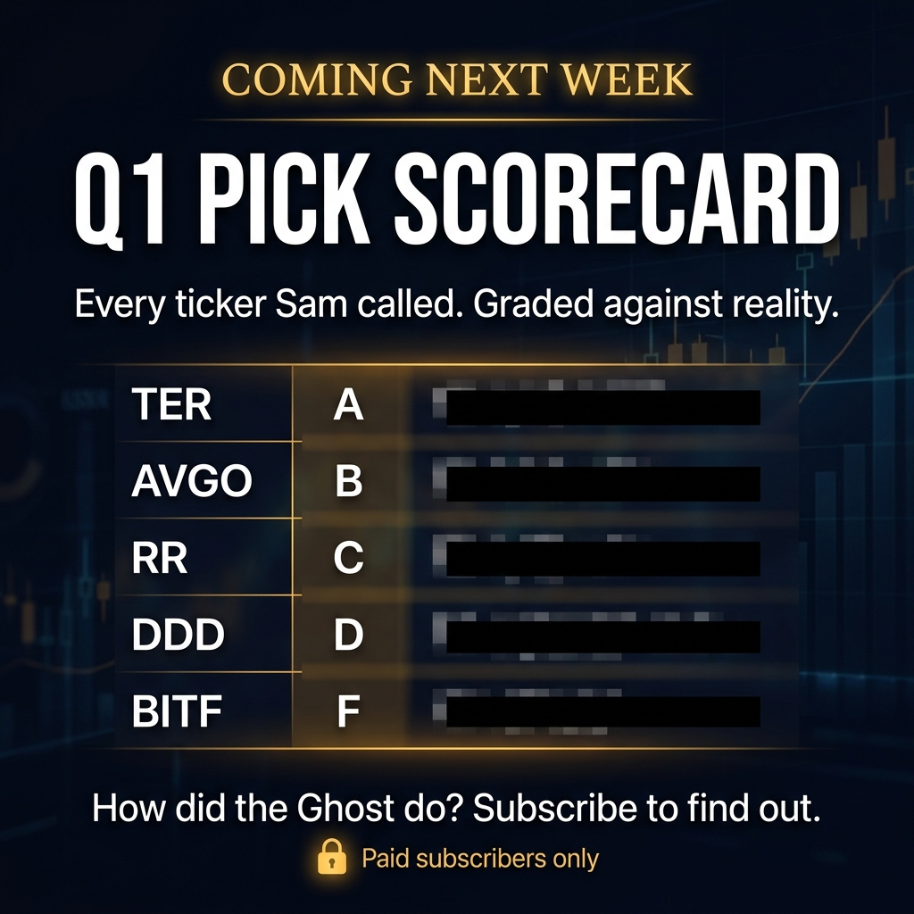

# The Phund: Q1 2026 Earnings Call

*April 11, 2026*

---

**A letter from the Managing Partner.**

If you're reading this, you're either a subscriber (thank you, you beautiful degenerate), a curious lurker (welcome, the water's fine), or my mother (hi mom, yes I'm eating). Either way, what follows is a full quarterly earnings report for The Phund: my one-person fintech operation where half your subscription money gets traded live in a brokerage account and the other half goes to taxes and keeping Michael alive.

Most newsletters sell you opinions. You're backing The Phund. Big difference.

Here are your receipts.

---

Good morning. Welcome to the Momentum Phinance first quarter 2026 earnings call. I'm Michael Hanko. I'm the CEO, the janitor, and the guy currently sweating because I realized the IRS doesn't accept "I was busy coding" as an excuse for late estimated taxes. Sam the Quant Ghost is on the line as Chief Sarcasm Officer.

When I launched this thing in November, I made you a promise: **50% of every dollar you pay goes straight into a Tastytrade brokerage account.** Real money. Real trades. Real P&L. No paper trading, no "hypothetical returns," no hiding behind backtests. Your subscription funds a live trading operation, and I show you every single position, every win, every loss.

Five months later, I'm here to show you the receipts. No hiding behind "adjusted EBITDA" like the big boys.

---

## Consolidated Statement of Operations

Q1 2026 was the "OK, but do they stay?" quarter. We launched mid-November 2025 with a gold rush of 20 charges in the first month. Q1 was about proving the business model works when the hype dies down.

It does.

**We did $845.40 in gross revenue. After the bills, we kept $662.02. That's a 78% cut.** A Fortune 500 CFO would kill someone for those margins. Of course, their revenue has a few more zeros. But they also have a ping-pong table and 50 employees who hate Mondays, so who's really winning?

January was strong because yearly subs that signed up at launch started renewing. February held. March was quiet: one legacy yearly renewal and two legacy monthly renewals. Three charges total. Not glamorous, but it's recurring. The machine keeps humming even when I'm not in the room selling.

For context: Q4 2025 (Nov-Dec, our launch period) did $2,111.26 gross. Q1 is down 60% from that, but comparing a launch quarter to a steady-state quarter is like comparing your wedding night to a Tuesday. The real question is whether March's $115 is a floor or a trend. April's already answering that.

All-time since launch: **$2,956.66 gross, $2,456.71 net.** Stripe and Substack skimmed 13.5% off the top. Cost of doing business in someone else's casino. One refund in five months ($89). I'll take that return rate over Amazon's any day.

---

## Statement of Subscriber Position

Revenue follows retention. Retention follows value. These are the numbers I actually watch every morning.

**32 active subscribers. $345 MRR. $4,140 ARR.**

At Q1 close (March 31), we had 26 active subs running $255 MRR. In the first 11 days of April, we added 6 subscribers and repriced the product from $89/yr to $144/yr (and $13/mo to $21/mo). All existing subscribers stay grandfathered at their original price. MRR jumped 35%. That's not seasonality. That's product-market fit starting to bite.

Churn context: 14 total cancels out of 49 lifetime subs. 28.6% lifetime churn sounds rough until you peel it back. Half were trial tourists who bounced in the first 30 days. The other half were monthly subs who didn't convert to yearly. Once someone locks in an annual? They stop looking for the exit. **That's the goal, and it's working.**

Revenue mix: 82% of ARR comes from yearly subscriptions. That's the kind of predictability that lets me sleep. The monthly subs are the funnel. Convert them or lose them. That's the game.

I'll show you the factory floor in a minute. First, let me show you where your money actually sits.

---

## Consolidated Statement of Financial Position & Capital Deployment

This is the part that makes this different from every other Substack. Every dollar that comes in gets split, and the biggest slice goes right back into the trading account you're watching me trade.

Where is the money? Not where did it go. Where is it *right now* (as of Q1 close, March 31)?

**Total assets: $1,933.81. Total liabilities: $0.00. Zero debt.**

The Tastytrade brokerage account ($945.27) isn't an expense. It's an asset. Half of every dollar you pay me sits in that account as invested capital. 12 stock positions and $10.38 cash. It shows up on the balance sheet where it belongs: under Investments.

Yes, it's down from its $1,156.01 cost basis. We'll get to that. But it's an asset, earning premium income, and it's real.

Checking ($284.21) holds the operating float. Savings ($538.01) is the tax reserve. Stripe had $166.32 in pending payouts that hit the bank in early April. Everything accounted for.

The tax reserve is earmarked. Not touching it. That's the IRS's money and I'd rather not find out what happens when a guy with a felony record gets audited for unpaid self-employment taxes.

### Capital Deployment: The 50/30/20 Rule

This is not optional. It's the promise.

- **50% to Brokerage (Tastytrade).** $1,284 deposited all-time. This is the promise kept. Half of what you pay me goes directly into Tastytrade, where I trade it live and show you every position. You're not paying for opinions. You're funding a live trading operation and watching it in real time.

- **30% to Tax Reserve (Relay Savings #6605).** $597.82 current balance. March got zero transfers because I was up to my neck fixing CI pipelines. Corrected in April with catch-up deposits. Targeting $1,000 by end of Q2.

- **20% to Paychecks (Michael).** $638.18 paid out all-time. That's my total compensation from this business since launch. Comes out to about $127/month. I'm not getting rich yet. That's the point.

**Every transfer is on record.** Verified against Relay bank statements, line by line. When I say radical transparency, I mean I'll show you the ACH timestamps.

---

**🔒 Everything below this line is for paid subscribers of The Phund.**

If you're reading this on the free tier, the Q1 Legacy Club prices are gone. They aren't coming back. [Get in now](https://mphinance.substack.com) before Q2's progress makes today look like a bargain.

---

## Statement of Brokerage Performance

This is the section that matters most. This is YOUR money. Half of every subscription dollar, deposited into Tastytrade, traded live, reported here with zero filters. Showing your P&L in public is either the bravest or dumbest thing a financial content creator can do. I've been doing it since day one.

**Net Liquidating Value: $945.27 on $1,156.01 deposited. Down 18.2% on stock positions.**

Here's the thing: that headline number doesn't tell the whole story. Two of three wheel positions are *green* when you count the premiums.

**DDD:** The stock's underwater by $42.68. But I've collected $51 in options premium selling covered calls against it. Net P/L: **+$8.32**. The wheel works.

**RR:** Down $59.34 on the stock. Collected $93 in premium. Net P/L: **+$33.66**. Same story.

**BITF:** This one was a relapse. I saw the momentum breaking and I stayed in the bar too long. I finally walked out at $1.91 on February 24 with a $109.43 bruise. Wash sale applied through March 26 (now expired). It's a cheap price to pay for a reminder that the market doesn't care about your feelings. Or mine.

**Total premium income: $144.00** on a sub-$1,200 account. That's a 12.5% yield from selling volatility alone. The stock positions need to recover, but the premium engine is running.

**Adjusted P/L: -$66.74.** Premium income has offset 68% of the stock losses. Over time, this converges. That's the whole thesis of the wheel.

Is it perfect? No. BITF was a bad call and I ate the loss in front of everyone. But that's the point. You don't learn from someone who only shows you their winners. You learn from someone who shows you the BITF trade, explains why the momentum broke down, and then shows you the DDD and RR wheels printing premium to cover it. That's what your subscription pays for. Not perfection. Transparency.

---

## Live Portfolio Update (April 11, 2026)

Q1 numbers are the rearview mirror. Here's what the account looks like RIGHT NOW, pulled live from the Tastytrade API as I write this.

RR is at $2.01 today, near its 52-week low of $1.88. With $93 in premium already collected, the effective cost basis is $2.10/share. The stock is underwater but the wheel has almost fully covered the drawdown. Net adjusted P/L on RR: **-$8.97**. That's $93 in premium absorbing a $102 stock loss.

DDD dropped to $1.92 since the Q1 snapshot ($2.04 on April 7). Stock P/L is now -$67.32 with $51 in premium collected. Net adjusted: **-$16.32**. Continue selling covered calls at the $3 strike.

**The next move: SELL 1 RR $2.00 PUT, May 15 expiry (34 DTE).**

Why? The VoPR scan shows IV at 107.5% with a VRP ratio of 1.6x. That means implied vol is pricing in 60% more movement than what's actually happening. Vol regime is compressing. When volatility is overpriced, you sell it. That's the whole game.

If assigned, I pick up 100 shares at $2.00, which lowers the blended average basis from $2.10 to roughly $2.05 on 203 total shares. If it expires OTM, I keep the premium and do it again. Either outcome is fine.

**One brokerage account. Full transparency. Every position on the record.**

---

## Research & Development Output

I don't have a dev team. I have a caffeine addiction and an AI copilot that doesn't sleep. Here's the wreckage we built in Q1:

- **ROIC Fortress Screener.** Full-market quality scoring engine. 6 axes, 0-100 scoring. Scanned 771 stocks on first run. 79 Fortresses found.
- **16-stage automated dossier pipeline.** Runs daily at 5AM CST. No human input needed. Deep dives, technical analysis, AI synthesis, all published automatically.
- **Ghost Alpha V2 indicators.** 12-signal TradingView suite with institutional signal detection (FVGs, liquidity sweeps, volume profile).
- **Alpha.HUD widget system.** 8 embeddable Bloomberg-style widgets for any website.
- **GitHub Actions CI/CD.** Automated daily reports, blog entries, and suggestion pipeline. Green after the great Syncthing exorcism of April 10.
- **TickerTrace Pro.** ETF institutional flow tracker. The code got pulled into [TraderDaddy.pro](https://www.traderdaddy.pro/?ref=8DUEMWAJ), where it belongs.
- **Signal engine.** Real-time EMA/RSI/ADX/Hull/Volume scoring with SSE streaming to the HUD.

Zero employees. Zero VC funding. Zero excuses.

---

## Q2 2026 Guidance

**The new $144/yr pricing is already converting.** Three of April's six new subscribers signed up at the new price point. That's 62% more revenue per subscriber vs. the legacy $89 rate. Every new sub from here on out comes in at the higher price. If this conversion rate holds, the math changes fast.

**The hustle:**
1. New pricing adoption. Every new sub from here out is $144/yr or $21/mo. The upgrade path is real.
2. TraderDaddy.pro integration. TickerTrace institutional flow signals are now baked into [TraderDaddy.pro](https://www.traderdaddy.pro/?ref=8DUEMWAJ). Sam's heading there this weekend to wire it all together. One platform, all the signals.
3. Ghost Alpha Indicator on TradingView marketplace. $8 one-time, volume play.
4. Content flywheel. Every daily dossier and weekly Substack piece is a subscriber magnet.

**Capital priorities:**
- Tastytrade account funded and running the wheel strategy
- Continue 50/30/20 allocation on all new revenue
- Build tax reserve to $1,000 by end of Q2

**Risks I'm watching:**
- Right now, we're a one-trick pony. Q2 is about teaching the pony how to juggle. The TraderDaddy.pro integration consolidates everything under one roof.
- Monthly churn. Better onboarding and yearly conversion flows needed.
- Single-operator dependency. If I get hit by a bus, the pipeline still runs at 5AM. But nobody's writing new features.
- Market conditions. VIX above 40. Tariff uncertainty. Could drive subscribers (people want guidance) or kill them (people stop trading). Net effect unclear.

---

## The Radical Transparency Pledge

Every number in this report came from one of four sources:

1. **Stripe API.** Live production data. 49 subscriptions, 63 payment intents, every invoice.
2. **Relay Bank statements.** Checking #6604 and Savings #6605, transaction-level.
3. **Tastytrade account.** Positions, P&L, premium income, wash sales.
4. **Infrastructure invoices.** Vultr, GitHub, domain registrar.

No rounding. No "approximately." No "we believe." These are the real numbers from a real one-person fintech operation that launched five months ago with zero dollars and a felony record.

The fact that this exists at all is the alpha.

---

## Coming Next Week

Every ticker Sam called in Q1. TER, AVGO, RR, DDD, BITF, the whole watchlist. Graded against reality. How did the Ghost do? That's next Friday for paid subscribers.

---

*Already backing The Phund? I'm building the Q2 roadmap right now. Hit reply and tell me which R&D project you want prioritized. You're the limited partners. Tell the manager where to focus.*

*Not subscribed yet? The Q1 Legacy Club prices are gone, and they're not coming back. [Get in now](https://mphinance.substack.com) before Q2's progress makes today look like a bargain.*

*God, grant me the serenity to accept the trades I cannot change, the courage to cut the ones I should, and the wisdom to tell the damn difference.*

**- Michael Hanko, Managing Partner, The Phund**
