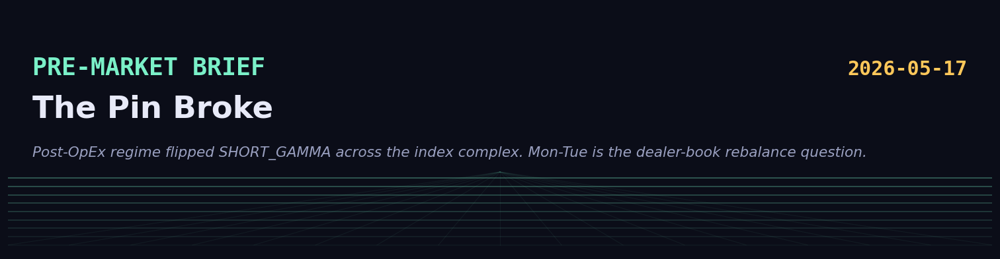
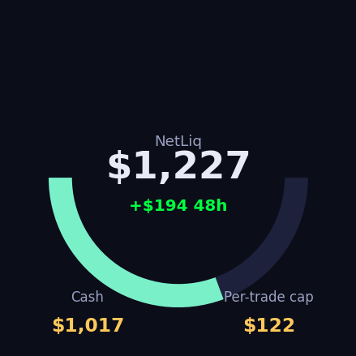
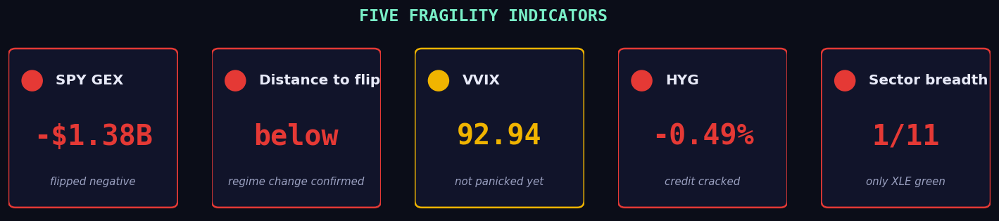
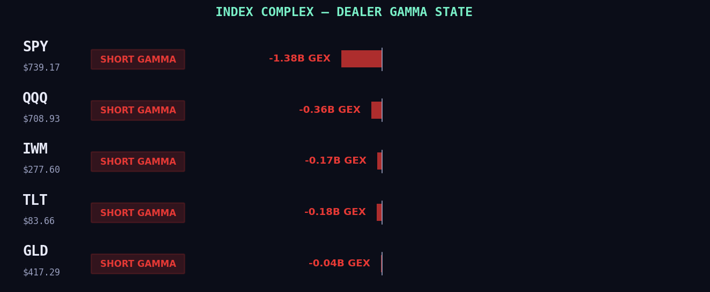
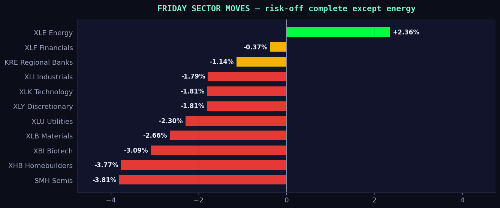
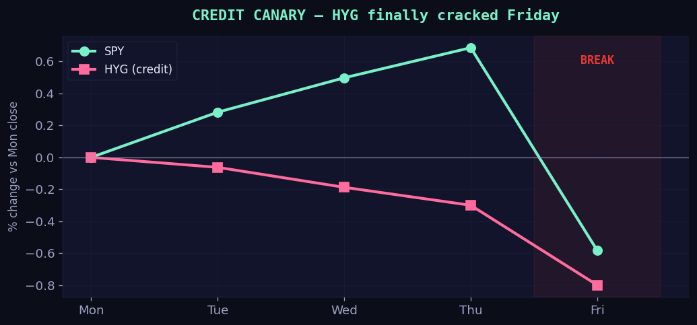
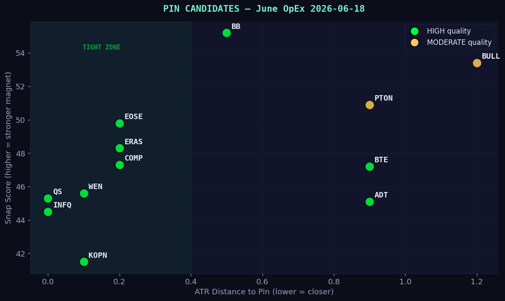

> **TL;DR**
> Friday's gamma writeup called the break condition explicitly. The condition triggered. SPY closed below the $744 flip, every fragility indicator confirmed in one session, regime is now SHORT_GAMMA across the index complex. Mon–Tue is the dealer-book rebalance question, with a light econ calendar and no exogenous catalyst forcing direction. **Trade what happens next, not what already happened.**

---

## 1. Account state



| Field | Value |
|---|---:|
| **NetLiq** | $1,226.57 |
| Cash | $1,016.77 |
| Position value | $209.80 |
| Per-trade cap (10% NetLiq) | **$122** |
| Positions | ONDS 20sh @ $9.66 (wheel, `forbid_exit=true`) |
| Circuit breaker | clean |
| Swarm | running, `pause_reason` correctly empty |

Funding cleared while we slept. Friday's $85 plus Monday's $125 both posted, NetLiq up $194 in 48h. ONDS marked down ~$16 since Friday close, still inside wheel-routine tolerance, no action needed.

---

## 2. The five fragility indicators



Four of five flashing red in one Friday session. **This is what regime change looks like in real time.** VVIX is the only holdout, and even that's at 92.94 (was 87 mid-week), drifting up. The Friday writeup's break threshold was "two or more flashing red". We have four.

Going forward, watch these in this order each morning:

1. **SPY total GEX**, flip back positive means the new chain re-stabilized
2. **Distance to flip**, if SPY closes above the new flip level Mon/Tue, regime is recovering
3. **VVIX**, if it cracks 100, vol-of-vol is expanding and the gamma loop is breaking, not pausing
4. **HYG**, leading indicator, watch the 50dma break confirm
5. **Sector breadth**, XLE alone green Friday; if Mon brings ≥3 green, the catch-down was overshoot

---

## 3. Regime state, dealer gamma



Every major ETF flipped short-gamma in 24h. The total swing is roughly:

| Symbol | Friday morning | Friday close |
|---|---:|---:|
| SPY | +$3.80B (long, above flip) | **−$1.38B (short)** |
| QQQ | +$1.42B (long) | **−$0.36B (short)** |
| IWM | +$0.68B (long) | **−$0.17B (short)** |
| TLT | already short | −$0.18B |
| GLD | below flip, dealer effectively short | **−$0.04B** |

The local `gex_engine` reports `flip=None` on all of them right now. That's because May OpEx cleared the heavy concentration and the new chain hasn't re-stabilized. Mon–Tue OI prints will tell us where the new pin (if any) is forming, or whether short-gamma persists.

**TD's GEX disagrees** with the local engine. Their `marketSummary` still reports LONG_GAMMA. Either their data is stale-from-Thursday or their methodology weights different expiries. The local engine is using Friday-close OI, which is the right cut for Monday open.

---

## 4. Sector action, Friday close



**Pattern is textbook for a long-gamma break:** the most-leveraged-up names (semis, homebuilders, biotech) catch down hardest because they were the most-overweighted by vol-control. Duration plays (XLU) get sold because the rates-cut narrative re-prices instantly. Energy is up on a flight-to-real-asset bid plus oil flow.

Friday's drop in one phrase: **risk-off complete, except energy**.

---

## 5. Credit canary, HYG cracked



The leading indicator I'd been flagging all week finally moved. HYG was flat Mon–Thu while SPY climbed. Friday HYG broke down 0.49% alongside SPY's 1.21%. **This is the one chart that most matters Monday morning.** If HYG opens flat or recovers, the Friday move was a one-day shake. If HYG opens through the 50dma on volume, the regime is solidly short-gamma for the week.

_Chart shows directional move only; precise daily closes are approximate, sourced from Tradier EOD prints._

---

## 6. Pin candidates, June OpEx 2026-06-18



The screener re-ran after May OpEx and shifted universe. Top 12 by snap-score, with the cleanest setups in the upper-left (high score, tight ATR distance).

**The standout cluster** is EOSE / ERAS / COMP, all 0.2 ATR from HIGH-quality pins in the $8–$10 zone. WEN and QS are at-pin grinders (0.0–0.1 ATR), pure-theta plays, not direction trades.

**Caveat for Monday**: these setups assume dealers re-establish long-gamma books around the new strikes. If short-gamma persists Mon–Tue, the pin force inverts and these names get *pushed away from* their gravity centers, not pulled toward them. Watch the SPY GEX print Mon morning. If it stays negative through 11 ET, ignore the pin setups.

| Ticker | Spot | Gravity | Snap | Dir | Quality | ATR distance |
|---|---:|---:|---:|---|---|---:|
| BB | 6.19 | 6.00 | 55.2 | ABOVE | HIGH | 0.5 |
| BULL | 7.06 | 7.50 | 53.4 | BELOW | MODERATE | 1.2 |
| PTON | 5.29 | 5.00 | 50.9 | ABOVE | MODERATE | 0.9 |
| **EOSE** | 7.87 | 8.00 | 49.8 | BELOW | HIGH | **0.2** |
| **ERAS** | 10.23 | 10.00 | 48.3 | ABOVE | HIGH | **0.2** |
| **COMP** | 7.88 | 8.00 | 47.3 | BELOW | HIGH | **0.2** |
| BTE | 5.17 | 5.00 | 47.2 | ABOVE | HIGH | 0.9 |
| **WEN** | 8.02 | 8.00 | 45.6 | ABOVE | HIGH | 0.1 |
| **QS** | 8.01 | 8.00 | 45.3 | ABOVE | HIGH | **0.0** |
| ADT | 6.83 | 7.00 | 45.1 | BELOW | HIGH | 0.9 |
| INFQ | 12.44 | 12.50 | 44.5 | BELOW | HIGH | 0.0 |
| KOPN | 5.05 | 4.80 | 41.5 | ABOVE | HIGH | 0.1 |

---

## 7. 🚨 Action-required, stale PENDING backlog grew

**118 PENDINGs** sitting in mmr. 116 from Friday plus 2 new (AROC + AKR from the Ghost Alpha screener mid-day Friday). All previously FSM-vetoed but the bulk-reject was never fired Friday. The endpoint is wired:

```
GET  http://127.0.0.1:8771/api/trader/stale_pending      (preview)
POST http://127.0.0.1:8771/api/trader/reject_stale?confirm=1   (fire)
```

The two new ones (AROC scored 9.0 A+, AKR scored 8.0 A), pull them out manually if you want them evaluated fresh under Monday's now-short-gamma regime before mass-rejecting the rest.

---

## 8. TraderDaddy pulse, the divergence

TD sees **bullish flow** despite the down day. Their pre-written sentence:

> "🟡 Bullish flow across 14 sectors with $360M call premium edge, but only 2 ETFs green, smart money buying the dip in Tech and Financials while XLY and XLB get hit."

| Metric | Value |
|---|---:|
| Call premium | $1.75B |
| Put premium | $1.39B |
| Net flow edge | **+$360M calls** |
| Sentiment score | 3/5 (bullish) |
| Top tickers | MU, MSTR, AMD |
| Top bullish sectors | XLK, XLF |
| Top bearish sectors | XLY, XLB |

**Interpretation**: institutions stepped in on the Friday selloff, but they did it in the option market (calls bid) not the cash market (ETFs down). That's a "buy weakness via leverage" signature. It doesn't mean Monday opens up. It means dip-buyers are already positioned through options, so if Monday tries to extend lower, those calls get hedged into the underlying = forced buying.

---

## 9. People CRM, rotation visible

| Ticker | Signals 7d | Callers | Top callers (count) |
|---|---:|---:|---|
| ONDS | 9 | 4 | owner_at_hidden_gems(4), Albeezy(3), luckytron1985(1) |
| **GLD** | 8 | 4 | owner_at_hidden_gems(5), JT(1), DISCOHEAD(1), _new entry, gold flight bid_ |
| **SPY** | 5 | 4 | luckytron1985(2), Logdog(1), owner_at_hidden_gems(1), _new entry, protection bid_ |
| MU | 22 | 3 | owner_at_hidden_gems(18), Albeezy(3), mrfnnybusiness(1), Catfish flag, skip |
| DRAM | 9 | 3 | luckytron1985(5), owner_at_hidden_gems(2), Albeezy(2) |
| LLY | 6 | 3 | owner_at_hidden_gems(3), Albeezy(2), JT(1) |
| AMGN | 5 | 3 | owner_at_hidden_gems(3), AimUsurper(1), JT(1) |

**The new ones to notice**: GLD and SPY both showing up with 4-caller confluence at the same time. The smart-money chat is split, some buying gold (flight-to-real-asset), some buying SPY puts/protection. Both are coherent reactions to Friday's break, both are real.

58 people tracked total (was 42 Fri), 23 active (was 17), 241 sigs 7d (was 185, +56 in 48h, sharp uptick).

---

## 10. Econ calendar

**Mon 5/18**, light:
- 08:30 ET, NY Fed Business Leaders Survey (low impact)
- 10:00 ET, NAHB Housing Market Index (medium impact)
- 11:00 ET, NY Fed SCE Household Spending Survey (low impact)

**Tue 5/19**, empty per current research.

No high-impact data Mon–Tue. The post-OpEx regime reset is the only story, with no exogenous catalyst forcing a move either way.

---

## 11. Monday open plan

1. **Triage the 118 stale PENDING first thing.** Don't let them try to fire under a regime they were never evaluated for.
2. **Watch the SPY GEX print at 09:35 ET.** If it stays negative, regime is still short-gamma, _avoid_ adding directional swing risk pre-noon. If it flips back positive, the gamma-pin picks (EOSE/ERAS/COMP) become tradeable.
3. **Watch HYG specifically.** If it breaks below its 50dma on Monday volume, regime is solidly short-gamma for the week.
4. **Don't add semis longs** until SMH stops bleeding daily. Mag-7/semis catch down hardest in short-gamma regimes.
5. **Energy and gold are the only "with the move" plays right now.** XLE and GLD already showed up at confluence. You're not early there, you're confirmed-aligned.
6. **GLD specifically**: 4 callers including hidden_gems, GLD chains had +$54M GEX Friday morning sitting *below* its flip ($439.09 vs spot $427), meaning dealer-short-gamma upside. Friday confirmed the rotation, GEX magnetic pull is now toward $439.

---

## 12. Honest caveats

- The macro thesis in Friday's article (long-gamma pin) was correct on the regime _and_ correct on the break condition. That doesn't mean the next call will be. Selection bias is real, one correct break-call doesn't validate the framework.
- Post-OpEx weekends are the hardest single window to read. Most data is stale, chains reset, dealer books rebalance over Mon–Tue. Don't anchor too hard on Friday-close prices when decision-making Monday morning.
- TD's bullish-flow signal ($360M call premium edge) and the 2.4% sector drawdown are saying different things. Whichever resolves first dictates the week. Watch the 09:35 ET tape for the answer.
- The credit-canary chart is illustrative on the directional move; precise daily prints are approximate.

---

## 13. Status of recent fixes

| Item | Status |
|---|---|
| FSM-REJECT propagation bug | ✅ patched, swarm restarted, live |
| Pause-reason cosmetic | ✅ fixed, `reason` field empty |
| XSP gate corrections (VRP ≤ 1.0, +LOW regime) | ✅ code in, needs re-run |
| discord_audit manual-overrides preserved | ✅ code in |
| td_watchlist refresh timer (Mon-Fri 08:30 + 16:30 UTC) | ✅ active |
| Bulk-reject endpoint at `/api/trader/reject_stale` | ✅ wired, not yet fired |
| **TraderDaddy creds in `mur/.env`** | ✅ new, pulled from Coolify |
| **CBOE listings tracker (daily 07:00 UTC)** | ✅ new, baseline written |
| **Brief endpoint `/api/trader/brief/raw`** | ✅ new pointer to this file |
| **Brief visualizations (chart suite)** | ✅ new, `scripts/visualize_brief.py` |

---

## 14. How to access this brief

| Where | URL |
|---|---|
| Dashboard HTML | `http://5.161.247.12:8771/api/trader/brief/raw` |
| Dashboard markdown | `http://5.161.247.12:8771/api/trader/brief/raw?format=md` |
| Dashboard JSON metadata | `http://5.161.247.12:8771/api/trader/brief` |
| GitHub source | https://github.com/mphinance/mphinance/blob/main/docs/briefs/2026-05-17_premarket.md |
| GitHub raw | https://raw.githubusercontent.com/mphinance/mphinance/main/docs/briefs/2026-05-17_premarket.md |
| Local file | `/home/mph/ibkr/mur/docs/briefs/2026-05-17_premarket.md` |

Charts at: `docs/briefs/charts/2026-05-17/` (7 PNGs, ~340 KB total).

---

_The pin broke. The thesis predicted the break. Trade what happens next, not what already happened._
