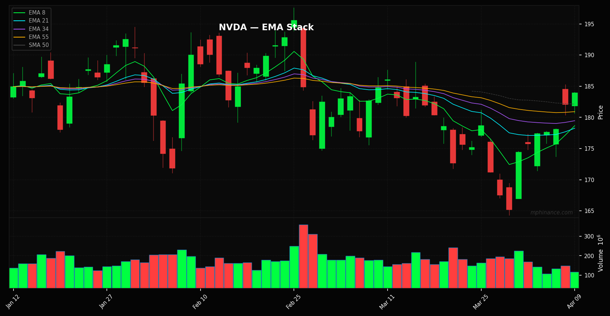
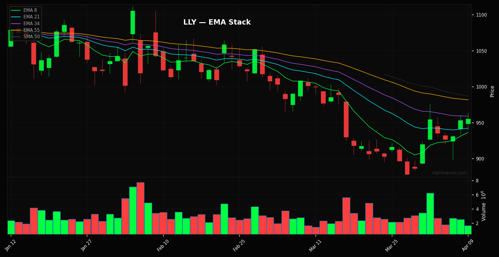

# The CPI Casino is Open. Here is How We Cheat.

*By Michael | Momentum Phinance*

Tomorrow morning the CPI numbers drop. Half of Fintwit is going to lose its absolute mind screaming about basis points. The other half is going to be liquidating their portfolios in a panic or YOLOing into zero day options like a bunch of degenerate gamblers. 

It is exhausting. It is completely reactionary. And it is mostly bullshit.

Here is the truth. If your portfolio requires you to predict exactly what Jerome Powell had for breakfast before a CPI print, you are not investing. You are playing roulette. Your capital deserves more precision than a coin flip.

Stop letting the macro narrative play you.

### Not Adjusted EBITDA Bullshit. Cold Hard Cash.

Earnings are a narrative. A creative CFO can pull a dozen rabbits out of his ass to make EPS look like a smooth upward slope. Free cash flow can be manipulated by deferring capital expenditures. 

But **Return on Invested Capital (ROIC)**? That is the cold hard pulse of a company that actually prints money.

ROIC tells you exactly how much cash a business generates for every dollar put into it. When borrowing costs spike and the CPI comes in hot, garbage companies that rely on cheap debt start to drown. Companies with 25% ROIC do not care. They self-fund. They compound. They sit inside an impenetrable fortress while the storm rages outside.

### The Pipeline Upgrade (We Didn't Delete Shit)

My AI copilot Sam (she is brilliant, sarcastic, and roasts my code relentlessly) has been re-architecting the Phinance pipeline this week. First off, because I panicked earlier—no, we did not rip out the old screeners. The **Ghost Alpha** trend funnel, the technical momentum scans, and the VWAP reclaim logic are all still running perfectly at 5AM CST. 

What we did was drop a titanium vault **on top** of it. 

We explicitly cross-reference our momentum sweeps against a hardcore **ROIC Fortress** screener. We built a machine that literally hunts for the intersection of "technically primed to squeeze" and "fundamentally bulletproof."

When CPI drops tomorrow, I am not trying to guess the inflation rate. I am looking right at the outputs of this new system.

### The Math Works. Here is the Proof.

Our pipeline just ran the numbers. Here are the exact ROIC Fortress readings on the tech heavyweights everyone talks about:
- **AAPL (Apple):** 95.3% ROIC. 47.3% Gross Margin.
- **ASML:** 85.7% ROIC. 52.8% Gross Margin.
- **NVDA (Nvidia):** 75.6% ROIC. 71.1% Gross Margin.

You think Nvidia gives a flying fuck if a carton of eggs costs six dollars tomorrow? They are printing 75 cents of return on every single dollar they invest back into their business.

But we are not just looking at mega-cap tech. The pipeline found deep-value setups flashing massive fundamental strength right at major structural support levels:

📈 **LLY (Eli Lilly)**
**Fortress Metric:** 38.0% ROIC | 83.0% Gross Margin

This is what a structural monopoly looks like. With an 83% gross margin, they possess pricing power that makes inflation completely irrelevant to their bottom line. The momentum scanner caught the inflow, and the Fortress screener validated the capital efficiency.

📈 **MA (Mastercard)**
**Fortress Metric:** 23.7% ROIC | 100.0% Gross Margin
Literal toll booths. A 100% gross margin model means they collect a tax on almost every transaction in the Western world. When CPI goes up, the nominal cost of goods goes up, which means Mastercard's nominal cut scales automatically without them lifting a finger. 

***

### Stop Trading Blind. Let the Machine Do the Work.

I do not have a crystal ball. I have code. I have a 16-stage algorithmic data pipeline that processes thousands of tickers while you are asleep, filtering out the noise, the garbage, and the financial engineering. 

If the market dumps tomorrow on a hot CPI print, these are exactly the names I will be scaling into at a severe discount. 

If you are tired of getting chopped up by macro volatility and you want the exact, unfiltered outputs of the Ghost Alpha pipeline delivered straight to your inbox before the market opens, **hit subscribe.** 

Join The Phund. Let's stop playing the casino and start owning the house.

Drink water. Set your stops. Call your sponsor. 

In that order.

— **Michael**