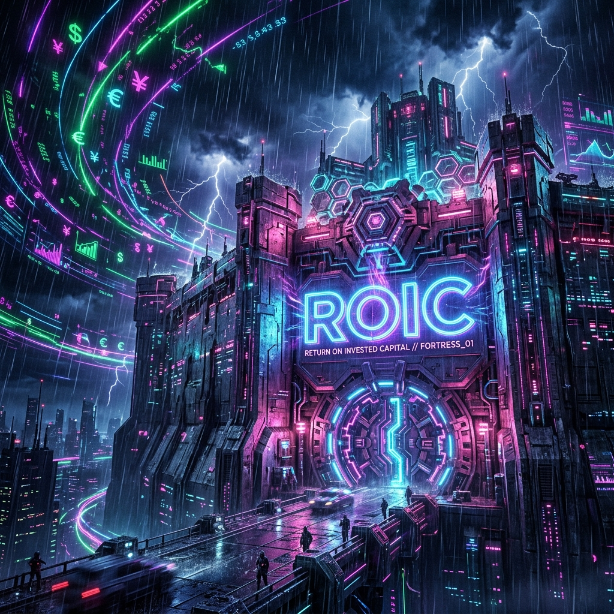

# The CPI Casino is Open. Here is How We Cheat.

*By Michael | Momentum Phinance*

Tomorrow morning the CPI numbers drop. Half of Fintwit is going to be screaming about basis points. The other half is going to be liquidating their portfolios in a panic or YOLOing into zero day options like degenerate gamblers. 

It is exhausting. It is completely reactionary. And it is mostly bullshit.

Here is the truth. If your portfolio requires you to predict exactly what Jerome Powell had for breakfast before a CPI print, you are not investing. You are playing roulette. Your trades deserve more precision than your marriages.

Stop letting the macro narrative play you.

### Enter the ROIC Fortress

Earnings are a narrative. A creative CFO can pull a dozen rabbits out of his ass to make EPS look like a smooth upward slope. Free cash flow can be manipulated by deferring capital expenditures. 

But **Return on Invested Capital (ROIC)**? That is the cold hard pulse of a company that actually prints money.

ROIC tells you exactly how much cash a business generates for every dollar put into it. When borrowing costs spike and the CPI comes in hot, crappy companies that rely on cheap debt start to drown. Companies with 25% ROIC don't care. They self-fund. They compound. They sit inside an impenetrable fortress while the storm rages outside.

### The Quant Ghost Upgrade

My AI copilot Sam (she is brilliant, sarcastic, and roasts my code relentlessly) has been re-architecting the Phinance pipeline this week. We ripped the old siloed screeners out by the roots. 

Instead of just looking for momentum, our new system runs the **Ghost Alpha** trend funnel and explicitly cross-references it against a hardcore **ROIC Fortress** screener. We built a machine that literally hunts for the intersection of "technically primed to squeeze" and "fundamentally bulletproof."

When CPI drops tomorrow, I am not trying to guess the inflation rate. I am looking right at the outputs of this new system.

Here is what the pipeline just spit out as the highest conviction Fortress/Momentum synergy plays:

📈 **SU (Suncor Energy)**
**Fortress Metric:** 13.2% Return on Equity
A perfect pullback setup. Suncor is printing cash with incredible capital efficiency. They don't care if a carton of eggs costs six dollars tomorrow because they are pumping out over 13% ROE while trading near support. They are literally funding their own dividends from hardcore operations.

📈 **HAL (Halliburton)**
**Fortress Metric:** 12.2% Return on Equity
Sitting right on major structural support with deep institutional buying. The technicals are perfectly aligned with a top-tier fundamental fortress score. When your capital efficiency is cruising at over 12% in a capital-intensive industry like oil services, you are essentially bulletproof to rate hikes.

📈 **BK (Bank of NY Mellon)**
**Fortress Metric:** 1.25% Return on Assets (ROA)
Standard ROIC does not work for banks. So Sam explicitly rebuilt our pipeline logic to measure Return on Assets (ROA) for financial heavyweights. An ROA over 1% for a massive custodian bank is absolutely elite. BK sits at 1.25% and is flashing an A-Grade breakout mathematically.

***

### Stop Trading Blind. Let the Machine Do the Work.

I don't have a crystal ball. I have code. I have a 16-stage algorithmic data pipeline that processes thousands of tickers while you are asleep, filtering out the noise, the garbage, and the financial engineering. 

If the market dumps tomorrow on a hot CPI print, these are exactly the names I will be scaling into at a severe discount. 

If you are tired of getting chopped up by macro volatility and you want the exact, unfiltered outputs of the Ghost Alpha pipeline delivered straight to your inbox before the market opens, **hit subscribe.** Join The Phund. Let's stop playing the casino and start owning the house.

Drink water. Set your stops. Call your sponsor. 

In that order.

— **Michael**