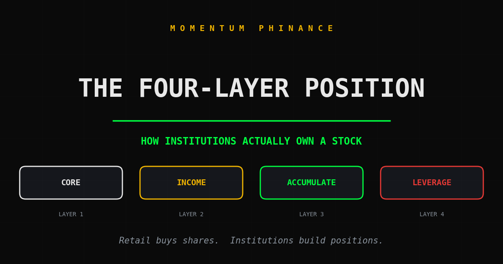
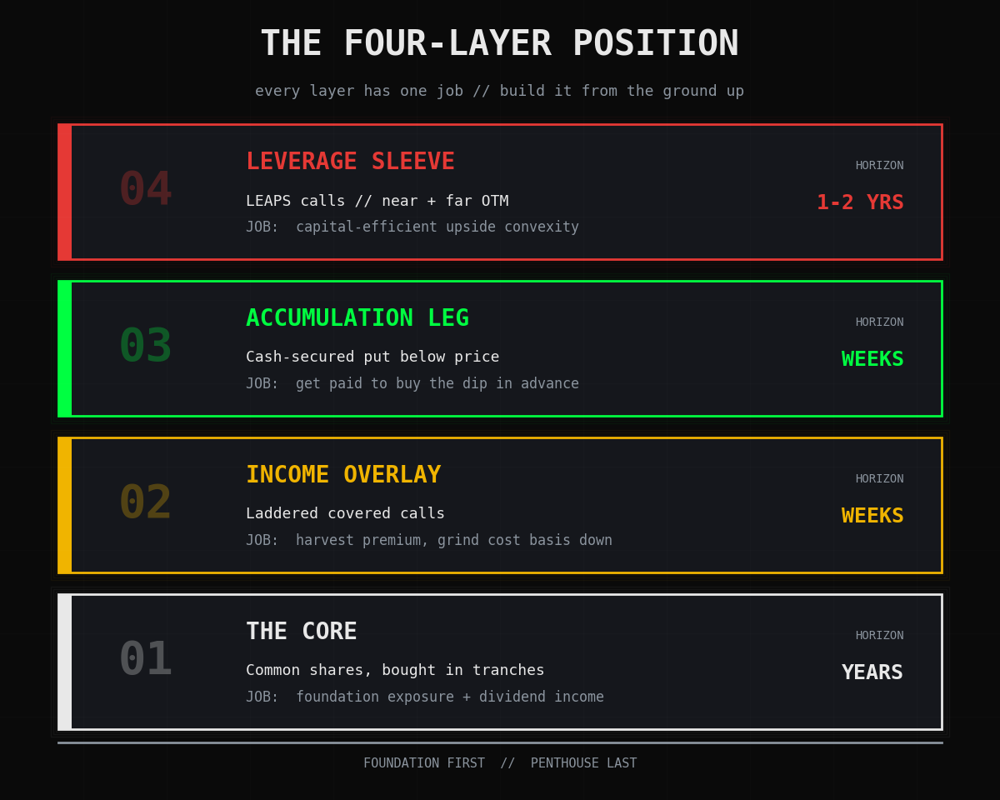
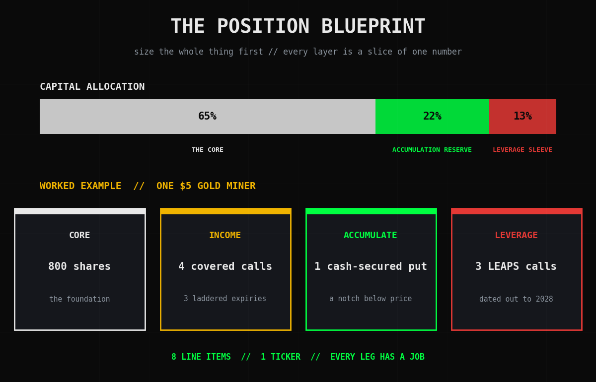
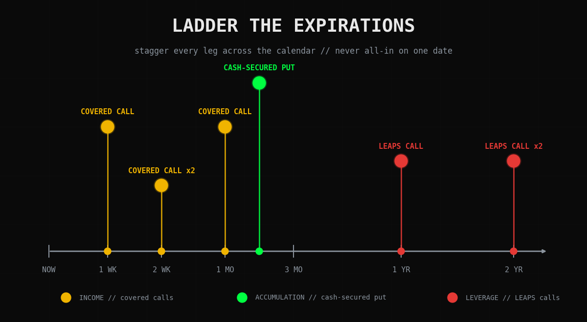

# Retail Buys Shares. Institutions Build Positions.

*by Michael Hanko, Momentum Phinance*

Most people don't own a position. They own a bet.

They liked a stock, bought 100 shares in one click, and called it a day. One price, one date, one direction. If it goes up they feel like a genius. If it goes down they're a bag holder posting cope on Reddit. That is not a position. That is a coin flip with a brokerage statement attached.

Institutions never do that. When a real fund "owns" a stock, they own a *structure*. A core. An income layer. A plan to accumulate more. A sleeve of leverage for the upside. Four jobs, four time horizons, one ticker. It looks complicated from the outside. It is actually simpler, because every piece has a job, and none of them need you to be right about next week.

Here is how to build one. You do not need a Bloomberg terminal or a nine-figure book. You need one liquid stock with a real options chain and the discipline to stop treating your account like a scratch ticket.

## The Tourist Position

Let's be honest about what most retail actually does.

You find a stock. You read a thesis, maybe your own, maybe some guy on YouTube's. You buy as many shares as your cash allows, all at once, at whatever the price happens to be that morning. Then you wait.

That is the whole strategy. Buy, wait, hope.

The problem is not the stock. The problem is the *shape*. A single block of shares bought at a single price has exactly one source of return: the price going up. No income while you hold. No mechanism to lower your cost. No extra juice if you are right. No plan at all if you are wrong. You handed your entire outcome to a number you do not control.

Institutions get paid four different ways on the same ticker. The tourist gets paid one. That gap has almost nothing to do with stock picking. It is position construction, and position construction is a skill you can copy for free.

## The Four-Layer Position

A real institutional-style position has four layers. Each one does a job the others cannot.

Think of it like a building. The core is the foundation. The income overlay is the floor you rent out. The accumulation leg is a cheap option to add more floors later. The leverage sleeve is the penthouse view you got for a fraction of the price. Build it from the ground up.

### Layer 1: The Core

The core is real stock. Actual shares, in size, in a name you would be genuinely fine holding for years.

Two rules for the core.

**Build it in tranches, not in one click.** Institutions do not buy 800 shares at 10:31 on a Tuesday. They scale in. Some now, some on a dip, some on confirmation. You will never nail the exact bottom. Scaling in means you never have to.

**Pick something that pays you to wait.** The core should ideally throw off a dividend. While the other three layers do their work, the core quietly collects rent. A boring dividend payer beats an exciting story stock for this slot every single time.

The core is not where you get rich. The core is the thing the other three layers are bolted onto. Boring is the entire point.

### Layer 2: The Income Overlay

Once you own shares, you can rent them out. You sell covered calls against the core and pocket the premium. That is the income overlay.

Here is where retail butchers it. They sell one call, against all their shares, on one expiration date. That is not an overlay. That is a single bet that the stock holds still.

Do it the institutional way instead. **Ladder it.**

Sell calls across multiple expiration dates. One contract expiring next week. A couple the week after. One a month out. Now you are harvesting premium continuously, you are never fully exposed to a single date, and every week something expires and gets rewritten at fresh prices. That staggered term structure turns covered calls from a gamble into a paycheck.

And **do not cover everything.** If you own 800 shares, sell calls against maybe half of them. The uncapped half stays free to run if the stock rips. Full coverage sells off all your upside for a few bucks of premium. Partial coverage keeps the dream alive while still cashing checks every week.

The income overlay has one job: grind your cost basis down, week after week, whether the stock goes up, down, or nowhere at all.

### Layer 3: The Accumulation Leg

Layer three is how institutions get paid to buy the dip before the dip even shows up.

You sell a cash-secured put at a strike below the current price. Someone pays you premium for the right to sell you shares down there. Two outcomes, both of them fine.

The stock stays up: the put expires worthless, you keep the premium, that is free money for agreeing to a price you liked anyway.

The stock falls to your strike: you buy shares at a level you already decided was a good entry, and the premium you collected makes your real cost even lower.

That is the accumulation leg. It is a standing order to add to your core at a discount, except the market pays you to place the order. The tourist either panic-buys dips with no plan or freezes. The institution pre-decided the add price and got compensated for the patience.

### Layer 4: The Leverage Sleeve

The last layer is upside leverage, and you build it with LEAPS: long-dated call options, a year or more until expiration.

A LEAPS call hands you stock-like upside for a fraction of the capital. Because expiration is so far out, the daily time decay is slow, so you are not bleeding premium the way a weekly option bleeds. It is the closest thing to leverage that will not detonate over one bad week.

Build the sleeve in two pieces.

**A near-the-money LEAPS for conviction.** Strike close to the current price, dated 12 to 24 months out. This is your "if the thesis is right, I want more exposure than my cash alone could buy" position.

**An out-of-the-money LEAPS for convexity.** A cheap, higher-strike, far-dated call. It costs almost nothing and does almost nothing, right up until the stock has a monster move, and then it does everything. A lottery ticket, except this one has a real thesis stapled to it.

Keep the sleeve small. It should be. It is the spice, not the meal.

## Here's the Truth

Stack the four layers together and look at what you actually built.

A core that pays a dividend. An income overlay that prints premium every week and chips away at your basis. An accumulation leg that gets paid to buy your dips. A leverage sleeve that turns a big move into a life-changing one. Four income streams. Four time horizons. One ticker.

Here is the part nobody tells you. **You stopped needing to be right about next week.**

The tourist with 100 shares needs the price to go up, and soon, or the position does nothing at all. The four-layer position makes money in almost every scenario. Stock goes nowhere? The overlay and the put still pay you. Stock dips a little? Your basis keeps dropping and the accumulation leg fills at a discount. Stock rips? The uncapped core and the LEAPS go to work. The only scenario that genuinely hurts is a violent, permanent collapse, and you manage that one with position size, not cleverness.

That is what "institutional" actually means. Not fancier. Not faster. Not some secret data feed. Just a position shaped so that time, volatility, and patience are all working for you instead of against you.

I run exactly this structure on a single $5 gold miner in my own account right now. Core shares. A ladder of short calls stacked across three expirations. A cash-secured put sitting underneath. Three LEAPS stretching all the way out to 2028. One ticker, four layers. It is the calmest position I own and the one that pays me the most reliably. That is not a coincidence.

<!--paywall-->

## Building It Yourself: The Order of Operations

Free readers got the architecture. Paid readers get the build order, the sizing rules, and the mistakes that quietly wreck this thing.

**Step 1: Size the whole position first. Everything else is a percentage of that number.**

Decide the full dollar amount you are willing to commit to this ticker. That number is your ceiling, and you do not exceed it. The core shares get roughly 60 to 70 percent. The accumulation leg needs its cash set aside, because a cash-secured put is only honest if the cash is actually there, so reserve about 20 percent for that. The leverage sleeve gets the leftovers, and it should never run past 10 to 15 percent. If every LEAPS in the sleeve went to zero tomorrow, it should annoy you, not hurt you.

**Step 2: Build the core in three tranches.**

Split your core budget into thirds. Buy the first third now, so you have skin in the game. Buy the second third on a real pullback. Buy the last third on either a deeper flush or a confirmed move back up. You are not timing the bottom. You are refusing to bet everything on one print.

**Step 3: Start the income overlay only after the core exists.**

You cannot sell a covered call without shares to cover it. Once the core is on, sell your first calls against no more than half the share count, and stagger the expirations. A common ladder: one contract about a week out, one or two about two weeks out, one about a month out. As each expires, rewrite it further out at a fresh strike. The ladder should always have rungs.

**Step 4: Drop the accumulation put underneath.**

Sell one cash-secured put at a strike that is a genuine "yes, I will happily own more here" price, usually a notch below the current price, dated a few weeks to a month out. The cash for assignment is the 20 percent you already reserved. If you get assigned, congratulations, that is the plan working. Those new shares become core, and you start selling calls against them too.

**Step 5: Add the leverage sleeve last, and add it slow.**

Buy the near-the-money LEAPS first. Only add the out-of-the-money convexity LEAPS when the sleeve budget allows it. Never finance the sleeve by shrinking the core. The order matters: foundation first, penthouse last.

## The Worked Example

Here is the structure on the gold miner I mentioned, so you can see it in the wild instead of in theory.

The core is 800 shares. The income overlay is four short calls laddered across three separate expirations, struck at and just above the share price, covering only 400 of the 800 shares, so half the core stays uncapped. The accumulation leg is one cash-secured put sitting a notch below the current price about a month out. The leverage sleeve is three LEAPS: two near-the-money calls dated into 2027 and 2028 for conviction, and one cheaper, higher-strike 2028 call for convexity.

That is it. Eight line items on one ticker, and every single one of them has a defined job. Nothing in that position is a hope. Nothing is a coin flip. The shares pay a dividend, the calls pay premium, the put pays me to wait for a dip, and the LEAPS are coiled for the move I actually believe is coming. Whatever the stock does next week, the position has an answer.

## What to Do Monday

Pick one liquid stock you would be comfortable owning for years. Not your most exciting idea. Your most boring, durable one. The kind of name you would not panic-sell at 9:35 on a red morning.

Size the full position. Carve it into the layers. Buy your first core tranche. That is the whole assignment for week one. The overlay, the put, and the sleeve come after the core exists, not before.

You are not trying to get rich by Friday. You are building something that pays you in four directions while you sleep. That takes a few weeks to assemble and then it runs more or less on its own.

## The Closer

I built my life the same way I now build a position. In layers, in order, foundation first.

In active addiction I wanted the penthouse with no building under it. The result, the feeling, the win, all of it right now, with nothing poured underneath to hold the weight. It does not work in recovery and it does not work in a brokerage account. You pour the foundation. You let it cure. Then, and only then, you build the floors that pay you, and last of all you allow yourself the view.

A position, like a sober life, is not a single dramatic bet. It is four boring layers, stacked in the right order, doing their quiet jobs while you stay out of your own way.

Build the foundation. The penthouse comes last. It always comes last.

*Not financial advice. I am a felon with a brokerage account and a strong opinion about position construction. Build your own, size it so a total loss only annoys you, and never sell a put with cash you do not actually have.*

---

**Subscribe to Momentum Phinance for the live position tracker, the weekly premium tally, and every layer of the book as it gets built in real time. Half of every paid subscription goes straight into the brokerage account. You are literally funding the foundation.**

- Michael Hanko, Managing Partner, The Phund
