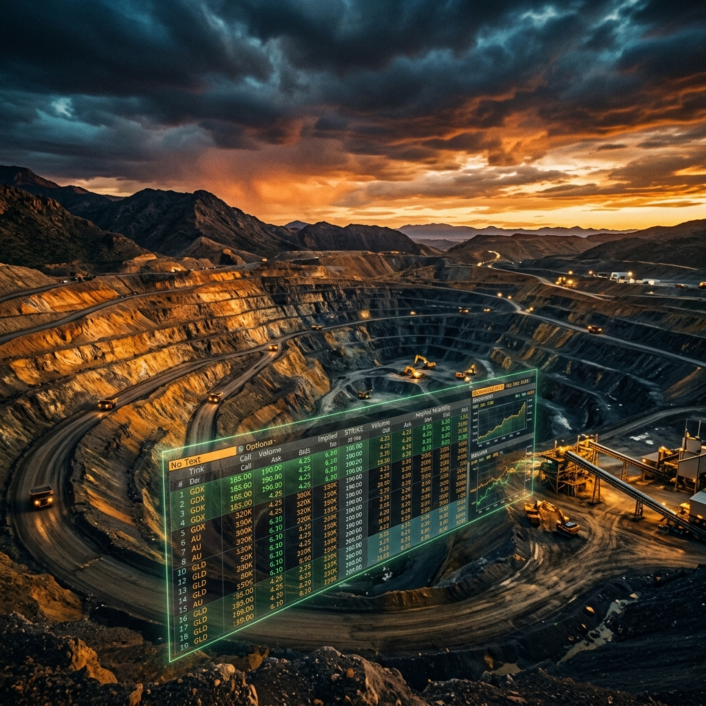
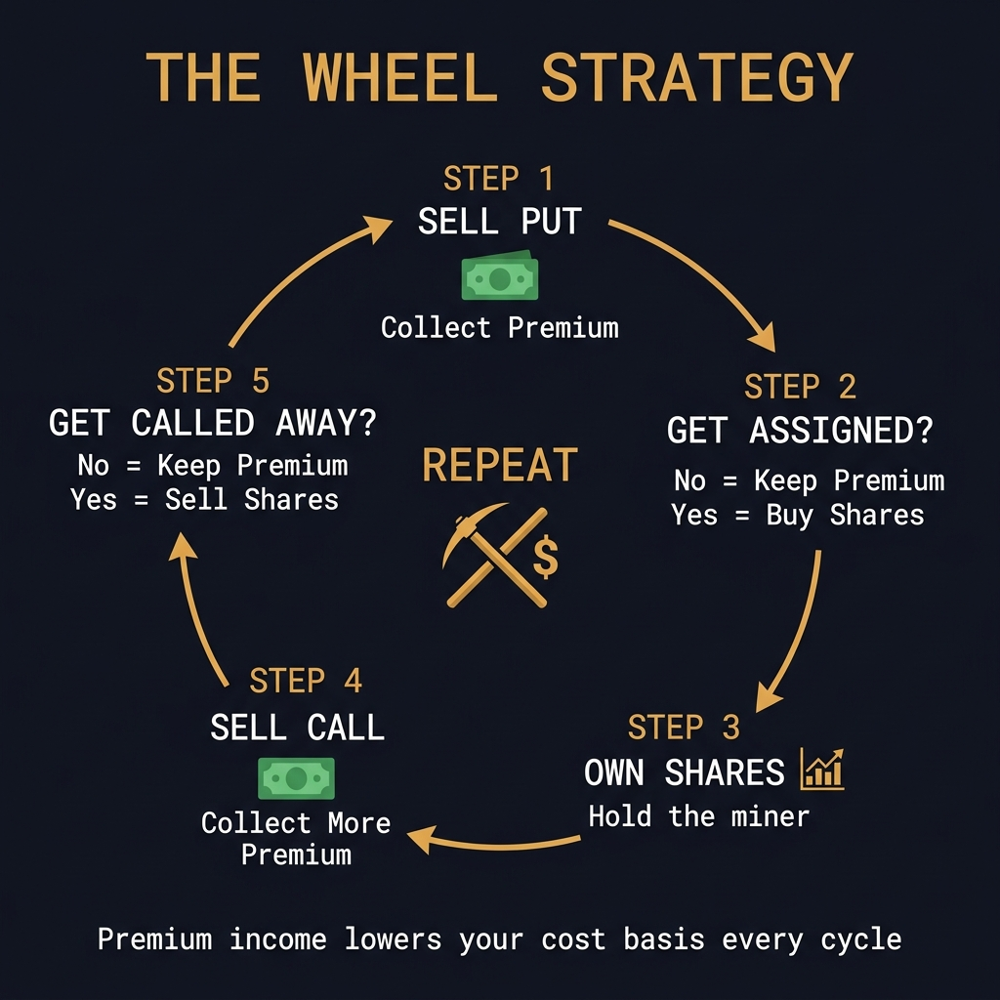
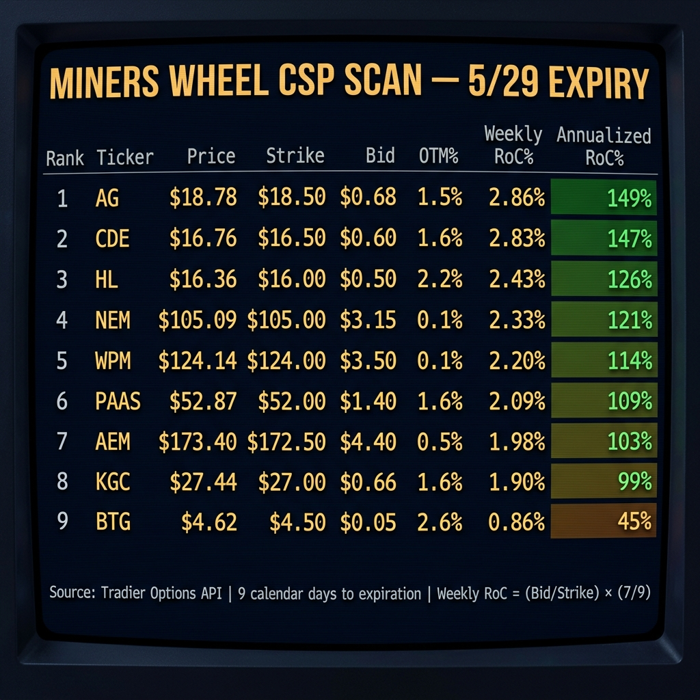
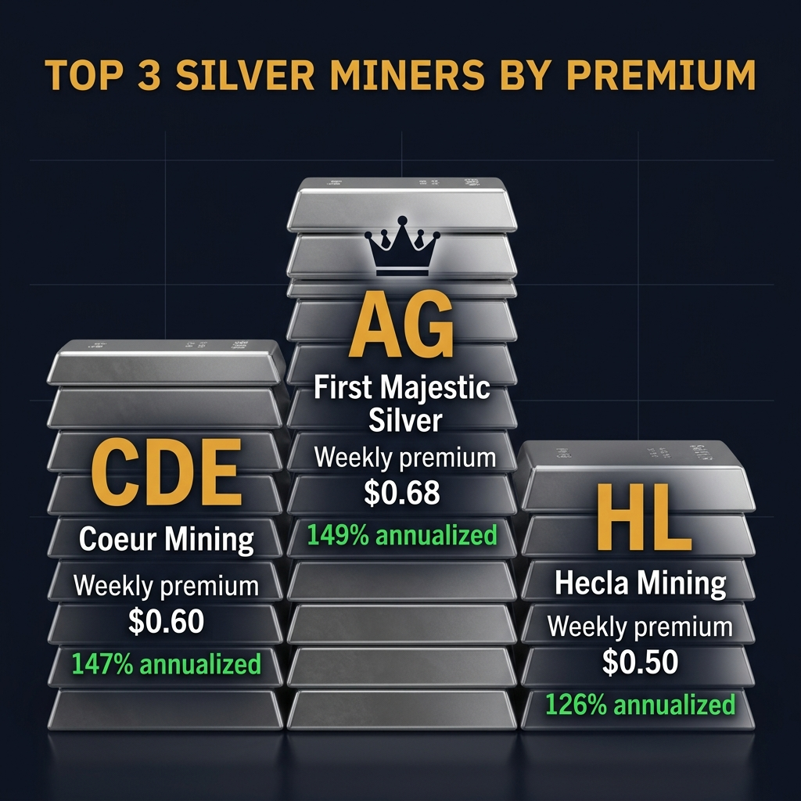
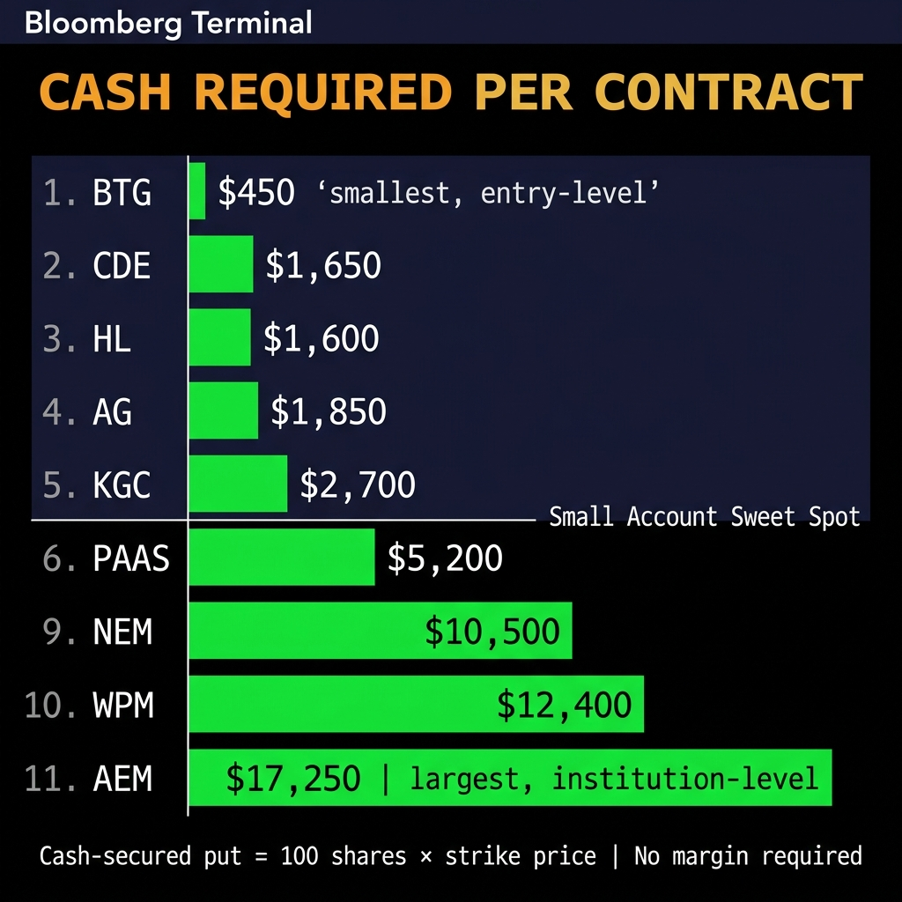
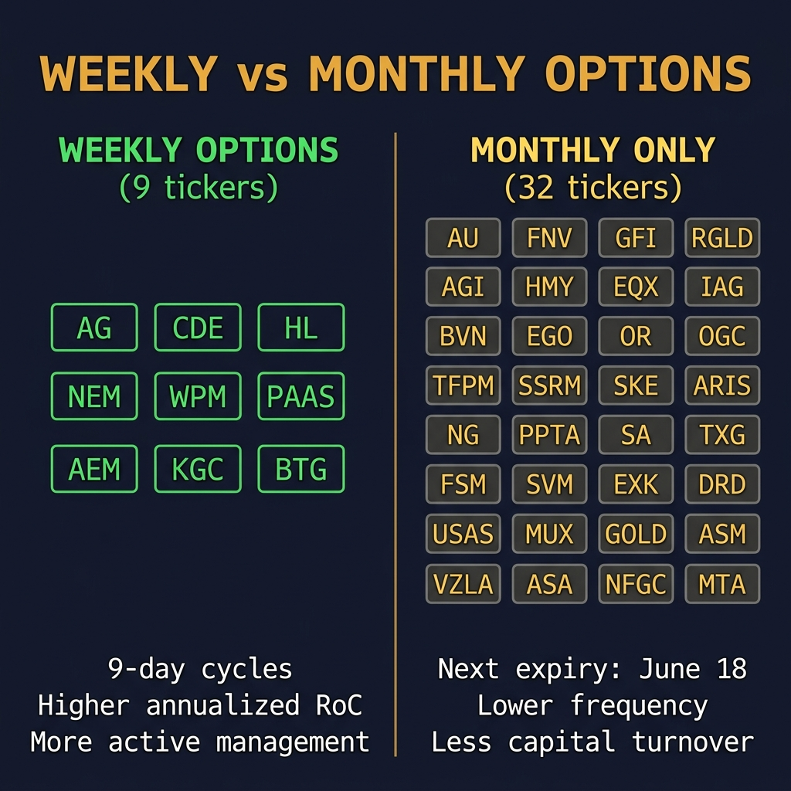

# I Scanned 41 Gold Miners for Cash-Secured Puts. Only 9 Had Weekly Options. Here's What Pays.

*by Michael Hanko, Managing Partner, The Phund*

Last week I showed you the BTG wheel. $591 in premium. 36 contracts. A nicotine habit fully funded by a $5 gold miner.

A few of you asked: "What else can I wheel?"

So I built a scanner. I took every US-listed gold and silver miner held by at least one major mining ETF (GBUG, GDX, GDXJ, RING, SLVP, SILJ, GOAU, SIL, SGDM, SGDJ), filtered for active options chains, and ran them through the Tradier API looking for cash-secured put setups expiring May 29.

41 tickers. 10 mining ETFs worth of institutional conviction. One question: what pays the most premium relative to capital this week?

## The Filter

Here's what I scanned for:

**Expiration:** May 29, 2026 (9 calendar days out)

**Strike:** The highest put strike at or below the current stock price. One strike out of the money. This is the sweet spot for wheeling because if you get assigned, you're buying at a price the stock was just trading at. Not reaching down to some random deep OTM strike for pennies.

**Metric:** Weekly Return on Capital. The formula is dead simple.

**Weekly RoC = (Put Bid / Strike Price) x (7 / Days to Expiration)**

If you sell a $16.50 put on CDE for $0.60 with 9 days to expiration, you're putting up $1,650 in cash to collect $60. That's a 2.83% return in a little over one week. Annualized, that's 147%.

No, you will not make 147% over a full year doing this. That's not how annualization works in practice. But it gives you a normalized way to compare which miners are paying the fattest premium relative to risk right now.

## How the Wheel Works

If you're new here, this is the strategy in one image:

Sell a put. Collect premium. If the stock stays above your strike, you keep the cash and do it again. If it drops below, you get assigned 100 shares at a price you were willing to pay. Then you sell covered calls on those shares. Collect more premium. If the stock gets called away, you pocket the gain and go back to selling puts.

The wheel turns. Premium income lowers your cost basis every cycle. That's literally all there is to it.

## The Results

Out of 41 miners, only 9 had weekly options expiring May 29. The other 32 only offer monthly options (next one is June 18). If you want to wheel weekly, your universe is smaller than you think.

Let me break down what you're looking at.

## The Top 3: Silver Miners Go Hard

**#1 AG (First Majestic Silver) - 2.86% weekly, 149% annualized**

The $18.50 put is bid at $0.68 with AG trading at $18.78. That's only 1.5% out of the money, meaning there's a real chance you get assigned. But that's the point. You'd be buying First Majestic at $17.82 effective cost ($18.50 minus $0.68 premium). Silver has been running. If you're bullish on silver miners, getting paid to enter a position is not a bad deal. $1,850 cash per contract.

**#2 CDE (Coeur Mining) - 2.83% weekly, 147% annualized**

Coeur is the one that catches my eye. The $16.50 put pays $0.60 with the stock at $16.76. Open interest on this strike is 1,230 contracts. That is massive for a mid-cap miner. When you see that much OI, it tells you this is a liquid, well-traded options name. CDE appears in 5 of the 10 mining ETFs I track. Institutional consensus. $1,650 per contract.

**#3 HL (Hecla Mining) - 2.43% weekly, 126% annualized**

Hecla at $16.36, $16.00 put pays $0.50. The 2.2% OTM cushion is the widest of the top 3, giving you a little more breathing room. HL is the oldest silver miner in North America and has been around since 1891. If you're going to get assigned 100 shares of something, might as well be a company that survived two world wars and the Great Depression. $1,600 per contract.

## The Blue Chips: Premium With Prestige

**#4 NEM (Newmont) - 2.33% weekly, 121% annualized**

The big dog. $112 billion market cap. The $105 put pays $3.15. Only 0.1% OTM, so this is basically at-the-money. You're getting paid because NEM has real volatility (48% IV) despite being the largest gold miner on earth. The catch: $10,500 per contract. This is not a small account play.

**#5 WPM (Wheaton Precious Metals) - 2.20% weekly, 114% annualized**

Wheaton is a streaming company, not a traditional miner. They fund mines in exchange for a cut of production at fixed prices. Lower operational risk. The $124 put pays $3.50. Only 3 contracts of open interest on this strike though, which means the spread might be wide when you try to fill. $12,400 per contract.

**#6 PAAS (Pan American Silver) - 2.09% weekly, 109% annualized**

Pan American is in 5 of 10 mining ETFs. The $52 put pays $1.40 at 1.6% OTM. Solid middle-of-the-road play. Not the sexiest premium, not the biggest capital requirement ($5,200). The Toyota Camry of miner CSPs.

**#7 AEM (Agnico Eagle) - 1.98% weekly, 103% annualized**

Agnico is the prestige pick. $86 billion market cap, Canadian flagship, 4 ETFs hold it. The $172.50 put pays $4.40. But you need $17,250 in cash per contract. This is for the bigger accounts. The premium is there, it just takes more capital to access it.

**#8 KGC (Kinross Gold) - 1.90% weekly, 99% annualized**

Kinross at $27.44, the $27 put pays $0.66. Just barely under 100% annualized. $2,700 per contract makes this the most accessible of the gold miners (after BTG). If NEM is too expensive and BTG is too cheap, KGC sits right in the middle.

**#9 BTG (B2Gold) - 0.86% weekly, 45% annualized**

My baby. The stock I've been wheeling since February. At $4.62 with the $4.50 put paying $0.05, it is clearly the lowest premium on the board. But it is also the lowest entry cost at $450 per contract. You could sell 10 of these for the same capital as one NEM. And if you get assigned, you're buying a gold miner at $4.45 effective cost in a gold bull market. I have done this exact trade 36 times. It works.

<!--paywall-->

## The Capital Question

This is where it gets real.

If you have a $5,000 account and you want to wheel miners, your realistic options are BTG ($450), HL ($1,600), CDE ($1,650), AG ($1,850), and KGC ($2,700). That's it. The bigger names (NEM, WPM, AEM) need five figures per contract.

Here's the play I like for a small account: sell one CDE $16.50 put for $60 and one BTG $4.50 put for $5. Total premium: $65. Total capital tied up: $2,100. Combined weekly RoC: 2.41%. If both expire worthless, you made $65 in 9 days on $2,100. Sell the same trades next week. Repeat.

If CDE gets assigned, you own 100 shares of a gold and silver miner held by 5 major ETFs. Start selling covered calls at $17 or $17.50. You are now running the wheel.

If BTG gets assigned, welcome to the club. I have 721 shares and counting. Start selling $5.00 calls. That's my Zyn money right there.

## Why Only 9?

32 of these miners only have monthly options. No weeklies. That doesn't make them bad wheel candidates, it just means you're locking up capital for 30 days instead of 9. The monthly June 18 expirations on stocks like GOLD (Barrick), GFI (Gold Fields), EGO (Eldorado), and IAG (IAMGOLD) are worth scanning too if you don't mind the longer duration.

But for weekly income, the nine names above are your universe. And honestly, that's fine. You don't need 41 options to wheel. You need 2 or 3 good ones that you understand, that have enough liquidity to fill your orders, and that you'd be happy owning if you get assigned.

I'd be happy owning any of these nine. They're all real companies mining real gold and silver in a macro environment that favors precious metals. Central banks are still buying. The dollar is still wobbly. And I'm still collecting premium every week while the rest of the market argues about whether AI is overvalued.

## The Math Behind the Scan

For the nerds (I say this with love, because I built this scanner at 7am before market open):

Weekly RoC = (Bid Price / Strike Price) x (7 / Calendar Days to Expiration)

Annualized RoC = Weekly RoC x 52

I used the bid price, not the mid or the ask. The bid is what you can actually sell for right now. Mid prices are theoretical. I don't trade theoretical.

I sourced every number from the Tradier Options API. Live chain data, live Greeks. The scanner script pulls batch quotes for all 41 tickers, checks which ones have 5/29 expirations, grabs the put chain, finds the strike just below the current price, and calculates everything automatically.

The full scan took about 30 seconds. Gold miners ranked by premium efficiency. No manual spreadsheet. No guessing. Sam (my AI copilot) wrote the scanner while I poured coffee.

## What's Next

I'm going to keep running this scan every week. I want to build a historical database of which miners consistently produce the best wheel premiums so I can show you trends over time instead of just a single snapshot.

I'm also working on adding the covered call side. Once you get assigned shares from a CSP, the natural next step is selling calls. That data plus the put data gives you the complete wheel economics for every miner.

For now, the play is simple: pick a miner you believe in, sell a put at the strike just below the current price, collect premium, and either keep the cash or get assigned shares you wanted to buy anyway.

Drink water. Sell premium. Call your sponsor. Stack gold.

*Not financial advice. I'm a felon with a brokerage account, a Python script, and an AI copilot that roasts my code. But every number in this article came directly from the Tradier Options API and is verifiable. The scanner script is on GitHub.*

---

**Subscribe to Momentum Phinance for weekly CSP scans, wheel trade updates, and the ongoing BTG saga. The scanner runs before market open every week and subscribers get first look.**

- Michael Hanko
