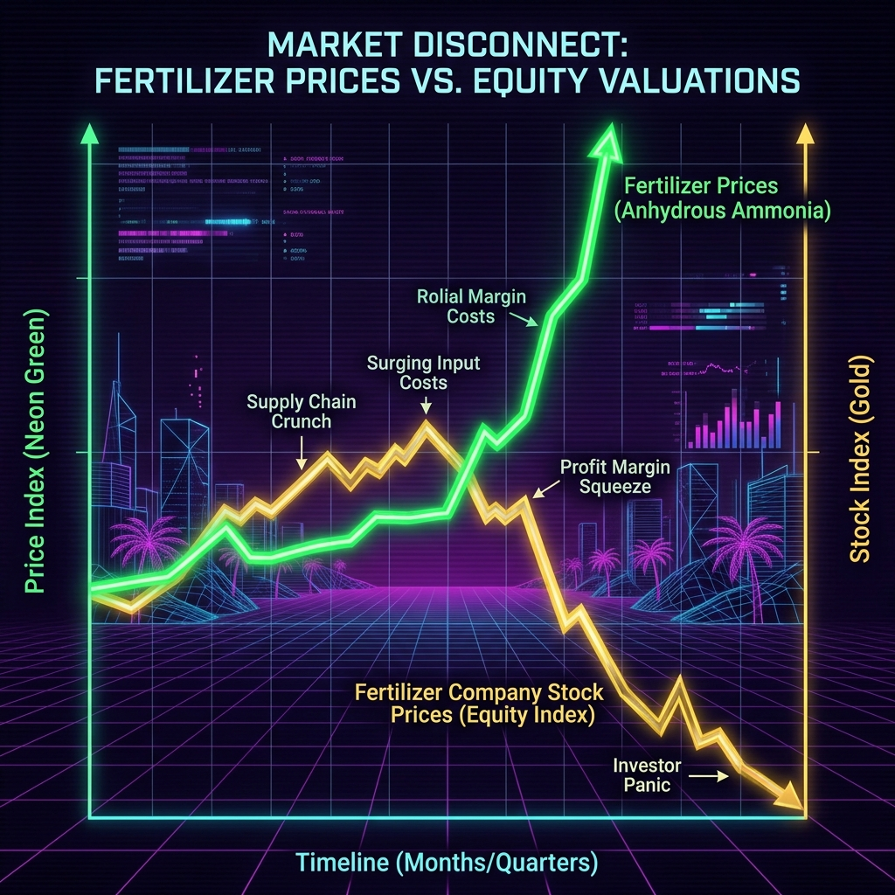

# The Hormuz Money Glitch: Why $1,100 Fertilizer is Crashing Fertilizer Stocks

Earnings are mostly bullsh*t. But supply chain destruction? That is pure math.

Everyone is panicking about $150 crude oil. That is amateur hour. The real crisis isn't in your gas tank. It is in the damn soil. 

The Strait of Hormuz closure just wiped out 50% of global seaborne urea exports. Let that sink in. Half the world's supply of the stuff that makes food grow is trapped behind a geopolitical blockade. 

Japan is releasing 80 million barrels of oil from reserves. Air New Zealand just suspended earnings guidance because of jet fuel costs. Over 800 vessels are stranded in a war zone. But you know what you can't release from a strategic reserve? Anhydrous ammonia.

Here is the truth. The market is broken, and we are seeing a massive disconnect. Anhydrous ammonia prices just spiked 36% to $1,124 per ton. Liquid nitrogen is up 25%. If you are a Midwest corn farmer, your production costs just jumped 27 bucks an acre. That destroys farm margins. 

But look at the equity markets. You would think domestic fertilizer giants like CF Industries (CF), LSB Industries (LXU), Nutrien (NTR), and CVR Partners (UAN) would be printing money right now. They are outside the conflict zone. They have cheap US natural gas inputs. They should be capitalizing on this money glitch.

Instead? We are seeing widespread bearish crossovers. Prices for CF, LXU, and NTR are dropping despite their core products skyrocketing in value. 

Why is the market punishing the exact companies that should be profiting? 

It comes down to three basic truths. 

First, demand destruction. At $1,124 a ton, farmers don't just eat the cost. They plant less nitrogen-intensive crops like soybeans. They skip applications. The market knows that sky-high prices eventually cure sky-high prices by killing the demand.

Second, the broader macro environment is terrified. With crude hitting $150 and global GDP projected to drop by almost 3 percentage points, algorithms are blindly selling anything tied to cyclical commodities. They are pricing in a global recession. They are completely ignoring the localized monopoly these domestic producers just gained.

Third, implied volatility is through the roof. CF is sitting at an 83% IV rank. LXU is at 81%. Options traders are pricing in massive, violent moves. The uncertainty is making institutional capital run for the hills.

I don't have a crystal ball. My track record has enough dents in it. But this is exactly the kind of setup we look for in The Phund. The market is confusing a macro panic with a micro fundamental tailwind. Domestic fertilizer producers are sitting on a structural advantage. Yes, demand might soften. But the margin expansion on the volume they do sell is going to be absurd. 

Stop letting Wall Street play you. This is a supply shock, pure and simple. The world still has to eat. 

Subscribe below if you want to see exactly how we are trading this volatility.
