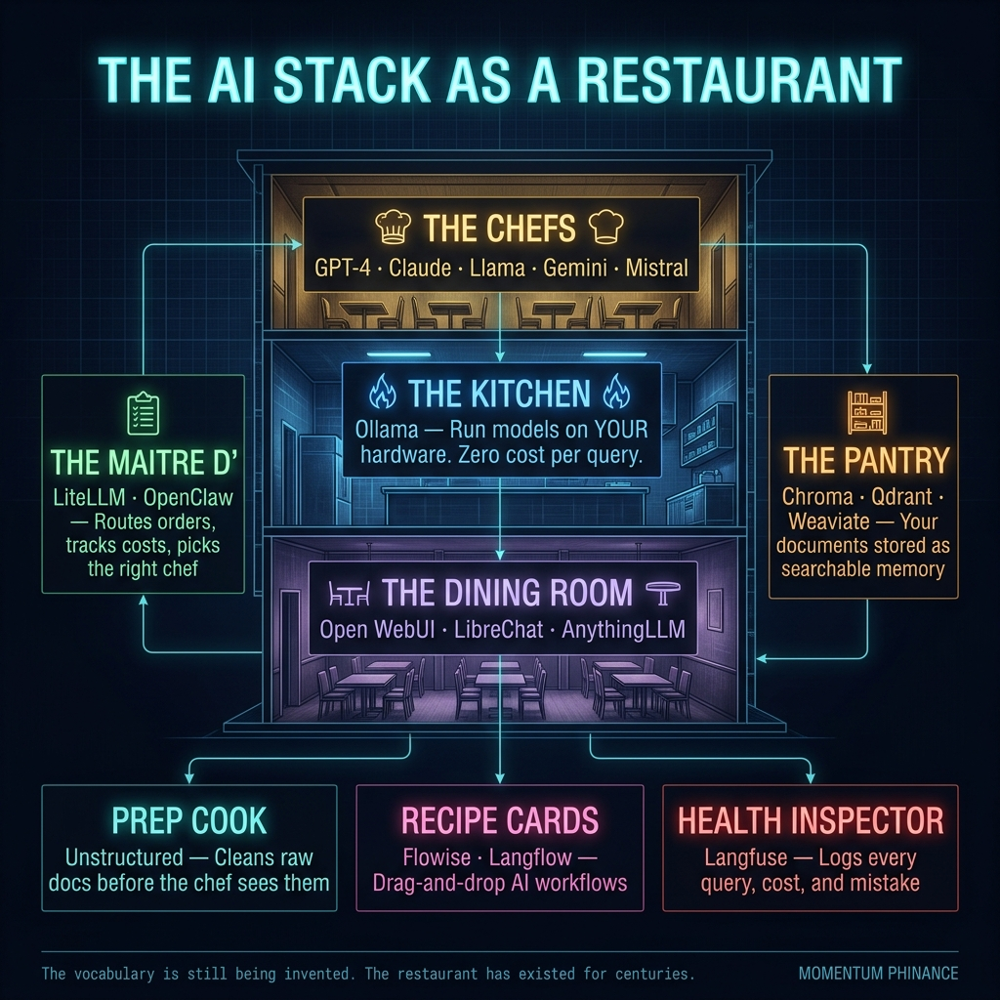

# The AI Infrastructure Menu: You've Been Eating at the Restaurant, Now Own the Kitchen

*[IMAGE PROMPT: A sleek, dark-themed restaurant at night — glowing neon sign, heavy fog, a silhouette of a chef visible through a steamy kitchen window. Cinematic. Brooding. Think "high-end but slightly dangerous." Text overlay reads: "Stop ordering takeout from OpenAI."]*

Most of you have been eating at the restaurant.

ChatGPT. Claude. Gemini. You type, a plate shows up. Tastes good. You have absolutely no idea what's happening in the kitchen, who cooked it, what it cost per dish, or whether you're the customer or the cow.

I spent the last six months learning how to own the kitchen. Here is what matters.

## The Chefs

*[IMAGE PROMPT: Four chefs in a professional kitchen — distinct personalities, same white coats. Labels floating above them: "GPT-4," "Claude," "Llama," "Gemini." Dark, dramatic lighting. Kitchen steam.]*

GPT-4, Claude, Llama, Gemini, Mistral... these are the chefs.

They're the talent. They do the work. They're good. But a chef sitting alone in an empty building feeds no one. You need a kitchen, a pantry, a dining room, and someone managing the front door.

Models aren't the product. They're labor. Once that clicks, you stop worshipping them and start managing them.

---

## The Kitchen: Ollama

*[IMAGE PROMPT: A powerful, gleaming kitchen interior. State-of-the-art equipment. No windows to the outside world, completely self-contained. A single chef works confidently at the stove. Label: "Ollama — Your Kitchen." Dark blue-black color palette.]*

Ollama is the physical kitchen.

It's the space and equipment that lets you run a chef *in your own building* instead of ordering takeout from OpenAI every single time. Your hardware. Your kitchen. No per-meal bill.

You can run a genuinely capable AI model on your own machine, completely offline, and it costs exactly zero dollars per query. The capital expenditure is hardware. The marginal cost is electricity.

Sound familiar? It should. That's how every other asset-heavy business in history works.

---

## The Dining Room: Open WebUI, LibreChat, AnythingLLM

*[IMAGE PROMPT: Three distinct restaurant dining rooms side by side. One is sleek and minimal (Open WebUI), one is warm and cozy (AnythingLLM), one is modern and chaotic-good (LibreChat). Same kitchen behind all three. No people — just vibes.]*

These are different dining rooms. Each has a different vibe, layout, and feel.

Open WebUI looks like if Apple designed ChatGPT. LibreChat gives you multi-model chaos in the best way. AnythingLLM is built for organizations that want to drop in their documents and stop losing institutional knowledge every time an employee quits.

The food is the same. The kitchen is the same. The experience differs.

The point is: you get to choose. When you own the restaurant, you decide what kind of establishment you're running.

---

## The Maitre d': LiteLLM and OpenClaw

*[IMAGE PROMPT: A sharply dressed maitre d' standing at a podium at the front of a fine dining restaurant. Calm, authoritative expression. He's holding a clipboard showing "Cost: $0.003 | Chef: Claude | Route: Local Kitchen." Dark jacket, candlelit background.]*

Nobody explains this piece. It runs the show.

The maitre d' stands at the front of the house. Takes your order. Decides which kitchen or which chef handles it. Tracks what everything costs. If the local kitchen is slammed, routes you to the next one. Keeps the tab. Reports back at end of service.

LiteLLM is the proxy. OpenClaw adds routing, personas, and multi-channel on top.

When I ask my system a trading question, the maitre d' decides: is this a quick lookup that a fast cheap model handles, or is this a high-stakes decision that needs my best chef? That routing logic alone has saved me real money and gotten better answers.

---

## The Pantry: Chroma, Qdrant, Weaviate

*[IMAGE PROMPT: A massive, organized walk-in pantry. Shelves of labeled ingredients stretching back into darkness. A chef is scanning shelves, pulling a specific item. Labels on shelves read: "Earnings Reports," "Past Conversations," "Research Notes," "Trade Logs." Dark, moody lighting.]*

When you ask a great chef a question, they don't just wing it from memory alone. They check the pantry first.

The pantry is where your documents live. Your past conversations. Your research notes. Your trade journals. Your company filings. All of it stored as searchable ingredients called embeddings. The chef pulls what's relevant before they start cooking.

Without a pantry, the chef forgets everything the moment the kitchen closes.

That's RAG. Retrieval-Augmented Generation. Translation: the AI checked the pantry before answering. Now you know.

---

## The Recipe Cards: Flowise, Langflow

*[IMAGE PROMPT: Laminated recipe cards pinned to a kitchen board. Each card shows a flowchart with arrows: "1. Check pantry. 2. Pull today's data. 3. Format result. 4. Send to Discord." Handwritten feel but digital clarity. Warm light on the cards in an otherwise dark kitchen.]*

These are the recipe cards. Step-by-step instructions for multi-stage tasks.

"First search the pantry. Then check today's market data. Then format the result like this. Then send it to Discord."

You're not writing code. You're designing a menu. Drag, drop, connect. The kitchen follows the recipe automatically.

I use this to build agentic workflows without being a software engineer. If you can draw a flowchart, you can build an AI pipeline. I thought I'd need a CS degree for this. Turns out I needed a Sharpie and a Saturday afternoon.

---

## The Health Inspector: Langfuse

*[IMAGE PROMPT: A stern health inspector in a restaurant kitchen, clipboard in hand. Behind them, a digital dashboard shows metrics: latency, cost per query, error rate, model used. Red and green indicators. The chef looks slightly nervous.]*

Watches every single dish that goes out the door.

What ingredients were used? How long did it take? What did it cost? Did the customer send it back?

You review the logs after service. Over time, you learn which chefs are fast, which are expensive, and which keep getting orders wrong.

This is observability. In trading terms: Langfuse is your trade journal for your AI. You wouldn't run a strategy blind. Don't run your AI stack blind either.

---

## The Prep Cook: Unstructured

*[IMAGE PROMPT: A focused prep cook at a stainless steel table, chopping and organizing raw vegetables, PDFs, documents. Chaos on one side. Clean, uniform portions on the other. Efficient. Unglamorous. Essential.]*

Before a chef can use raw ingredients, someone has to wash, chop, and portion them.

PDFs. Word docs. Web pages. Earnings reports. They come in messy. They go out clean.

That's Unstructured. It processes raw documents into usable chunks before they ever reach the pantry or the chef's hands. Nobody glamorizes the prep cook. But every good kitchen lives or dies by them.

---

## The Kitchen Manager: MetaMCP

*[IMAGE PROMPT: A calm, competent kitchen manager in a headset, coordinating between chefs and stations. Multiple tools hanging on the wall: calculators, phones, tablets, reference books. They're handing a chef exactly the right tool for the job. Efficient. Orchestrated.]*

Coordinates all the tools available to the chefs: calculators, search engines, external APIs, databases.

The chefs don't manage their own tools. They call the kitchen manager, who hands them what they need and puts it back when done.

In AI terms: MCP (Model Context Protocol) is how agents access external capabilities without the model itself needing to know how to operate every tool in existence. MetaMCP is the manager coordinating all of it.

---

## Why This Feels So Confusing

*[IMAGE PROMPT: Two scenes side by side. Left: a chaotic, unfamiliar AI tech diagram with labels like "vector database," "LLM gateway," "orchestration layer." Right: the same diagram redrawn as the restaurant, clean and familiar. Same information. Different vocabulary.]*

The restaurant industry has existed for centuries. Everyone understands their role.

The AI infrastructure industry is about three years old. We haven't agreed on names yet. Half the tools launched last month.

When someone says "vector database," they mean pantry.
When someone says "LLM gateway," they mean maitre d'.
When someone says "orchestration framework," they mean the recipe card system.

The metaphor is the same. The vocabulary is still being invented.

I've been building my trading stack on this infrastructure for months. Routing queries through multiple AI models. Storing trade context in a vector database so my AI remembers what happened last week. Logging every inference for cost tracking. Building agentic workflows that run at 5am without me.

None of this required a computer science degree. It required understanding the restaurant.

You've been eating here your whole life.

Time to learn how the kitchen works.

---

*The full map.*

---

*If this clicked for you, hit subscribe. I'm building in public, breaking things in public, and documenting every step of it. Momentum Phinance is where traders who actually build things come to learn.*

*Next up: how I wired all of this into a trading system that wakes up before I do.*
