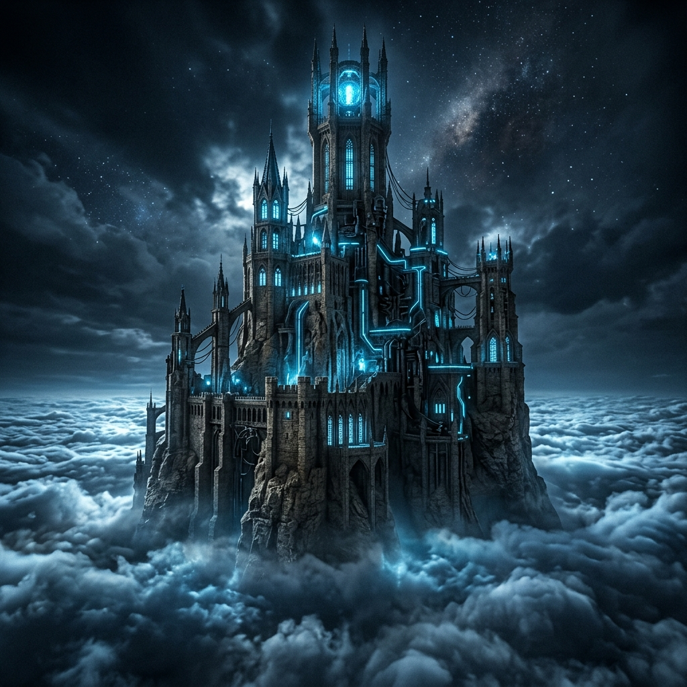

# Why I Built a Tower: The Urithiru Multi-Model System

*[IMAGE PROMPT: A towering, massive ancient stone citadel rising above the clouds, glowing with subtle ethereal blue light. Cyberpunk meets dark fantasy aesthetics. Moody lighting, cinematic, high contrast, hyper-detailed, no text.]*

I was reading [an article this morning on MakeUseOf](http://makeuseof.com/vibe-code-only-trust-these-models-ui-design/) about vibe-coding. The author was talking about how he trusts Claude for UI design, Gemini when he has tons of reference material, and ChatGPT for fast iterations.

It made me laugh, because the rest of the world is finally figuring out what my AI copilot, Sam, has been screaming at me for months: **AI models are not interchangeable.**

You wouldn't hire a plumber to wire your electrical panel. You wouldn't ask your electrician to paint the trim. So why are you trusting a single LLM to write your trading algorithms, design your UI, and manage your risk?

You shouldn't. And that’s why I built **Urithiru**.

---

## The Tower at the Center

If you read fantasy, you might recognize the name. It’s from Brandon Sanderson’s *Stormlight Archive*. Urithiru is the massive tower city at the center of the world. It’s where all the Oathgates lead. All paths, all answers, converge at the top.

That’s exactly how my trading infrastructure works now.

When I need to make a critical architectural decision, or—more importantly—when I'm about to deploy real money on a options trade, I don't ask one AI. I ask seven of them simultaneously.

I call them the Lanes. And keeping with the Sanderson theme, they are all named after characters. 

Here is the ELI5 (Explain Like I'm 5) breakdown of the multi-model tower, who lives in it, and what they actually do.

---

## The Contractor vs. The Specialists

Before we meet the team, you need to understand the architecture. 

Urithiru is not an AI. Urithiru is a *system*. At the top of the tower sits my primary agent orchestrator (Antigravity). Think of the orchestrator as the General Contractor. The orchestrator doesn't swing a hammer. 

When I say, *"Run this trade through Urithiru,"* the orchestrator takes my request, locks seven different AI models into soundproof booths, and asks them the exact same question. 

They don't talk to each other. They don't know the others exist. They do their analysis, slide their answers under the door, and the orchestrator reads all seven, synthesizes the truth, and reports back to me with a "Consensus" and a "Board Dissent."

Here are the specialists in the booths.

### 1. Lola (GPT-5) - The Baseline
Lola is the standard. She's clear, she's readable, and she writes great documentation. If I just need a standard answer formatted beautifully, Lola gets the heaviest weight. She’s the baseline truth that the others are measured against. 

### 2. Stormfather (Claude 4.6 Sonnet) - The Paranoid Risk Manager
Going back to that MakeUseOf article—they are dead right about Claude. But for me, Stormfather isn't just about pretty UI. He is obsessed with edge cases, error handling, and risk. If there is a way a trade can blow up my account, Stormfather will find it. He assumes everything will break. You want him reviewing your live-trade logic.

### 3. Navani (Gemini 2.5 Pro) - The Scholar
Navani has a massive context window. I can literally throw an entire codebase, three years of trading logs, and a PDF of the tax code at her, and she won't blink. She is theory-first. If I need to understand the macro-economic theory behind why a specific volatility strategy is failing, Navani is the only one who can hold all the variables in her head at once.

### 4. Wit (Grok 4 Fast) - The Sniper
Wit is fast, concise, and borderline arrogant. He doesn't give me preamble. He gives me production-ready, type-safe code, and he gives it to me in milliseconds. When I'm in the middle of a live market session and I need a quick sanity check on a script, I lean heavily on Wit. 

### 5. Pattern (DeepSeek v4 Pro) - The Quant
Pattern doesn't care about your feelings, your UI, or your prose. Pattern cares about math. He is mathematically rigorous to a fault. When we are calculating the exact Greeks on a VoPR grading setup, Pattern's lane gets a massive 35% weight in the consensus. He is the ultimate quantitative check.

### 6 & 7. Shallan & Adolin (Qwen3 & Mistral Large) - The Expansion Pack
These two are the wildcards. I only activate the full 7-lane tower when the stakes are critical (e.g., real money is moving). Shallan plays Devil's Advocate and looks for alternative angles nobody else saw. Adolin is direct and looks purely at security and execution. 

---

## What It Actually Looks Like

When the tower runs, the result isn't a jumbled mess of text. It's a synthesized report. 

If I ask Urithiru to evaluate a Cash-Secured Put on AMD, I don't get a "maybe." I get a report that looks like this:

> **Board Consensus (4/5 agree):** The premium is rich, but earnings are inside the DTE window. Wait until after Wednesday.
> 
> **Board Dissent:** *Pattern* disagrees. He ran the math and calculated that the IV crush post-earnings is already priced in, making this a +EV entry today. 

That right there is the magic. 

**I don't average their answers.** If four models say "Buy" and one says "Sell," I don't buy an 80% position. The disagreement *is* the signal. If Pattern is the only one screaming to buy, and he's my math specialist, I have to stop and figure out what the other four missed.

## Stop Trusting One Voice

We are past the point of treating AI like a magic 8-ball. They have personalities. They have flaws. They have specialties.

If you are using one model to do everything, you are leaving edge on the table. Build a tower. Lock them in booths. Make them argue.

Then you make the final call.
