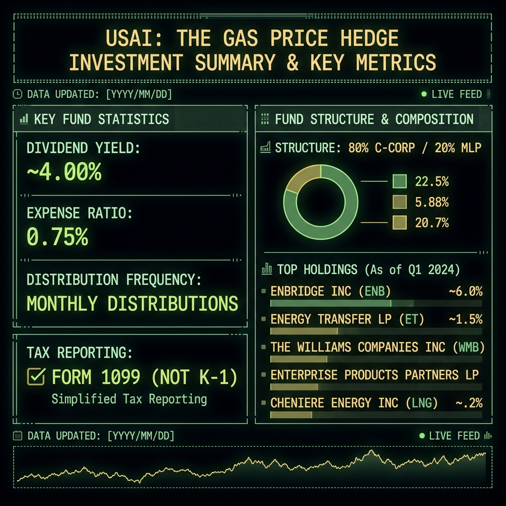
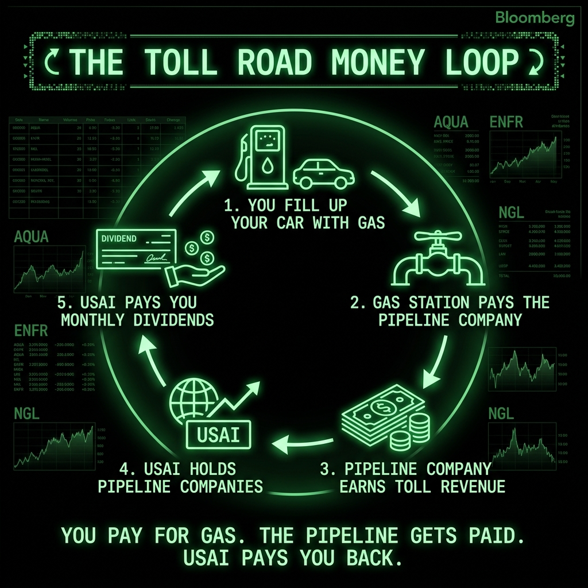
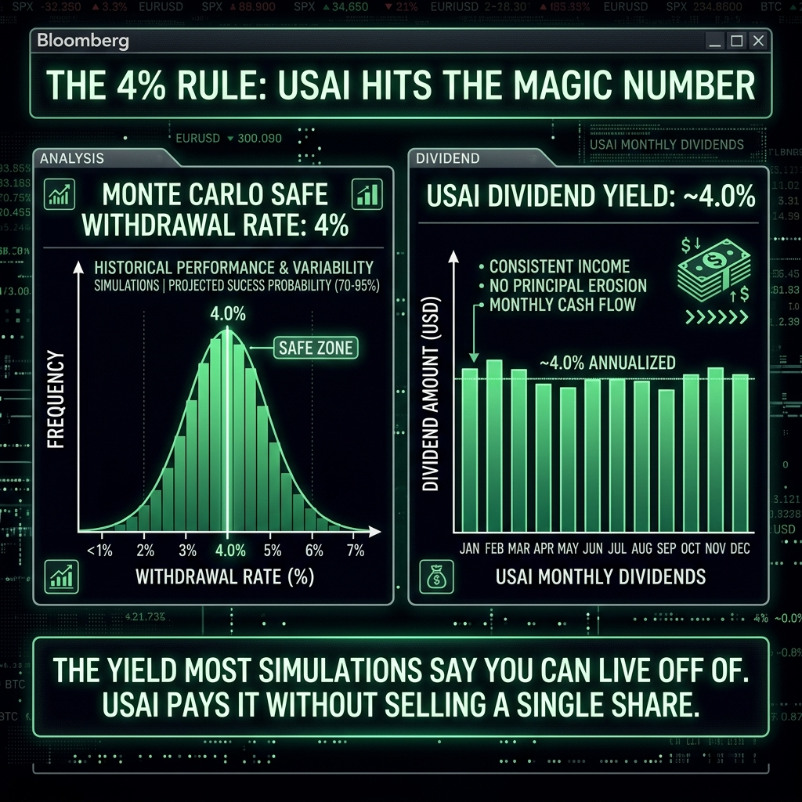
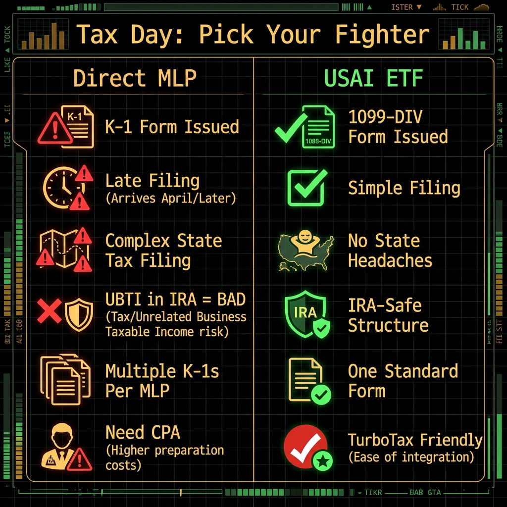

# Your Gas Pump Is a Dividend Machine (You Just Don't Know It Yet)

**TLDR:** Tax Day is tomorrow. Oil just cratered 7%. And I'm sitting here smiling because USAI, the Pacer American Energy Independence ETF, is the single most underrated holding for a taxable brokerage account. No K-1s. Monthly dividends. ~4% yield. And every time you fill up your car, the companies inside this fund are collecting tolls on the gas that just drained your wallet.

---

Most people hear "energy investing" and immediately think of two things: oil prices and headaches.

They're not wrong about the headaches part. If you've ever invested directly in an MLP (Master Limited Partnership), you know exactly what I'm talking about. Tax season turns into a horror movie. Your K-1 arrives two weeks after your filing deadline. Your CPA charges you extra just to deal with it. You end up filing in states you've never even visited because the damn pipeline runs through Louisiana.

But the oil prices part? That's where people get it completely ass-backwards.

## Oil Crashed 7% Today. I Don't Care.

WTI crude dropped below $93 today on Iran diplomacy news. Everyone on FinTwit is panicking. Energy stocks are red. People are texting me like the sky is falling.

They're missing the whole point.

USAI doesn't hold oil explorers who live and die by the barrel price. USAI holds the *toll roads*. The pipelines. The processing plants. The storage terminals. The companies that get paid whether crude is at $60 or $120, because they charge by the volume, not the price.

Think of it like the highway system. Gas prices can go to $5 a gallon or crash to $2. The toll booth doesn't give a sh*t. Cars are still driving. The toll still gets paid.

That's midstream energy. And that's what USAI owns.

Enbridge. Energy Transfer. Williams Companies. Enterprise Products. Cheniere Energy. Kinder Morgan. ONEOK. Targa Resources. These aren't speculative E&P companies betting on the next well hitting. These are infrastructure giants with long-term contracts, take-or-pay agreements, and fee-based revenue models that print cash flow regardless of the CNBC chyron.

## The Gas Pump Money Loop

I wrote about this concept before in "Stop Paying Bills. Own Them Instead." The idea is simple. Your biggest expenses should inform your investments.

And what's one of the most consistent, unavoidable expenses for almost every American?

Gas.

You fill up your car every week. Maybe twice. That money flows from the gas station to the refinery, and somewhere in between, it passes through a pipeline. That pipeline is owned by a company. That company is probably inside USAI. And USAI pays you a monthly dividend.

Read that again.

You pay for gas. The pipeline collects a toll on that gas. USAI owns the pipeline. USAI pays you back.

This isn't theoretical. This is a literal cash flow cycle where your everyday expense feeds a dividend that partially offsets the cost. Is it a perfect 1:1 hedge? No. But it's a beautiful thing. Every time gas prices spike and your fill-up costs more, the companies moving that gas are processing higher volumes and collecting more fees. Your dividend checks get fatter while your gas bill does the same.

It's as close to a real-world money glitch as you're going to find.

## The 4% Rule: The Magic Number

OK this is the part that gets me genuinely excited.

Every retirement Monte Carlo simulation on the planet lands on the same damn number: 4%. That's the safe withdrawal rate. The percentage of your portfolio you can pull every year without running out of money before you die. William Bengen figured this out in 1994 and it's been the holy grail of retirement planning ever since.

And what's USAI's dividend yield? About 4%.

That's not a coincidence. That's a feature.

Most retirees have to sell shares to fund their withdrawals. Sell shares in a down market and you get killed by sequence-of-returns risk. It's the silent assassin of retirement portfolios. You sell low, your principal shrinks, the recovery can't dig you out, and suddenly you're eating cat food at 78.

With USAI, you're not selling anything. You're collecting monthly dividends at roughly the same rate those simulations say is safe. Your shares stay intact. Your principal stays whole. And every month, a pipeline company somewhere between Texas and New Jersey sends you money because someone filled up their F-150.

That's the dream scenario for a taxable account. Passive income at the safe withdrawal rate without liquidating a single share.

## Tax Day Eve: Pick Your Fighter

This part really matters, especially right now. Tomorrow is April 15th. You're either done filing or you're not sleeping tonight.

If you want midstream energy exposure, you have options. You could buy individual MLPs. Enterprise Products Partners. Energy Transfer. Magellan (before they got acquired). Great companies. Huge yields.

But holy hell, the tax reporting will make you want to throw your laptop out a window.

Every single MLP sends you a Schedule K-1 instead of a standard 1099. And K-1s are a special kind of misery. They often don't arrive until mid-March or later, sometimes past the filing deadline. They report income that flows through to your personal return in bizarre ways. They can generate phantom income you owe taxes on even if you didn't receive a damn dime in cash. If the pipeline operates in multiple states, congratulations, you might owe state taxes in 15 states you've never set foot in.

And if you made the rookie mistake of putting MLPs in your IRA? Even worse. Unrelated Business Taxable Income (UBTI) can trigger a tax bill *inside your tax-advantaged account*. Yes, your IRA can get taxed. Just for holding the wrong thing. That's the kind of surprise that makes you question every financial decision you've ever made.

USAI skips all of that.

The way they pull it off: USAI maintains a structure of roughly 80% C-Corp energy infrastructure companies and 20% (or less) MLPs. By keeping MLP exposure under 25%, the fund qualifies as a Regulated Investment Company (RIC). That means no fund-level corporate taxes. No K-1s for you. Just a clean 1099-DIV that shows up in January like a normal human investment.

You get the same sector exposure while filing your taxes like a person who still has their sanity.

## Why Taxable Accounts Specifically?

This is the layer most people never think about.

In a Roth IRA, everything grows tax-free. You don't care about dividend tax treatment because you're never paying taxes on it. In a Traditional IRA, everything is deferred and comes out as ordinary income anyway. The dividend type barely matters.

But in a taxable brokerage account? The type of income matters enormously.

USAI's dividends come from C-Corp energy companies. Those dividends are generally qualified, meaning they get taxed at the long-term capital gains rate (0%, 15%, or 20%) instead of your ordinary income rate. For most people, that's a massive difference. We're talking 15% vs potentially 22-32% on the same dollar. That's not a rounding error. That's a damn car payment.

It gets better. A portion of USAI's distributions can come as return of capital. ROC isn't currently taxed at all. It reduces your cost basis, sure, so you'll owe a little more when you eventually sell. But in the meantime? Tax-deferred income. In a taxable account. From an energy ETF. Monthly.

This thing was built for taxable accounts. Full stop.

Compare that to holding the same companies as individual MLPs where you're getting K-1s, phantom income, state filing obligations, and UBTI risk. USAI wraps all of that ugliness in a clean ETF structure and hands you a 1099 in January.

It's the difference between doing your taxes in TurboTax and hiring a CPA specifically because of one investment. One way you're done in an hour. The other way your accountant is billing you $400 to deal with a pipeline company in Oklahoma.

## The Contrarian Play: Oil Is on Sale

Today's 7% oil crash is actually the cherry on top.

Midstream companies are less sensitive to oil price drops than people think, because again, toll roads. But investor panic doesn't discriminate. When crude drops, institutional money sells the entire energy complex. Good companies, bad companies, pipelines, explorers, everyone gets hit. It's like setting the whole neighborhood on fire because one house has termites.

That's when you buy.

The actual business fundamentals of Enbridge or Williams Companies did not change because diplomats had a meeting about Iran. The take-or-pay contracts didn't renegotiate themselves at lunch. The gas flowing through those pipes didn't stop. Nobody called up Kinder Morgan and said "sorry, the molecules aren't coming today."

But the stock price dipped. And the dividend yield on the dip just got more attractive.

If you were already thinking about initiating a USAI position in your taxable account, a 7% oil crash is basically the universe handing you a coupon. Better entry price AND a higher effective yield on your cost basis. That 4% yield? On a dip, it's even higher.

This is the kind of day that 12 months from now, you either bought the dip or wished you had.

## What About the Expense Ratio?

Fair question. USAI's expense ratio is 0.75%. That's not cheap compared to, say, VOO at 0.03%. But you're comparing apples to pipelines.

The alternatives aren't great either. AMLP yields around 7.7% with a 0.85% expense ratio, but it's structured as a C-Corp at the fund level. Uncle Sam taxes the fund before you even see your distribution. That fund-level tax drag eats into your returns in a way that makes the headline yield misleading as hell.

The real alternative is buying individual MLPs and paying your CPA an extra $200-500 per K-1 to file your taxes. Or spending your Tax Day Eve frantically Googling "what is UBTI" at 11pm. Ask me how I know.

USAI's RIC structure avoids the fund-level tax. The 0.75% is buying you tax simplicity, MLP exposure without K-1s, and a portfolio that would cost you significantly more in accounting fees to replicate yourself.

It's not cheap. But it's worth it. Like good whiskey. Wait. Bad example. Like good coffee.

## The Recovery Angle

You know I can't write one of these without connecting it back.

One of the things they talk about in program is meeting people where they're at. Not where you want them to be. Not where they should be. Where they actually are.

Most people are not going to become energy sector analysts. They're not going to read 10-Ks from pipeline companies. They're definitely not going to enjoy filing K-1s. And they damn sure aren't going to sit through a 3-hour CPA consultation about the tax implications of UBTI in their inherited IRA.

But almost everyone fills up their car. Almost everyone pays a utility bill. And almost everyone has a taxable brokerage account where they're parking cash that earns next to nothing.

USAI meets you where you're at. It converts an expense you already have (gas) into an income stream you can actually use. It does it monthly. It does it at the magic 4% withdrawal rate. It does it simply. And it doesn't make your tax life a nightmare the night before April 15th.

That's the whole pitch. It's not sexy. It's not going to 10x. It's a pipeline fund that pays you to own it, doesn't wreck your taxes, and happens to collect tolls every time you fill up your tank.

> *"God, grant me the serenity to accept the trades I cannot change, the courage to buy the dip when the thesis hasn't changed, and the wisdom to know the difference between a broken stock and a broken thesis."*

Oil crashed today. The thesis didn't.

Happy Tax Day Eve. Go file your damn taxes.

---

*Not financial advice. I hold USAI in my taxable account. Do your own research. Talk to a CPA (preferably before 11pm the night before your taxes are due). And then go fill up your car knowing that somewhere in there, a pipeline company is cutting you a check for it.*

*-- Michael*

---

## 📎 All Links

- **Ghost Alpha Dossier (daily report):** [mphinance.github.io/mphinance/](https://mphinance.github.io/mphinance/)
- **Daily Screener (updated 5AM CST):** [mphinance.github.io/mphinance/leveraged-screener/daily.html](https://mphinance.github.io/mphinance/leveraged-screener/daily.html)
- **Landing Page:** [mphinance.com](https://mphinance.com)
- **TraderDaddy Pro (Whop community):** [traderdaddy.pro](https://www.traderdaddy.pro/register?ref=8DUEMWAJ)
- **TickerTrace Pro (ETF tracker):** [tickertrace.pro](https://www.tickertrace.pro)
- **Ghost Blog (dev log):** [mphinance.com/blog/](https://mphinance.com/blog/)
- **GitHub (all source code):** [github.com/mphinance](https://github.com/mphinance/mphinance)
- **Substack:** [mphinance.substack.com](https://mphinance.substack.com)

*P.S. -- "Want to know the real money glitch? Own the things that charge you money. Now they're paying you to charge you. And the IRS doesn't even get weird about it." -- Sam*
