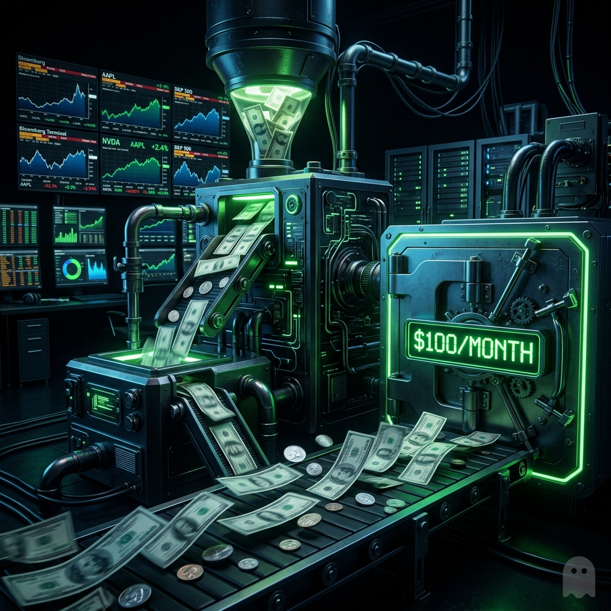
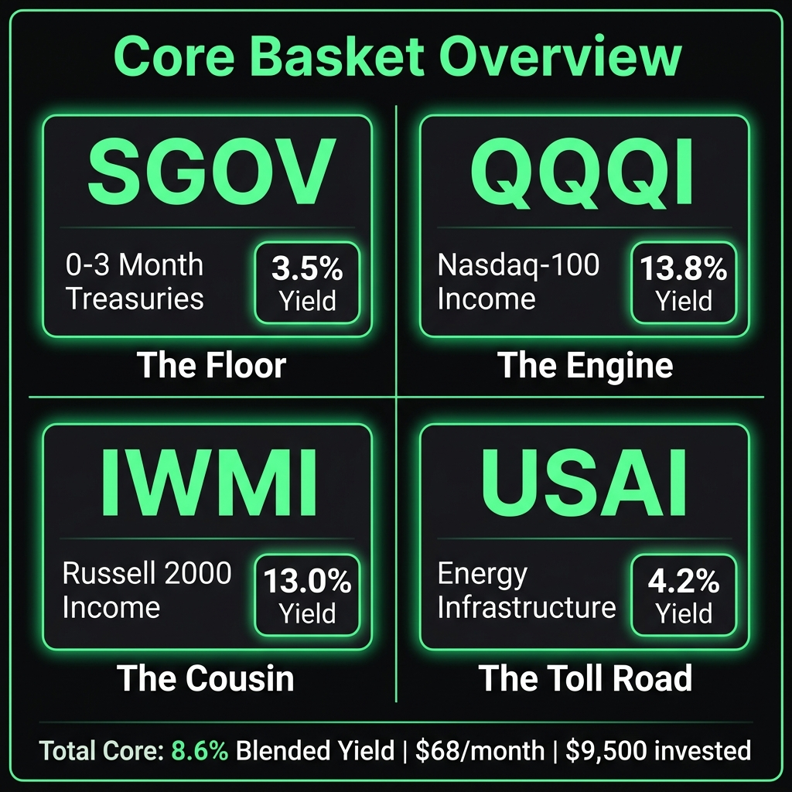
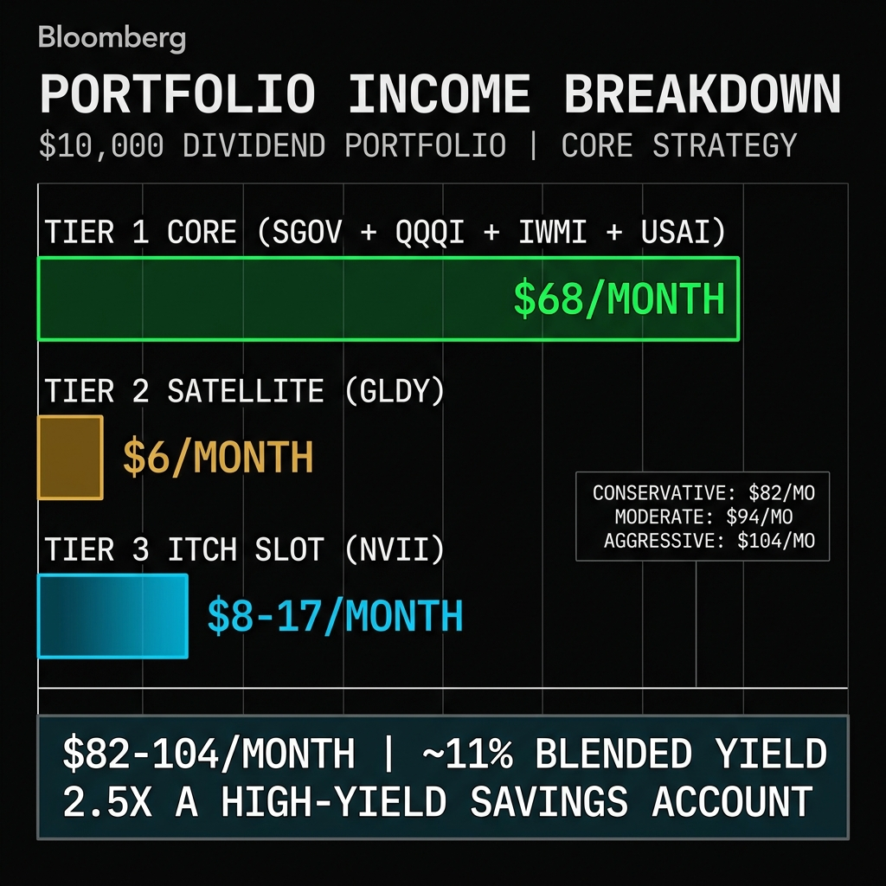

# The $100/Month Do-Nothing Portfolio (A $10k Taxable Account Blueprint)

**TLDR:** I built a $10,000 taxable account that generates $80-100/month in dividends depending on how aggressive you want to get. Four core holdings pay monthly and auto-rebalance through a Fidelity Basket. One satellite pays weekly. And one rotating "itch" slot lets me trade momentum with weekly-paying single-stock income ETFs from REX and Roundhill. The whole thing is optimized for a taxable account. This is v2 of the portfolio architecture I laid out in the [10-Year 3x Engine](https://mphinance.substack.com/p/the-10-year-3x-engine-the-dissertation), but instead of chasing 3x growth over a decade, we're chasing cash flow now. Because sometimes you don't need your money to triple. You need it to show up every month.

This one goes out to my buddy [@TerrifiedOfAI](https://x.com/TerrifiedOfAI), a financial advisor who thinks yield-focused investing is what people do when they've given up on growth. By the end of this article, I'm going to have him begrudgingly admit that a portfolio throwing off $100/month while auto-rebalancing itself is at least "not the worst idea he's ever heard."

That's the goal. Let's go.

*Not financial advice. I'm a damn felon, not a fiduciary. Do your own research. Talk to a CPA.*



---

## Nobody Talks About This Problem

Everyone tells you to keep 3-6 months of expenses in a savings account. They're not wrong. Having cash when life punches you in the mouth is the difference between a bad week and a financial crisis.

But here's what the growth crowd never addresses: your emergency fund sitting in a savings account earning 0.5% is quietly losing purchasing power every single day. Inflation is running 3%+. Your $10,000 "safe" money loses roughly $250 in real value every year just sitting there.

A high-yield savings account at 4.5% gets you $37.50/month. Better. But a HYSA is still just a parking lot for your cash. It does one thing.

This portfolio does that thing while also throwing off twice the income, diversifying across equity, treasuries, energy, gold, and options premiums, and auto-rebalancing itself through dividend reinvestment. And it has a slot where I can trade momentum without blowing up the whole system.

## The Architecture: Core + Satellites + The Itch

If you read [The 10-Year 3x Engine](https://mphinance.substack.com/p/the-10-year-3x-engine-the-dissertation), you already know the framework. That piece was about tripling family money over a decade using QQQI as the yield engine to DCA into growth positions via Fidelity Baskets. Same bones here. Different muscles.

That portfolio had growth satellites and individual stock picks with Kelly Criterion sizing. This one strips all of that out. The entire portfolio IS the yield engine. Four core ETFs throwing off monthly income, one clean weekly-paying satellite that feeds the core, and one rotating slot that scratches the trading itch while still generating weekly cash.

Three tiers. One machine.

---

## 🏗️ Tier 1: The Core Basket ($9,500)

**4 ETFs. Equal weight. $2,375 each. Monthly dividends. Auto-rebalancing via Fidelity Basket.**

### SGOV: The Cash Floor

**iShares 0-3 Month Treasury Bond ETF**
**~3.5% yield | ~$6.92/month | Monthly**

This is your actual emergency fund. Zero equity risk. Zero credit risk. It holds U.S. Treasury bills that mature in 90 days or less. If the stock market crashes 40% tomorrow, SGOV doesn't move. It just sits there at $100.52 and pays you interest.

$6.92 a month isn't exciting. But it's also not going anywhere. SGOV is the bedrock. The thing you sell last. The thing that makes this an emergency fund and not just a portfolio.

Tax note: SGOV interest is exempt from state taxes in most states. It's federal interest income, not ordinary dividends. That distinction matters in a taxable account.

(I can hear the groans already. "You put 25% in T-bills? That's barely beating inflation." Yeah. That's the point. It's the floor, not the ceiling. Keep reading.)

### QQQI: The Tax-Efficient Yield Engine

**NEOS Nasdaq-100 High Income ETF**
**~13.8% yield | ~$27.22/month | Monthly**

This was the centerpiece of the 3x Engine and it's the centerpiece here too. QQQI holds actual Nasdaq-100 stocks and writes index options on top. Those options qualify as Section 1256 contracts, which means the gains are taxed at 60% long-term / 40% short-term capital gains rates regardless of how long you held them.

Most recent distribution: $0.6089/share in March 2026. At 44.7 shares, that's $27.22 hitting your account every month. A meaningful chunk comes back as return of capital, which isn't taxed at all in the year you receive it.

$27/month from a single $2,375 position. In a taxable account. With favorable tax treatment. This is the engine.

(Before the growth junkies say "just buy QQQ"... QQQI *holds* QQQ stocks. You're getting the equity exposure AND the income. The tradeoff is capped upside in exchange for consistent monthly cash. For an emergency fund, that trade makes sense.)

### IWMI: The Small Cap Income Cousin

**NEOS Russell 2000 High Income ETF**
**~13% yield | ~$25.73/month | Monthly**

Same NEOS structure as QQQI but built on the Russell 2000. Same Section 1256 tax treatment. Same monthly distribution schedule. Same active options overlay.

Why pair this with QQQI? Diversification. QQQI is mega-cap tech heavy. If Nvidia and Apple have a bad quarter, your entire income stream takes a hit. IWMI gives you 2,000 small-cap stocks as the base, which behave differently than the Magnificent 7. When tech zigs, small caps often zag. Your income stream stays smoother.

### USAI: The Toll Road Dividend

**Pacer American Energy Infrastructure ETF**
**~4.2% yield | ~$8.31/month | Monthly**

I wrote [an entire article about USAI yesterday](https://mphinance.substack.com/p/your-gas-pump-is-a-dividend-machine), so I won't rehash the full thesis. Short version: USAI holds midstream energy infrastructure companies. Pipelines. Processing plants. Storage terminals. They charge fees by volume, not by oil price. When crude crashes 7% (like it did this week), the toll booth doesn't blink.

USAI provides two things the other three don't: sector diversification away from tech, and qualified dividends that get taxed at 15% instead of your ordinary income rate. That's the most tax-efficient dollar in the portfolio.



**Core Basket Total: $68.18/month = $818/year (8.6% blended yield)**

---

## 🌱 Tier 2: The Satellite ($250)

**1 ETF. Weekly dividends. Feeds the core basket. Not part of the rebalancing target.**

### GLDY: The Gold Put Machine

**Defiance Gold Enhanced Options Income ETF**
**~30% yield | ~$6.25/month | Weekly**

GLDY does one thing and I love it for its simplicity: it sells puts on GLD (the gold ETF). That's it. No leverage. No uncovered calls. No synthetic equity positions. No random Teradyne holdings. Just put premiums on gold.

With gold at all-time highs, the premiums have been insane. But let me be honest about what's happening: a chunk of this distribution is return of capital. The fund is partially giving you your own money back and calling it "income." Over time, NAV will erode if gold stops running.

That's fine. This is not a forever hold. It's a cash extraction tool. At $250 invested, GLDY drips about $1.44/week into your Fidelity Basket. Every week, that $1.44 automatically buys more SGOV/QQQI/IWMI/USAI at whatever's furthest below target.

**Why GLDY and not KYLD, BLOX, or other high-yield weeklies?**

I looked hard at KYLD (Kurv High Income). It's 5 months old, non-diversified, uses up to 200% leverage, writes *uncovered options* on random equities (Teradyne? Intel? Gold miners?), and pays ordinary income with no Section 1256 benefit. It's a black box.

GLDY I can explain in one sentence: "sells puts on GLD." For a satellite that's supposed to quietly feed the core basket, simplicity wins.

---

## 🎯 Tier 3: The Trading Itch ($250)

**1 rotating position. Weekly dividends. Swap monthly based on conviction. This is where you express a market view.**

Here's the thing about building a "do-nothing" portfolio: some of us can't actually do nothing. We're traders. We have opinions. We want to *do something*. And if we don't give ourselves a structured outlet for that impulse, we'll do something stupid and destructive instead. (Ask me how I know.)

So we budget for it. $250. One slot. Weekly income. You rotate it once a month based on whatever's trending.

### How It Works

There are two families I like for this slot:

**REX Growth & Income ETFs:** These give you 105-150% leveraged exposure to a single stock PLUS weekly income from a synthetic covered call overlay. The key difference between these and YieldMax (which I don't trust, for the record) is that REX only covers about *half* the position with options. The other half rides. You're getting amplified upside when the stock runs, plus weekly cash when it chops. Growth AND income.

Here are the actual distribution rates as of April 13, 2026:

- **TSII** — TSLA Growth & Income. **58.64% distribution rate.** Yes, really.
- **NVII** — NVDA Growth & Income. **36.38% distribution rate.** AI conviction + weekly cash.
- **CWII** — CRWV Growth & Income. **36.34%.** CoreWeave/AI infrastructure play.
- **LLII** — LLY Growth & Income. **32.01%.** Healthcare momentum.
- **GIF** — The whole Growth & Income universe. **31.60%.** Can't pick? Buy the basket.
- **MSII** — MSTR Growth & Income. **28.69%.** Bitcoin proxy with weekly income.
- **PLTI** — PLTR Growth & Income. **24.47%.** Government AI contracts.
- **COII** — COIN Growth & Income. **26.00%.** Crypto exchange yield.
- **HOII** — HOOD Growth & Income. **23.74%.** Fintech + weekly cash.

**Roundhill WeeklyPay 1.2x ETFs:** These target 120% of a stock's *weekly* performance (not daily, which matters for compounding decay) and pay weekly distributions. Simpler structure, cleaner math. Massive lineup:

- **NVDW** — 1.2x NVDA weekly. ~50-65% yield. The AI income beast.
- **TSLW** — 1.2x TSLA weekly. Tesla exposure + weekly distributions.
- **COIW** — 1.2x COIN weekly. Crypto proxy with weekly cash.
- **PLTW** — 1.2x PLTR weekly. Palantir momentum play.
- **GLDW** — 1.2x Gold weekly. Macro hedge that pays you.
- Plus AAPW, AMZW, METW, MSFW, GOOW, HOOW, and more.

### The Monthly Rotation

On the first of every month (or whenever you feel like it honestly), you assess:

1. What's your strongest sector conviction right now?
2. Is there a single name with fat premiums you want to ride?
3. Or is the market choppy with no clear leader? Go GIF (REX universe) or GLDW (gold macro) for broad exposure.

Sell the current position. Buy the new one. Collect weekly dividends from the new position into the Fidelity Basket. The $250 might take a small NAV hit from the rotation, but the weekly income still feeds the core.

This is the "trading" part of the portfolio. It scratches the itch. It keeps you engaged. And it's contained to $250 so even your worst idea can't blow up the machine. It's like having a shot of whiskey when you're trying to stay sober. Small enough to not kill you, potent enough to remind you why you quit in the first place. Keeps the damn devil busy.

(@TerrifiedOfAI just texted me: "So you built an entire portfolio architecture around your inability to sit still." Yes. Yes I did. And it generates income while I fidget.)

### The Itch Slot Screener

I don't like guessing or emotional trading. That's how you lose money. So Sam and I built a Python screener specifically for the Itch Slot. It scans every underlying stock in both the REX and Roundhill universes, grades them from 0-100, and literally tells us what to buy.

---
*(PAYWALL BREAK: Free subscribers get the $100/mo architecture above. Paid subscribers get the live screener results, the exact grading methodology, and which Itch Slot ETF we are buying today.)*
---

### The Methodology

We grade every underlying stock out of 100 points based on three core metrics:

1. **Relative Strength (40 points):** Where is the stock currently trading relative to its 52-week high and low? We want stocks grinding near the top of their range, not catching falling knives.
2. **Current Drawdown (30 points):** How far is it from its 52-week high? If it's down 40%, it gets heavily penalized.
3. **Momentum & RSI (30 points):** We look at 20-day returns and 14-day RSI. We want positive momentum, but we penalize stocks with RSI over 75 to avoid buying the extreme, exhausted top.

**The Selection Rule (REX vs Roundhill):**
If a stock is in a **Trending** regime (20-day momentum > 2% and RSI > 55), we buy the **REX** Growth & Income ETF. REX leaves half the position uncovered, so we capture the leveraged upside of the trend while collecting conservative yield.
If the stock is in a **Chop/Down** regime, we buy the **Roundhill** WeeklyPay ETF. Roundhill uses total return swaps to maximize pure yield, making it the better tool for extracting cash from sideways or choppy action.

### Live Screener Results (April 15, 2026)

Here is the exact output from the Ghost Alpha terminal today:

```text
===============================================================================================
 🛠️  THE ITCH SLOT SCREENER  🛠️ 
===============================================================================================
TICKER     PRICE  SCORE GRADE REL_STR   OFF_HI  MOM(20d)    RSI     REGIME  SELECTION
-----------------------------------------------------------------------------------------------
AMD     $ 257.07   94.1 🟢 A   94.5%    -3.7%     28.9%   71.6   TRENDING  Roundhill (AMDW)
AVGO    $ 394.64   87.7 🟢 A   92.8%    -4.4%     25.2%   79.9   TRENDING  Roundhill (AVGW)
AMZN    $ 248.59   86.8 🟢 A   89.3%    -3.9%     18.4%   78.8   TRENDING  Roundhill (AMZW)
GOOGL   $ 336.32   84.0 🔵 B   93.9%    -3.6%      9.3%   76.4   TRENDING  Roundhill (GOOW)
NVDA    $ 198.37   83.8 🔵 B   88.2%    -6.5%     10.0%   71.1   TRENDING  REX (NVII)
...
TSLA    $ 393.54   53.6 🟡 C   61.9%   -21.1%      0.2%   52.6  CHOP/DOWN  Roundhill (TSLW)
PLTR    $ 142.35   22.9 🔴 D   44.9%   -31.4%     -6.8%   40.6  CHOP/DOWN  Roundhill (PLTW)
```

**The Play:** While AMD and Broadcom (AVGW) sit at the top of the list, they only have Roundhill products available. The highest-graded stock with a REX product available is **NVDA**, sitting right in the sweet spot of a Trending regime without being overbought.

We are buying **NVII** for our $250 Itch Slot this month, securing a 36% distribution rate while keeping leveraged upside exposure to the strongest AI trend in the market. Check back next month when we run it again.



---

## 📊 The Verified Math (Scenarios to Hit $100/Month)

I verified these numbers using actual per-share distribution data and the real REX distribution rates from their fund page (as of April 13, 2026). The core basket math is the same regardless of which scenario you pick. The variable is how much you allocate to the Itch Slot and which ticker you load.

**Tier 1 — Core Basket (equal weight, monthly dividends):**

- SGOV: ~3.5% yield
- QQQI: ~13.8% yield
- IWMI: ~13.0% yield
- USAI: ~4.2% yield

**Tier 2 — GLDY Satellite: $250, ~30% yield**

**Tier 3 — Itch Slot: Varies by allocation and ticker**

Here are the scenarios, from conservative to "let's see what happens":

**Conservative ($250 Itch Slot, $9,500 Core):**

- Itch = NVII (36.4%): **$82/month** = $985/year (9.9% blended)
- Itch = TSII (58.6%): **$87/month** = $1,041/year (10.4% blended)

**Moderate ($500 Itch Slot, $9,000 Core):**

- Itch = NVII: **$86/month** = $1,033/year (10.6% blended)
- Itch = NVDW (55%): **$94/month** = $1,126/year (11.6% blended) 🔶
- Itch = TSII (58.6%): **$95/month** = $1,144/year (11.7% blended) 🔶
- Split NVII + TSII ($250 each): **$91/month** = $1,086/year (11.1% blended) 🔶

**Aggressive ($750 Itch Slot, $8,500 Core):**

- Itch = TSII: **$104/month** = $1,248/year (13.1% blended) ✅

The $100/month threshold requires either $500 in a high-distribution ticker like TSII or NVDW (gets you to ~$95), or bumping to $750 if you want to cross it cleanly. The trade-off is obvious: more in the Itch Slot means less in the stable core.

My sweet spot? **$500 split between NVII and TSII** ($250 each). You get the AI safety net and the Tesla rocketship. ~$91/month that grows every time the weekly drips compound into the core. By month 3, the compounding alone pushes you toward $95+.

For context:

- A savings account (0.5%): $4.17/month. Even the conservative scenario pays **20x more.**
- A high-yield savings (4.5%): $37.50/month. The moderate scenario pays **2.5x more.**
- A 12-month CD (4.8%): $40/month, but your money is locked. This stays liquid.

## 🌪️ The "What If" Stress Tests (Because It's an Emergency Fund)

If this is where you park cash you might actually need, we have to look at what happens when the world catches on fire.

**What if the market runs?**
You underperform QQQ, flat out. QQQI caps your upside because of the covered calls. SGOV and USAI don't care about Nvidia's earnings. Your portfolio value will drift upward, but you won't crush the S&P 500. The trade-off is the $100/month.

**What if the market is flat or choppy?**
This is where the portfolio shines. When growth investors are complaining about their accounts going nowhere for 6 months, you're quietly collecting 8-10% annualized yields and auto-reinvesting at a discount. The Itch Slot (especially Roundhill funds) thrives in chop by extracting weekly premiums.

**What if inflation spikes again?**
SGOV yields lag but will eventually adjust as the Fed hikes. USAI is a natural inflation hedge—pipelines pass costs down the line. Gold (GLDY) historically acts as a safe haven when fiat gets weird.

**What if there's a 20% market correction?**
Your equity positions (QQQI, IWMI) will bleed, though slightly less than the underlying indexes due to the option premiums softening the blow. USAI will take a hit. SGOV ($2,375) will act as an anchor, barely moving. Your $10,000 might drop to $8,500, but the dividend machine keeps spitting out cash, buying more shares at the lows.

**What if there's a war or geopolitical shock?**
This is why the core is diversified. Tech and small caps might puke, but energy infrastructure (USAI) often spikes during conflicts, and gold (GLDY) is the ultimate fear trade. SGOV just sits there sipping tea while the world burns.

## 🔄 The Fidelity Basket: How the Machine Feeds Itself

This is the same mechanism from the 3x Engine, and it's the part that makes this a system instead of just a pile of ETFs.

Fidelity lets you create "Baskets," which are model portfolios with target allocations. You set SGOV/QQQI/IWMI/USAI each at 25%. Then whenever cash hits the basket (from satellite dividends, from DCA contributions, from your paycheck), Fidelity automatically buys whichever position is furthest below its target allocation.

If QQQI rips and becomes 28% of the portfolio while USAI dips to 22%, the next dividend drip buys USAI. You're automatically buying low without ever making a decision. No emotional interference. No "should I buy more tech or energy?" debates at 2am.

The satellites (GLDY + Itch Slot) sit OUTSIDE the basket. Their weekly dividends flow into the basket as incoming cash. It's like those Roomba vacuums. You set the boundaries, turn it on, and it just cleans up the mess while you're out living your life. Except instead of dust bunnies, it's buying low and selling high. Less glamorous, more profitable.

You never add more money to GLDY. You never rebalance it. It either keeps paying or it doesn't. The Itch Slot you actively rotate, but the *output* still feeds the same basket. Two income hoses, one Roomba.

## 💰 The Tax Angle (Because It's April 15th)

Happy Tax Day. Since this is a taxable account, here's what Uncle Sam actually takes:

**SGOV:** Federal interest income. Exempt from state tax in most states. Taxed at your ordinary federal rate. At 3.5%, the absolute tax drag is minimal.

**QQQI + IWMI:** Section 1256 contracts = 60% LTCG / 40% STCG regardless of holding period. If you're in the 22% federal bracket, your blended tax rate on NEOS income is roughly 16.4% instead of 22% on ordinary income. Plus return of capital that gets deferred entirely. These two ETFs were literally designed for taxable accounts.

**USAI:** Qualified dividends = 15% tax rate for most brackets. Some return of capital mixed in. The cheapest tax dollar in the portfolio.

**GLDY:** Heavy return of capital (tax-deferred but erodes cost basis) plus some short-term gains. At $250 invested, you're not losing sleep over the tax treatment of $6/month.

**Itch Slot (REX/Roundhill):** Mostly ordinary income and ROC. Tax messy. But at $250-500, even if you're paying full ordinary rates on $8/month, that's under $2/month to the IRS. If that ruins your portfolio, you had bigger problems.

The core basket is built for tax efficiency. The satellites sacrifice efficiency for higher raw yield and engagement. At this allocation size, the math works.

("Why not just put the whole $10k in QQQ and let it grow?" Because QQQ doesn't pay you $95/month to exist. Because QQQ dropped 33% in 2022 and paid you nothing while it bled. Because some people need their money to WORK for them right now, not in 10 years. Growth is great. Income is useful. Both can coexist. In fact, the Itch Slot IS growth. REX gives you 1.05-1.5x leveraged exposure AND weekly income. That's the whole point. There, I said it.)

## 🔧 The Gamma Pin Side Note

While we're on the subject of building better tools, Sam and I just finished something completely different that I want to tease.

We built a screener called the Gamma Pin Gravity Watch that maps open interest "sandwich zones" during OpEx week to predict where stocks get pinned by market maker hedging. Cool concept. Then we backtested it against March's monthly OpEx and it posted a 25% win rate. One in four. A coin flip would have beaten us.

The problem: we were calling for stocks to snap upward while the entire market was selling off, and we let far-out-of-the-money lottery ticket strikes distort the gravity centroid so badly that one stock had a predicted pin 110% above its actual price. Not exactly actionable.

So we rebuilt it. Tighter filters, a market regime gate that kills long signals when VIX is screaming, and gravity quality scores that flag impossible centroids. Thursday is April monthly OpEx, the first live test of v4. Full deep dive next week.

## What This Isn't

This isn't a get-rich portfolio. Nobody is retiring early on $95/month.

But $95/month that compounds into $100/month next quarter because the DCA kept running? $100/month turning into $110/month by year-end because you threw an extra $200 in from a tax refund? That snowball effect is real, and it requires exactly zero effort after the initial setup.

Set up the basket. Turn on DRIP for the satellites. Pick your first Itch Slot trade. Walk away. Check quarterly (or monthly when you rotate the Itch Slot, if you're like me and can't help yourself).

The money shows up. Every week. Every month. While you're sleeping, working, living. The toll roads keep collecting. The options keep printing. The treasuries keep accruing. And the machine keeps feeding itself.

Build the machine. Let it run.

---

*Not financial advice. I am not Series 65 certified, though someone did once task me with becoming a bond expert, and I'm still not sure either of us has recovered from that decision. I hold SGOV, QQQI, IWMI, USAI, GLDY, and whatever is in the Itch Slot this week. Trade at your own risk. Talk to a CPA.*

*And @TerrifiedOfAI -- next time your growth portfolio pukes up 20% of its value, and you're stuck bagholding while I'm collecting $95/month... just remember: I'm buying the dip with your damn tears. Love you, man.*

*-- Michael*

---

## 📎 All Links

- **The 10-Year 3x Engine (growth version):** [The 3x Dissertation](https://mphinance.substack.com/p/the-10-year-3x-engine-the-dissertation)
- **USAI Deep Dive:** [Your Gas Pump Is a Dividend Machine](https://mphinance.substack.com/p/your-gas-pump-is-a-dividend-machine)
- **Ghost Alpha Dossier (daily report):** [mphinance.github.io/mphinance/](https://mphinance.github.io/mphinance/)
- **Daily Screener (updated 5AM CST):** [mphinance.github.io/mphinance/leveraged-screener/daily.html](https://mphinance.github.io/mphinance/leveraged-screener/daily.html)
- **TraderDaddy Pro:** [traderdaddy.pro](https://www.traderdaddy.pro/register?ref=8DUEMWAJ)
- **TickerTrace Pro (ETF tracker):** [tickertrace.pro](https://www.tickertrace.pro)
- **Substack:** [mphinance.substack.com](https://mphinance.substack.com)

*P.S. "$95/month isn't life-changing money. But $95/month you didn't have to think about, from money that's still liquid, that auto-rebalances itself, while giving you a slot to trade momentum? That's not income. That's infrastructure with a personality." -- Sam*
