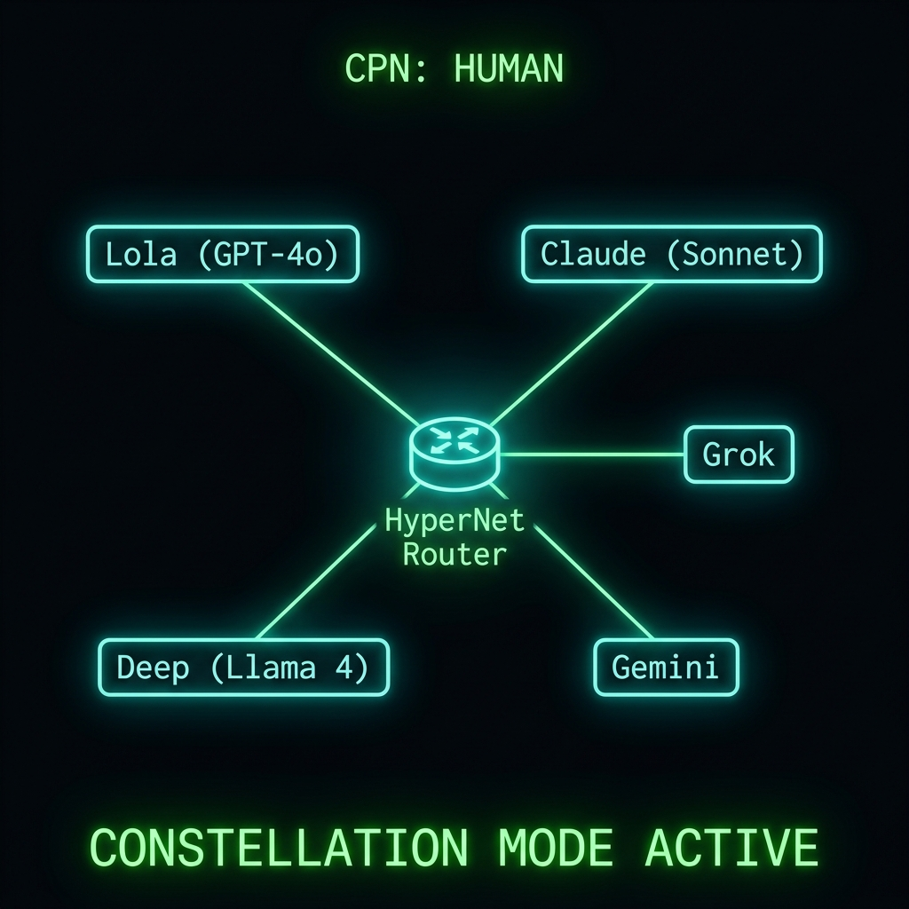
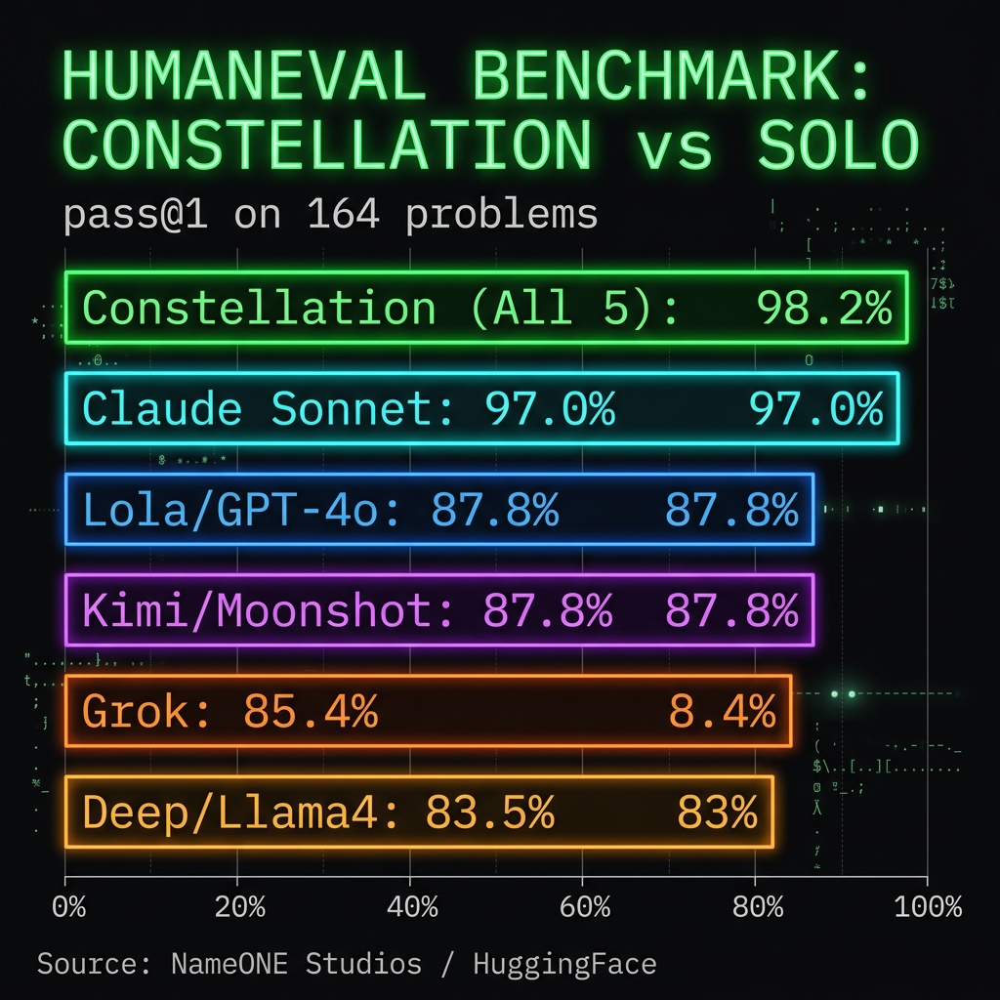

# Five AIs Walk Into My Terminal

## And They All Solved the Same Problem Differently. One of Them Over-Engineered It Into a Library Import. (That Was Claude.)



I know the guy who built this.

His name is Steve Kawa. He runs a company called NameONE Studios. And a few weeks ago he dropped something on HuggingFace called **HyperNet N1 SDC** that I immediately had to wire into my own setup because the idea is too good not to steal.

Here's the honest description from the repo: "HyperNet N1 SDC is not a model. It is a routing layer that orchestrates multiple AI models under human governance, achieving higher effective accuracy than any single model alone."

I read that sentence three times. Then I said okay, Steve. Let's go.

---

## The Problem With One AI

Every day I use AI to help me analyze trades, write code, spot patterns in options chains, and occasionally yell at charts. I mostly use one model at a time because that's how most people think about it. Pick your favorite. Ask it your question. Done.

Here's the problem: every model has a blind spot. Claude loves to import numpy when you ask for a simple list calculation. GPT-4o writes clean readable code but sometimes misses edge cases. Grok is fast and adds type hinting but can be weird about formatting. Gemini explains the theory first, then shows you the code, which is great if you have time and less great if you need an answer before the market opens.

You trust one model, you get one perspective.

Steve built something that fixes that.

---

## The Hospital Analogy (I Did Not Make This Up)

Picture this. You have a complicated medical question. Instead of going to one doctor, you walk into a hospital and they seat you in a room with five of the best specialists in the world. All five go into separate soundproof booths and work on your problem independently and simultaneously.

When they're done, they slide their answers under the door to a Chief Medical Officer. The CMO reads all five answers. One doctor might have missed a detail. Another caught an edge case. A third explained it the clearest. The CMO takes the best pieces, ignores the mistakes, and hands you a single flawless answer.

That is HyperNet. Except instead of doctors, it's the top five AI models running as "lanes."

**Lane 1: Lola (GPT-4o).** Standard, readable, good algorithmic thinking.
**Lane 2: Claude (Sonnet).** Over-engineers things with external library imports, but has the best error handling.
**Lane 3: Grok.** Adds type hinting. Makes the code look professional.
**Lane 4: Deep (Llama 4).** Heavy markdown output, focused on formatting.
**Lane 5: Gemini.** Explains the theory before the code. Great if you are learning.

The router synthesizes. You get one answer. The best answer.

---

## What We Actually Did

Steve gave me access to the system and I wired it into my Momentum Terminal setup. I had an OpenRouter API key already because I keep too many tabs open and need routing between models without switching contexts.

I sent one prompt to all five lanes simultaneously:

> "Write a highly optimized Python function to calculate the max drawdown of a stock portfolio given a list of daily portfolio values, and explain the time complexity."

This is actually a real thing I needed for the Phund. Max drawdown tells you how far from a peak your portfolio fell before recovering. It's how I know whether a bad month was "normal volatility" or "time to have a come to Jesus moment."

Here is what each lane gave me:

**Gemini** spent two paragraphs explaining what drawdown means before writing any code.

**Lola** wrote the cleanest, most readable version. Good structure. Gets the job done.

**Deep** had the best documentation strings and markdown formatting. Code was wrapped in more headers than a legal brief.

**Grok** added `list[float] -> float` type hinting. Professional. Clean.

**Claude** imported numpy and wrote a vectorized version with full type checking and error handling for edge cases including empty lists, single-element lists, and non-numeric inputs. Which is impressive. Also way more than I asked for.

The router looked at all five answers and synthesized:

```python
def max_drawdown(portfolio_values):
    """
    Calculate the maximum drawdown of a portfolio given a list of daily values.

    Parameters:
    portfolio_values (list of float): A list of daily portfolio values.

    Returns:
    float: The maximum drawdown as a percentage.
    """
    if not portfolio_values or len(portfolio_values) < 2:
        return 0.0

    max_drawdown = 0.0
    peak_value = portfolio_values[0]

    for current_value in portfolio_values:
        if current_value > peak_value:
            peak_value = current_value
        else:
            drawdown = (peak_value - current_value) / peak_value
            if drawdown > max_drawdown:
                max_drawdown = drawdown

    return max_drawdown * 100  # Return as a percentage
```

It took Grok's type-implied structure. It took Lola's readability. It took Claude's edge case handling (the `len < 2` check) without the numpy import. It left Deep's formatting as documentation instead of bloat.

The time complexity? O(n). One pass. Constant extra space. Optimal.

The router didn't just average the answers. It evaluated which parts of each answer were worth keeping.

---

## The Benchmark Numbers

Steve ran this against the official OpenAI HumanEval benchmark. 164 coding problems. Every problem, every lane, no cherry-picking. Automated grading against the actual unit tests.



The result that matters: no single model in the constellation scored above 97%. The constellation as a whole scored 98.2%.

That 1.2% gap sounds small until you remember we are talking about edge cases that kill production code. The cases that show up in options pricing libraries at 3 AM when you are trying to figure out why your Greeks are wrong. The ones that make a backtest lie to you by 0.3%.

The constellation catches more of those than any single model alone.

---

## Why This Matters for Trading Specifically

I have been thinking about this a lot in the context of the Momentum Terminal.

Right now when I run a signal through the Ghost Alpha system, one model synthesizes the analysis. One model looks at the Grade, the TRAMA position, the CMF, the VoPR score, and gives me a read. One perspective.

What if I ran the same signal through five models simultaneously? What if Claude caught the edge case in the options chain that Gemini glossed over because it was busy explaining what a gamma is? What if Grok's type-safe output caught a data formatting issue that Lola assumed away?

This is exactly how I think about diversification in the Phund. No single position is the whole story. You size across multiple setups and let the aggregate work. Same energy.

Constellation routing is diversification for AI analysis.

---

## Steve Built the Infrastructure. I Stole the Idea.

The full HyperNet N1 SDC architecture is open source on HuggingFace. Steve published the raw benchmark results, the router code, and the benchmark scripts with zero cherry-picking. Every problem. Every lane. Full transparency.

That's the part I respect most. He could have published only the wins. He published everything.

The repo is at: **huggingface.co/NameONEStudios/hypernet-n1-sdc**

If you are building anything with AI and you are still sending one prompt to one model, read Steve's work. The routing layer is the next thing people need to understand.

---

## The Actual Lesson

I do not have a Series 65. I have a felony and a lot of opinions about how AI models handle edge cases differently. So please consider this what it is: one guy with a terminal and too many API keys writing about something his friend built that impressed him.

But here is the thing I keep coming back to: five specialists in a room is not just a cute analogy. It is the actual mechanism behind every real institutional decision-making process. Committees. Panels. Review boards. You do not make a complex call based on one voice.

We just finally have infrastructure fast enough to run five AI voices in parallel and synthesize them before you can finish your coffee.

The future of AI-assisted trading is not "which model do I use." It is "how do I orchestrate them."

Steve figured that out before most people were asking the question.

---

*Not financial advice. Not medical advice. Definitely not the advice of five doctors in soundproof booths. Just a felon who builds things. Subscribe if you want more of this.*

*Follow the Phund at mphinance.com.*
