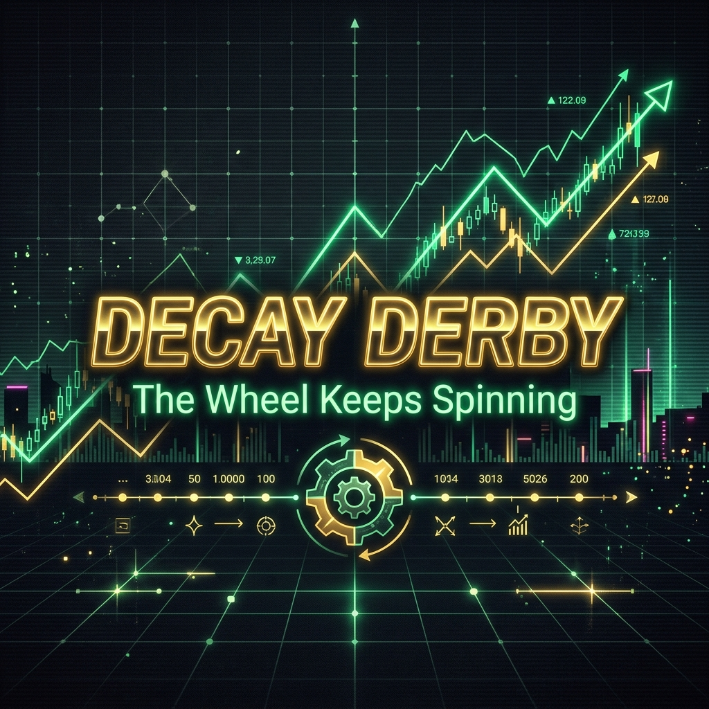

📣 *Before we get into it. Paid subscribers, scroll to the bottom. Starting May 1st the new IBKR account goes live. Real money. Real algo. Real alerts. You will be the first to see every fill. I am also dropping a free AI Cheat Sheet (PDF) down there for you. If you have been thinking about upgrading, this is the week.*

---

Yesterday I talked about the process. How the Ghost Alpha screeners got ripped apart and rebuilt as multi-factor scoring models. That was the code side.

Today we are talking about actual money.

**The Bucket Swap**

If you have been following the baby account challenge you know my goal was to grind my way out of Tastytrade. The $2,000 threshold was the escape velocity I needed to transfer out. We had three wheels spinning. It was a slow burn.

I got impatient. So I got creative.

My Relay savings account was holding about $1,000 of tax money. My Tastytrade account was also sitting at about $1,000. Instead of slowly bleeding new capital into a new broker I just swapped their jobs.

The $1,000 out of the tax savings went straight into Interactive Brokers (IBKR). That is the new home of the Momentum Phund. Tastytrade becomes the tax bucket. I am leaving the open options alone until they get called away, but any free capital in that account is being slowly converted into SGOV (short-term treasuries). I have 8 months to wind those trades down and park the cash safely before the IRS comes knocking.

Tax money stays safe. Trading operations migrate without skipping a beat. Sometimes the simplest move is the best move.

**The Decay Derby Tracker Overhaul**

While I was moving money I also had to fix the way we track it.

The Decay Derby dashboard was breaking. Not the strategy. The display logic. Selling cash-secured puts is easy to track. But when you get assigned and have to start selling covered calls, the old tracker would throw incorrect "expiring" alerts. It did not know how to handle the transition.

I spent the weekend completely overhauling the tracker logic. Now when a put gets assigned the system automatically reconciles the original record, transitions the position, and archives the old data. The UI finally knows the difference between an active cash-secured put and an assigned covered call position.

Sounds like a small fix. But when you are tracking dozens of premium trades across multiple accounts, the dashboard has to tell you the truth at a glance. Otherwise you make mistakes. And in this game, mistakes cost money.

**Decay Derby: End of Week Standings**

This is where the rubber meets the road. We are running the wheel strategy across a dedicated $10,000 account to prove the math works at scale. Here is the end-of-week scoreboard from Fidelity.

We started with a clean $10,000.

Active wheels spinning:
- **RCAT**: Assigned on 200 shares at the $12.50 strike. We own it now. Time to start selling calls against it.
- **UMAC**: Sold $13.50 puts for $40 premium.
- **UEC**: Sold $13.50 puts for $21 premium.
- **TMC**: Sold $5.00 puts for $18 premium.
- **NOK**: Rolling $9.50 puts, recently collected another $27.

We took a tiny scratch closing out AG and let a UAMY $9.50 put expire worthless. The machine keeps grinding.

The win rate is holding. The premium is collecting. The true cost basis on our assigned positions continues to drop.

This is the boring version of trading. You collect a few dollars at a time. You lower your basis. You let compounding do the heavy lifting. You do not panic when a position goes against you. You just roll the wheel.

It is not sexy. It just works.

In recovery they say "progress, not perfection." That is literally the wheel strategy in three words.

---

**🔒 The Paywall Cut: What Paid Subscribers Get This Week**

Here is the deal. The new IBKR account is funded and will be ready to trade on 5/1. I need about a week to wire the hooks up to the alert system. But very soon you will start getting live alerts every time the algo places a trade with real money. Not paper trading. Not backtests. Real fills, real P&L, delivered to your inbox.

I also put together something new this week. A lot of you have told me you use ChatGPT or Gemini or Claude but feel like you are "doing it wrong." So I distilled everything I have learned about prompting AI models (including the multi-model system I built called Urithiru) into a clean, actionable cheat sheet. Plug-and-play prompts for options analysis, strategy stress-testing, and portfolio review. It is attached as a PDF at the bottom of this section.

Now, the setup.

**Kinross Gold Corporation (KGC)**

I mentioned B2Gold (BTG) recently as a money printer, but if you want straight momentum, KGC is flashing Grade A right now in the Ghost Alpha screener.

- **The Setup:** Full bullish EMA stack alignment.
- **The Kicker:** It just triggered a Momentum Squeeze Fire (SQZ FIRE) signal.
- **The Value:** The fundamental model flags it as 44% undervalued against its fair value.

Gold miners are operationally leveraged to the gold price. With central banks hoarding and the macro environment doing what it does, miners that are actually printing cash and holding strong technical trends are exactly where you want to look. KGC is sitting near $32.79, ADX is pushing 28 (strong trend), and it is coiled to run.

Keep it on the watchlist this week. Accumulate on dips.

📎 **Download: [The Momentum Phinance AI Cheat Sheet (PDF)](prompt_cheat_sheet.pdf)**

---

*Built by Michael. Audited by AI. Fueled by black coffee and the Serenity Prayer.*

*Not financial advice. I am a trader who builds tools, not your financial advisor. Past screener performance does not guarantee future picks.*

*If you got value from this, share it with someone who needs it. And if you want the live IBKR alerts, the AI cheat sheet, and the weekly stock picks before anyone else sees them, [subscribe to the paid tier](https://mphinance.substack.com/subscribe). It is cheaper than one bad trade.*
