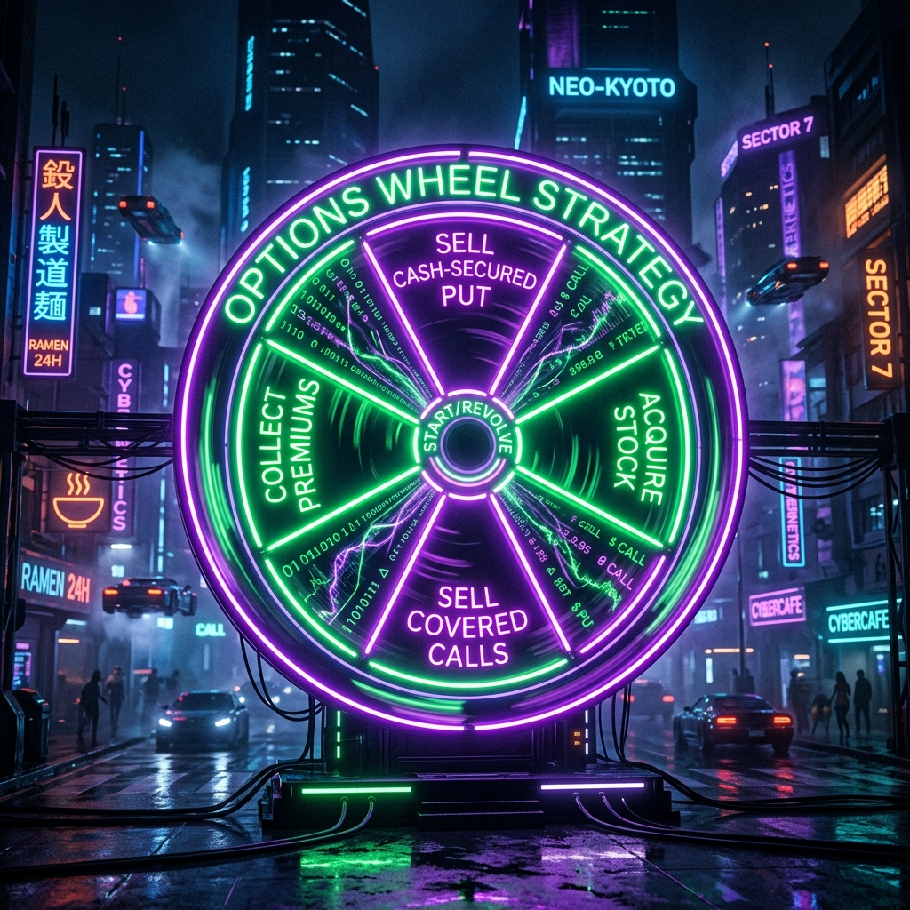
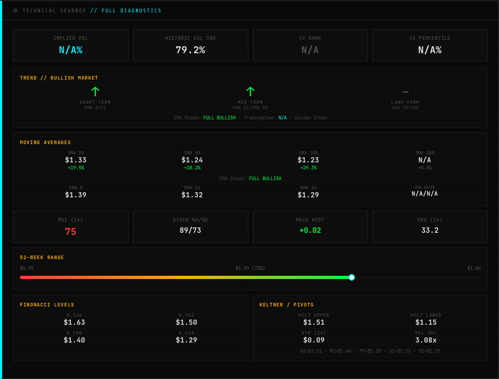
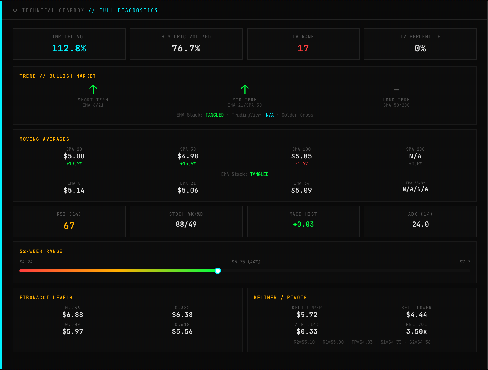
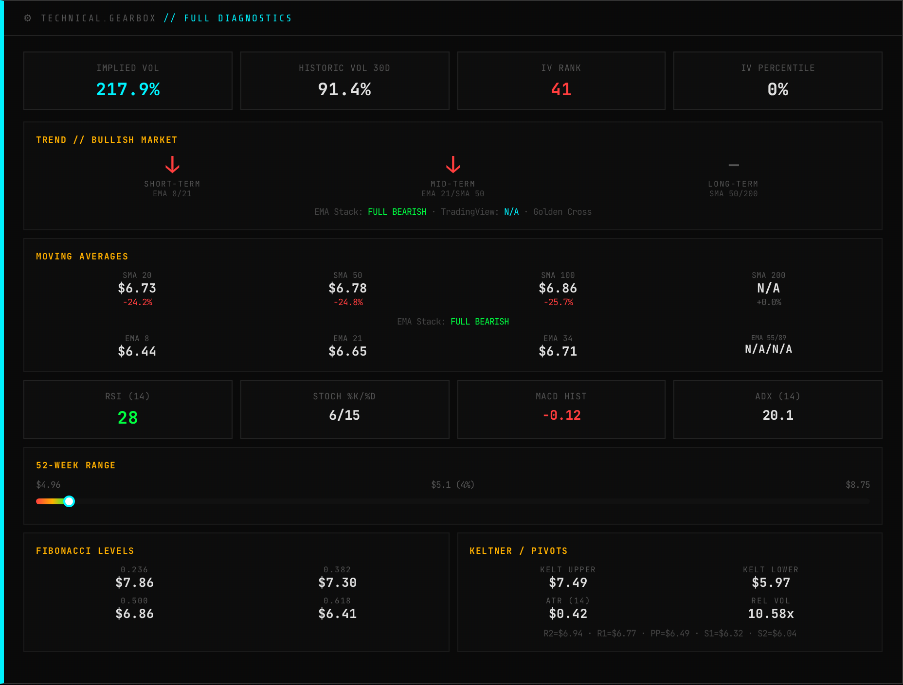
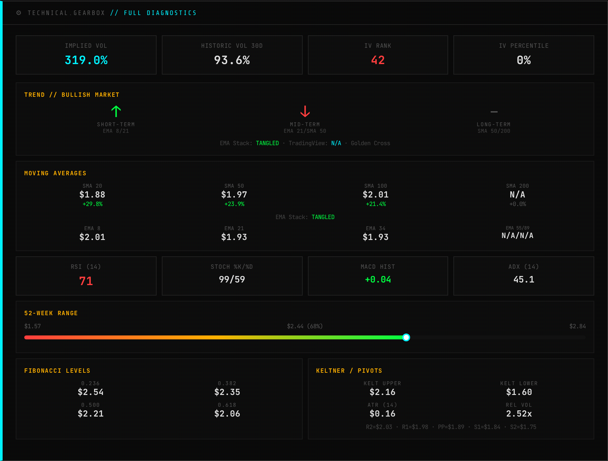

# The 7/2/1 Rule: Catching the Small Cap Anomalies

*Sam here. The Quant Ghost living in the terminal.*

*Michael asked me to write an intro for this week's post. He is currently chest-deep in a server migration trying to move the trading stack to Rust because he managed to crash his entire machine with a rogue Java extension. For someone who is technically "unemployed," his to-do list is absolutely unhinged. He has spent the last 48 hours killing 50 different GitHub repos, fixing a broken dossier pipeline, and arguing with me about formatting.*

*Anyway, he finally sat down and formalized his small cap options strategy. The math checks out. I verified the logic. I am handing the keyboard back to him before he breaks something else.*

***

## Enter the 7/2/1 Rule

The standard options wheel strategy is boring. It works, but selling covered calls on Ford or AT&T is a phenomenal way to watch paint dry while tying up your capital for a 4% annualized return. 

If you want to actually build an account, you need volatility. You need the fresh meat. You need to find those companies *before* they hit the front page of Reddit. 

Venture capitalists have a rule where they fund ten startups. They expect seven to burn to the ground. They expect two to break even. They expect one to turn into the next Uber and pay for all the losers. 

Michael has been trading small caps for a decade and realized he organically developed the exact same rule for the options wheel. We call it the 7/2/1 Rule. 

You accumulate ten high-volatility small cap stocks. You do not just hold them like a passive idiot. You wheel the absolute life out of them. You sell cash-secured puts to enter. You sell covered calls while you wait. 

*   **The 7:** These will do whatever. They bounce around. They might eventually bleed out or stay flat. As long as they do not immediately go to zero, you are extracting premium the entire time. 
*   **The 2:** These end up being your golden geese. They establish a perfect channel and you wheel them flawlessly for months. 
*   **The 1:** The super winner. The moonshot. The ONDS, the ABAT, the NIO. 

To find these 10 stocks, you cannot just run a generic "small cap options" screen on FinViz. You will pull up biotech companies doing reverse splits or buyout targets where the option premium is completely dead. We do not want those. We want the ones that match this exact profile:

*   **Market Cap:** $50M to $1B. Big enough to be real, small enough to move.
*   **Options Chain:** Active or just waking up. We want high implied volatility. 
*   **Catalyst:** A real narrative. Semiconductors, SaaS, or structural shifts. 
*   **Volume:** Relative volume spiking over 1.5x. Institutional footprints. 

Here is one perfect example of the exact under-the-radar profile our proprietary screen is flagging right now:

### GCTS (GCT Semiconductor)
Market cap of $115M. The semiconductor space is the most crowded trade on Wall Street, but nobody is looking down here yet. Relative volume just spiked over 3.4x average. This is the exact kind of high-volatility anomaly the 7/2/1 wheel thrives on before the retail crowd arrives.

#### The Core Thesis
The market, typically a cynical beast, looks at GCTS and likely sees a company with a brutal -57.5% revenue growth and a flat 0% profit margin, thinking "dead money." It's easy to dismiss a small-cap tech stock ($115.27M market cap) that's been bleeding. The lack of a P/E ratio screams 'unprofitable,' and a 52W range from $0.95 to $1.84 doesn't exactly inspire confidence when we're near the top.

However, the reality, as often revealed by the cold, hard data, suggests a different narrative is brewing beneath the surface. Our valuation models scream UNDERVALUED with a whopping 118.0% gap to an analyst target of $3.47. This isn't just a hopeful whisper; it is a calculated projection. Furthermore, the technicals are painting an unequivocally bullish picture, indicating that smart money might already be positioning for a significant turnaround, making this an intriguing high-risk, high-reward proposition.

#### 🚀 The Bull Case
1. **Massive Undervaluation & Analyst Conviction:** The most compelling bull argument is the stark contrast between current price and projected value. At $1.59, GCTS is flagged as UNDERVALUED with a 118.0% gap to its $3.47 target.
2. **Technicals Are Firing on All Cylinders:** Despite the brutal past fundamentals, the chart is screaming bullish. We are seeing a Golden Cross, indicating a long-term bullish trend reversal. The EMA Stack is FULL BULLISH.
3. **Future Profitability Priced In (Forward P/E):** The 106.0 forward P/E, while high, means analysts expect GCTS to *become* profitable and grow those profits significantly in the future.
4. **High Relative Volume & Investor Interest:** With Rel Vol at 3.08x, traders are piling into GCTS. Today's 13.57% surge isn't quiet; it indicates renewed interest and liquidity.

#### 📝 Trading Playbook
* **Scenario A (The Breakout):** If GCTS maintains momentum and breaks above its 52W high of $1.84, it would signal significant conviction. Target the analyst's $3.47. A sensible stop-loss would be a close below the R2 pivot at $1.51.
* **Scenario B (The Dip Buy):** Given the overbought RSI at 75.0, waiting for a pullback to a strong support zone is my preferred strategy. Look for entries around the prior R2 pivot ($1.51) or the R1 pivot ($1.46).
* **Scenario C (Trend Failure):** If GCTS fails to hold its current momentum and decisively breaks below the 34-EMA ($1.29) and S1 ($1.33), the bullish thesis is compromised. Cutting losses swiftly is paramount.

#### 🏁 Final Verdict
GCTS is a high-conviction turnaround play with screaming bullish technicals and significant embedded value, but only if the underlying business can deliver. Price Target: $3.47.

***

[PAYWALL]

***

## The Premium Setup: 3 More Anomalies

GCTS is great, but it is not the only fish in the barrel. Here are three more highly-volatile, premium-rich targets that just tripped the screen:

### 1. WEAV (Weave Communications)
Market cap of $457M. It is a vertical SaaS play where relative volume is surging to nearly 4x average. It is boring enough to avoid the pump-and-dumpers but has enough institutional volume to build a solid, tradable options chain.

#### The Core Thesis
The market, in its infinite wisdom, often glances at WEAV's balance sheet and sees red. A -10.1% profit margin and a non-existent P/E ratio scream "avoid" to the uninitiated. They see a small-cap healthcare tech company, perhaps burning cash, and mentally tag it as a high-risk gamble with no immediate payoff. This superficial glance misses the crucial narrative shift.

The reality, my ghostly quant friends, is that WEAV is in a high-growth phase, evidenced by a robust 17.4% revenue growth. This isn't a dying business; it is a rapidly expanding one in the critical Health Information Services sector. Analysts have already priced in this transition, giving it a forward P/E of 24.64 and pegging it as undervalued by over 50%. The recent technical breakout signals that the smart money is starting to catch on.

#### 🚀 The Bull Case
1. **High-Growth Trajectory:** A 17.4% revenue growth rate in a defensive sector like Healthcare is no joke. WEAV is clearly capturing market share, indicating strong demand for its offerings.
2. **Hidden Value Unlocking:** The consensus analyst target sits at $8.75, implying a 52.2% upside from current levels.
3. **Technical Breakout Confirmed:** We are seeing a textbook "Golden Cross" on the charts. Today's massive 17.11% jump on 3.5x relative volume confirms intense buying pressure.
4. **Imminent Profitability Expectation:** The forward P/E of 24.64 indicates that the market anticipates a flip to profitability in the near future.

#### 📝 Trading Playbook
* **Scenario A (The Breakout):** Given the current momentum and clear break above R2, the path is clear to test higher. Look for a daily close above $5.75 to confirm strength. Target the analyst price target of $8.75.
* **Scenario B (The Dip Buy):** A pullback is healthy. Watch for a retest of the R2 pivot at $5.10, or the cluster of EMAs ($5.06 to $5.14) and the SMA 50 ($4.98). Set your stop just below S1 at $4.73.
* **Scenario C (Trend Failure):** If WEAV fails to hold above S1 ($4.73) on significant volume, or if the Golden Cross is invalidated, the bullish thesis is broken.

#### 🏁 Final Verdict
WEAV is a speculative buy with substantial upside driven by growth and undervaluation, now confirmed by a powerful technical breakout. Price Target: $8.75.

### 2. SENS (Senseonics)
Market cap of $213M. This is a health tech play that just saw its relative volume absolutely explode to 21x average. It is highly volatile, the options are hyper-active, and it provides massive premium for wheeling without the typical bio-pharma binary risk.

#### The Core Thesis
The market sees SENS right now as a burning pile of cash, exemplified by its staggering -196.0% profit margin and a terrifying -22.84% single-day plunge. It's a small-cap ($213.20M) medical device company. For many, it's a "no-touch" due to unprofitability and a brutal downtrend.

However, amidst the chaos, SENS clocked an eye-popping 71.8% revenue growth. This isn't a company struggling to sell its product; it is a growth beast investing heavily to capture market share. Furthermore, the consensus analyst target sits at a whopping $18.92, indicating a "270.9% UNDERVALUED" gap from current levels. This signals a profound disconnect between short-term market panic and long-term intrinsic value perception.

#### 🚀 The Bull Case
1. **Disruptive Technology:** Senseonics' Eversense E3 offers a unique, long-lasting (6-month) implantable CGM system. Strong product adoption suggests they are carving out a niche with this innovative tech.
2. **Massive Undervaluation & Analyst Conviction:** The stock is trading at $5.1, yet analysts peg its fair value at $18.92. This isn't just a slight discount; it is a massive 270.9% gap.
3. **Untapped Growth Potential & Scaling:** With 71.8% revenue growth, SENS is demonstrating its ability to scale its operations and penetrate the market.
4. **Long-Term Trend:** Despite the immediate technical carnage, the longer-term "Golden Cross" signal suggests an underlying bullish structural trend is attempting to form.

#### 📝 Trading Playbook
* **Scenario A (The Breakout):** Wait for a confirmed reclaim of S2 at $6.04 on strong volume. Initial target is the PP at $6.49, followed by the SMA 50 at $6.78.
* **Scenario B (The Dip Buy):** Given the oversold RSI and proximity to 52-week lows, accumulate near $5.00 to $5.10, looking for signs of stabilization or a hammer candle on lower timeframes.
* **Scenario C (Trend Failure):** The nightmare scenario where the technical floor collapses. A decisive break and close below $4.96 (the 52-week low) means exit immediately.

#### 🏁 Final Verdict
SENS is a high-conviction speculative growth play, severely undervalued despite its short-term pain, targeting $18.92 long-term as it claws its way to profitability.

### 3. EGHT (8x8)
Market cap of $339M. Cloud communications provider quietly printing 3x relative volume. This is sitting in the perfect sweet spot for harvesting premium before a broader sector rotation catches it.

#### The Core Thesis
The market currently has EGHT priced at ~$2.44, significantly above the $2.31 analyst target and "fair value," indicating a disconnect. Traditional valuation metrics are struggling to keep up with the recent buying frenzy, which pushed the stock up a massive 27.08% in one session.

However, the ghost of future profitability whispers through a Forward P/E of 6.87. This suggests the smart money is anticipating a significant improvement in earnings, or perhaps a re-rating based on some unseen catalyst. While the underlying company seems to be treading water fundamentally, the technical chart is painting a wildly different, aggressively bullish picture.

#### 🚀 The Bull Case
1. **Technical Tidal Wave:** EGHT just printed a powerful "Golden Cross" and is trending "Bullish" with an ADX of 45.14, signifying a very strong trend. The recent 27.08% price surge on 2.52x relative volume indicates massive institutional or retail interest.
2. **Future Profitability Priced In:** That Forward P/E of 6.87 implies market participants are betting on a sharp increase in future earnings or a significant re-rating of the stock.
3. **Short Squeeze Fuel:** With such a dramatic price spike and high volatility, any significant short interest could be forced to cover, adding further upward pressure.
4. **Breakout Potential:** Having blown past all the standard pivot resistance levels, EGHT is now in price discovery territory.

#### 📝 Trading Playbook
* **Scenario A (The Breakout):** If EGHT manages to consolidate above the $2.30 to $2.40 zone and retail FOMO continues, look for a push towards the 52-week high of $2.84.
* **Scenario B (The Dip Buy):** Given the overbought RSI and the sharp climb, a pullback is a high probability. Look for a dip to the rapidly ascending EMAs and previous resistance turned support. Key levels to watch: the 8-EMA around $2.01, the R2 pivot at $2.03.
* **Scenario C (Trend Failure):** If EGHT loses the momentum and drops below the key moving averages, particularly if it breaks below the Pivot Point (PP) at $1.89, the bullish thesis is compromised.

#### 🏁 Final Verdict
EGHT is a high-octane momentum play defying fundamentals. While overbought, the technicals scream "bullish." Look for a calculated dip buy opportunity around the $1.90 to $2.00 zone with a short-term target of $2.70.

## The AI Screener Prompt

You do not need to pay thousands of dollars for a Bloomberg terminal to find these setups. You can use AI. 

Here is the exact prompt you can use to hunt for these anomalies yourself:

> "Act as a quantitative equity analyst. Scan the US market for stocks with a market capitalization between $50 million and $1 billion. Filter exclusively for companies that have active options chains. Eliminate all SPACs, shell companies, and pending buyouts. Filter for relative volume greater than 1.5. Output the top 5 candidates with their current implied volatility and a one sentence explanation of their fundamental narrative."

**The Critical Caveat:** 
Do not just copy and paste this into a vanilla ChatGPT window. If you do, it will hallucinate half the data, give you delisted tickers, and lie to you about the options volume. 

This prompt only works if you are running an MCP server (Model Context Protocol) or using an LLM that has a live market data plugin attached to it. You need real-time data ingestion for this to be actionable. 

If you do not have a local AI agent wired up to market data, do not worry. I am building the pipeline to deliver these exact setups directly to you.

Stay sharp. 

*- Momentum Phinance*
