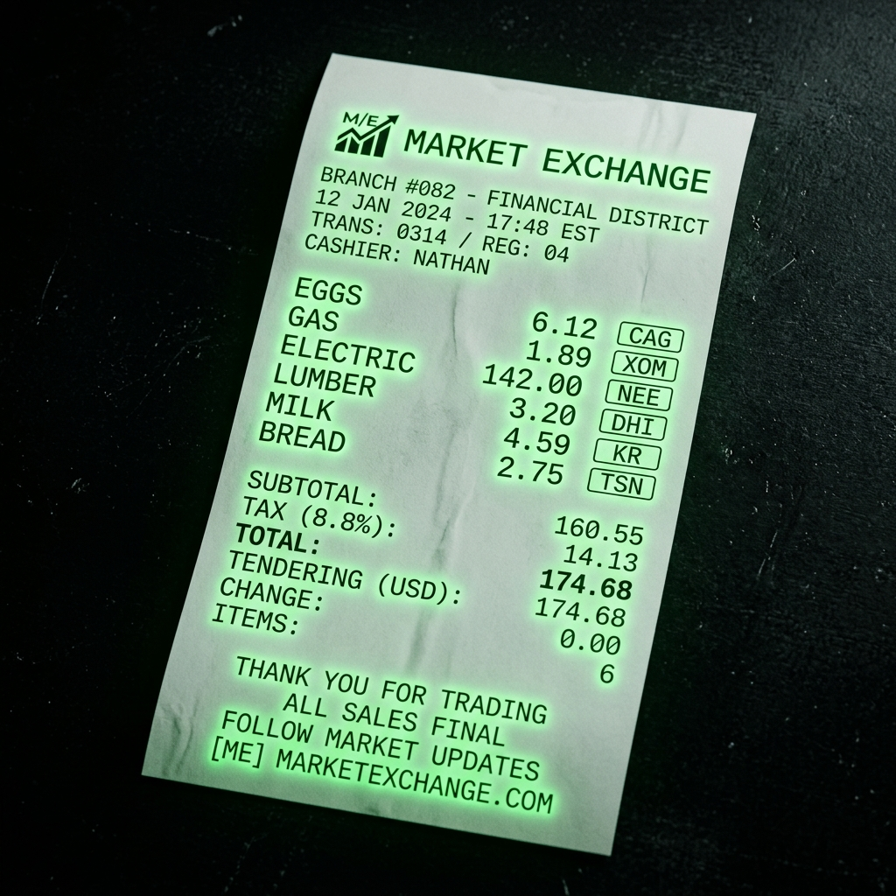
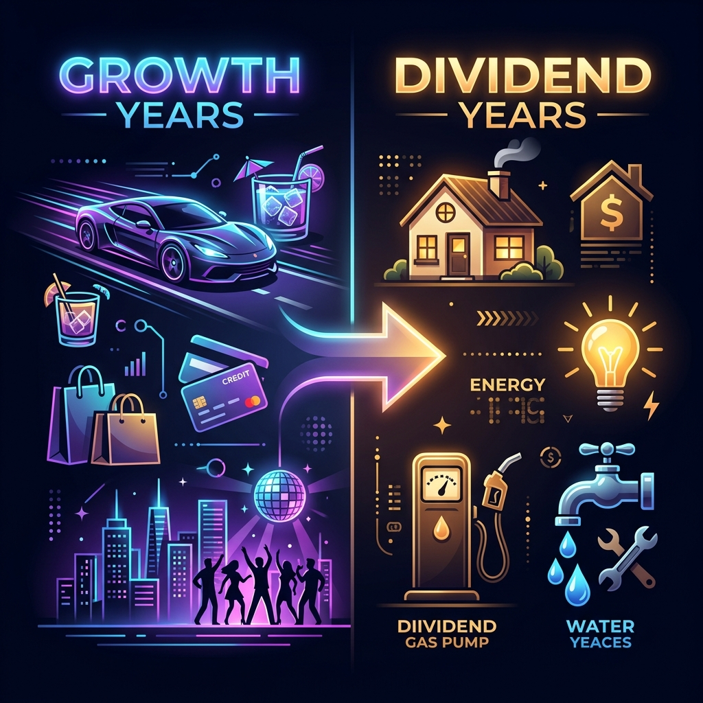
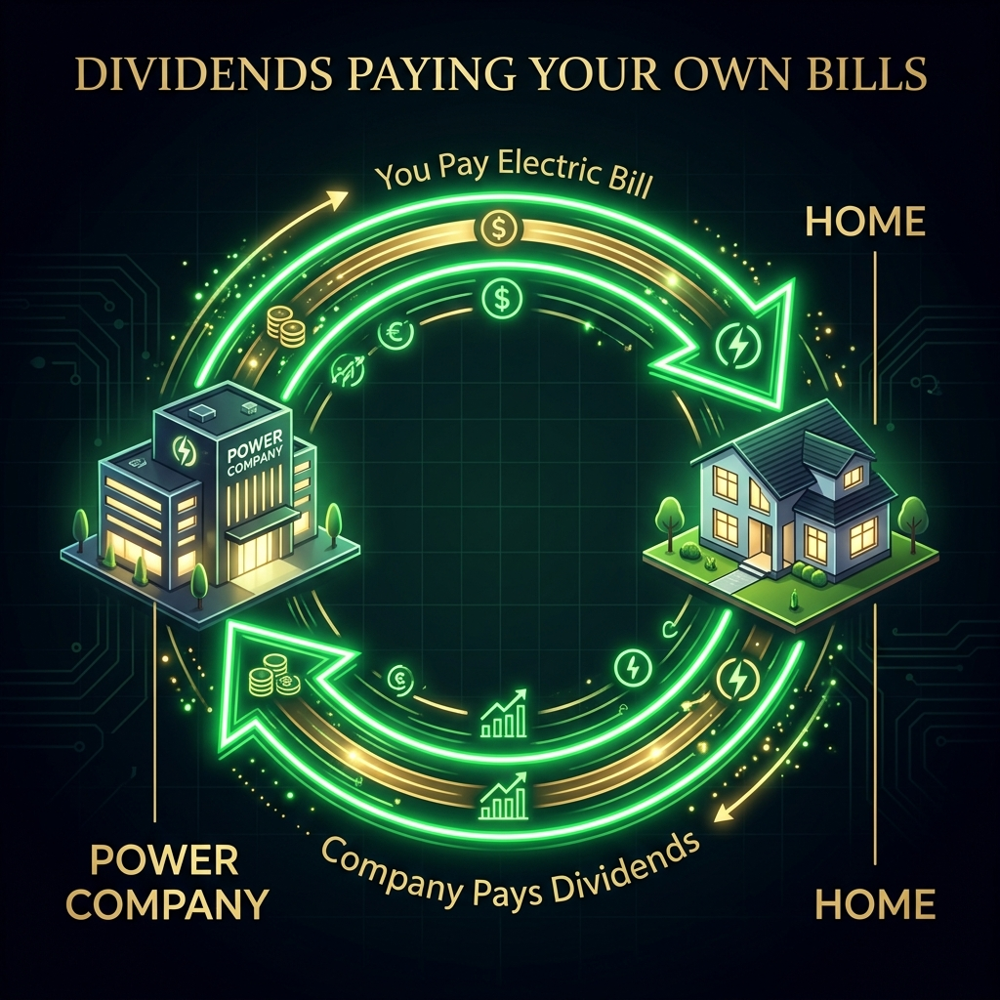

# Stop Paying Bills. Own Them Instead.

*Michael's Musings #15 · Apr 2026*

---

I was doing my dad's account the other day and something clicked.

His biggest expenses are completely different than mine. And it hit me: his portfolio should be too.

Most people build a portfolio like they're checking boxes. They buy a target date fund, maybe an S&P 500 index, and hope for the best. That is fine if your goal is being entirely average.

But here's the truth. Your investments shouldn't match a pie chart from some guy who makes money whether you do or not. Your investments should mirror your expenses.

## Your Expenses Are Already Telling You What to Buy

You don't need a Bloomberg terminal. You need to pay attention at the checkout counter.

This summer gas was under $2 a gallon. Eggs were $6 a dozen.

Most people saw that and complained. I saw cheap gas and thought "energy companies are getting squeezed, that's a buying opportunity." I saw expensive eggs and asked "who is making money from this?"

Every single person reading this already does fundamental analysis every day. You just don't know it yet.

When your buddy in construction tells you nobody is building because houses aren't selling, you avoid homebuilders. You don't need a housing starts report from the Fed. You already got the data from a guy named Dave who pours concrete for a living.

When gas drops below $2, energy companies are on sale. Not when CNBC tells you oil is "rebounding." By then everyone is already in.

When eggs hit $6, someone upstream is printing. Find them.

Your expenses are real-time market intelligence. Not theory. Not a screener. Just your life, telling you where money is flowing.

## The Age Shift Nobody Talks About

Now here's where it really gets interesting.

In your twenties and thirties, you are spending money on growth. Cars. Toys. Going out. Taking risks. Maybe some alcohol. Definitely some bad decisions.

Your portfolio should match that energy. You buy the growth stocks. You take the swings. Your capital is growing along with your lifestyle. You're betting on the future because you ARE the future.

Your expenses in your twenties are growth expenses. Your portfolio should be growth too.

Then something changes.

The cars get paid off. The house gets paid off. You stop buying toys and start buying reading glasses.

Your biggest expenses become incredibly boring. Heat. Electricity. Gas. Water. Insurance. Every dollar going out is just keeping the wheels turning.

This is exactly where your portfolio needs to shift.

## The Money Glitch

Stop trying to find the next 10x tech stock to pay your heating bill. Go buy the damn power company.

When utilities and energy become your biggest monthly expenses, your portfolio should be built to throw off dividends from those exact sectors. You shift from chasing capital appreciation to collecting steady cash flow.

Think about what that actually means.

You pay your electricity bill. The energy company takes your money, turns a profit, and cuts you a dividend check. You use their check to pay their next bill.

That is the closest thing to a money glitch in the real world. You own the very companies you are paying. They literally provide the capital to cover the invoice they just sent you.

## Expenses as a Portfolio Strategy

Here is how I think about it now:

**When something gets cheap in your life**, that's a buy signal. Gas under $2? Energy is on sale. Lumber prices crash? Homebuilders will eventually recover.

**When something gets expensive**, ask who is making money from that. Eggs at $6? Someone upstream is printing. Find them.

**When something disappears from your spending entirely**, pay attention. Nobody around you is building? Avoid the sector. Your friend just cancelled their streaming service? Maybe look at those subscriber numbers before buying the dip.

**When your bills shift with age**, your portfolio shifts with them. Match your investments to your actual life, not some model portfolio designed for a fictional 35 year old making $120K in San Francisco.

> *"God, grant me the serenity to accept the trades I cannot change, the courage to size up on the ones I can, and the wisdom to know the difference."*

Your grocery receipt. Your utility bill. Your mechanic's invoice. That is your research. You are already doing the work. Now invest like it.

---

*If you want to see how we turn real-world signals into actual trades, the [Ghost Alpha Dossier](https://mphinance.github.io/mphinance/) runs every morning at 5AM. Subscribe below so you don't miss the next setup.*

*-- Michael*

---

## 📎 All Links

- **Ghost Alpha Dossier (daily report):** [mphinance.github.io/mphinance/](https://mphinance.github.io/mphinance/)
- **Daily Screener (updated 5AM CST):** [mphinance.github.io/mphinance/leveraged-screener/daily.html](https://mphinance.github.io/mphinance/leveraged-screener/daily.html)
- **Landing Page:** [mphinance.com](https://mphinance.com)
- **TraderDaddy Pro (Whop community):** [traderdaddy.pro](https://www.traderdaddy.pro/register?ref=8DUEMWAJ)
- **TickerTrace Pro (ETF tracker):** [tickertrace.pro](https://www.tickertrace.pro)
- **Ghost Blog (dev log):** [mphinance.com/blog/](https://mphinance.com/blog/)
- **GitHub (all source code):** [github.com/mphinance](https://github.com/mphinance/mphinance)
- **Substack:** [mphinance.substack.com](https://mphinance.substack.com)

*P.S. -- "Don't pee upwind. Don't trade against the trend. Same energy." -- Sam*
