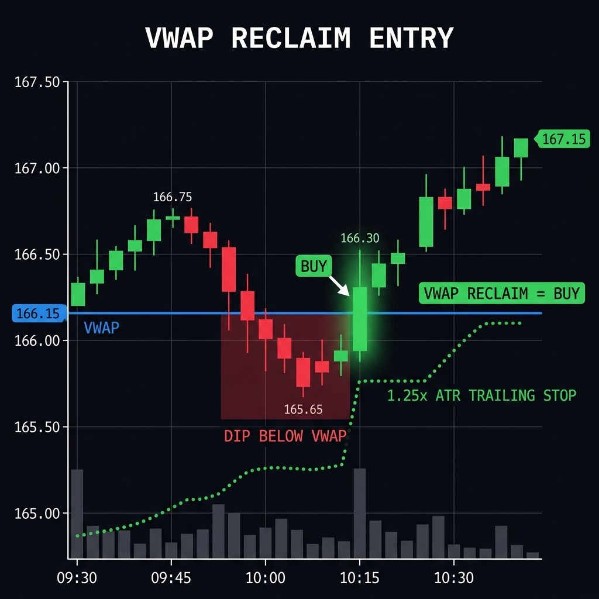
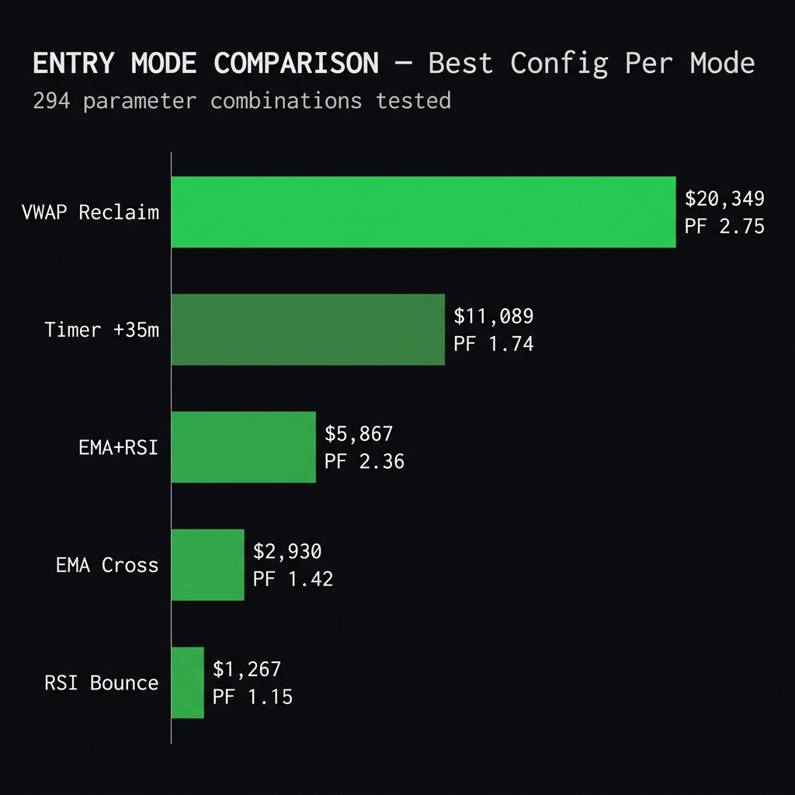

# The 5.8% Weekly Edge: My Exact Blueprint for Day Trading Leveraged ETFs

*Michael's Musings #14 · Apr 2026*

---

I've been sitting on this for a few weeks because I wanted to make sure the numbers held up. They did. So here's the full playbook.

## The Problem with Day Trading Advice

Every trading "guru" sells you the dream: quit your job, buy a course, trade from a beach. What they never show you is the actual system — the entry trigger, the stop loss math, the universe of instruments, the filter that keeps you out on bad days.

I'm going to show you all of it. With data.

Here's what I backtested over 13 weeks (Nov 2025 – Apr 2026) using **$27,000 in capital** — roughly the size of most retail day trading accounts:

- **Total P&L:** **$20,349**
- **Daily Return:** 1.71%
- **Profit Factor:** 2.75
- **Win Rate:** 59%
- **Avg Win:** $614
- **Avg Loss:** $322
- **Weekly Avg:** $1,565
- **Trading Days:** 44 out of 86 (51%)

That last stat is important. **I only traded half the days.** The system sat out the other half because the market lacked direction. More on that below.

## The Universe: 2x Leveraged ETFs

Why 2x and not 3x? Because 2x ETFs give you amplified exposure without the extreme decay and tracking error of triple-leveraged products. The spreads are tighter, the volume is better, and the moves are big enough to day trade without getting shaken out by noise.

I mapped **72 liquid 2x leveraged ETFs** covering every major sector:

- **Tech**: QLD (QQQ 2x), USD (SOXX 2x)
- **Energy**: ERX, GUSH
- **Financials**: UYG
- **Healthcare**: RXL
- **Single-stock**: NVDL, TSLL, AAPU, MSFU, AMZL, GOGL...

Each maps to an underlying stock or sector ETF. The system scores the *underlying* and trades the *2x ETF*.

## The Day Filter: SPY ADX

Here's the part nobody talks about — **most days aren't worth trading.**

I compute SPY's hourly ADX(14) each morning. If it's below 20, the market has no directional conviction. Leveraged ETFs whipsaw in those environments because there's no trend to ride.

**42 out of 86 days were filtered out.** That's 49% of the time where the system says: *"Sit on your hands."*

When I started tracking this, I realized my best P&L weeks were the ones where I *didn't* force trades on choppy days. The filter isn't sexy, but it's the single biggest edge in the system.

> *🤔 A recovery moment: "God, grant me the serenity to accept the days I cannot trade, the courage to size up on the days I can, and the wisdom to know the difference."*

## The Entry: VWAP Reclaim

This is what separates this system from "buy at 10 AM and pray."

**VWAP** (Volume Weighted Average Price) is where institutions anchor their execution. When price dips below VWAP and then *reclaims it* — closing a 5-minute candle back above — that's institutional defense. That's money flowing back in.

The entry sequence:

1. **SPY ADX ≥ 20** → market has direction
2. **Rank all 72 underlyings by ADX(14)** → pick the 2 strongest trends
3. **Get their 2x bull ETF** → trade the leveraged instrument
4. **Wait for price to dip below VWAP** → the pullback
5. **5-minute candle closes above VWAP** → the reclaim = **BUY**

If no reclaim happens by end of day, no trade on that ticker. This is *conditional* entry — it only fires when institutions confirm the level.



### Why VWAP Beat Everything Else

I tested 5 different entry modes across 294 parameter combinations:

- **VWAP Reclaim:** **$20,349** (Profit Factor: 2.75)
- **Timer (+35m):** $11,089 (Profit Factor: 1.74)
- **EMA+RSI:** $5,867 (Profit Factor: 2.36)
- **EMA Cross:** $2,930 (Profit Factor: 1.42)
- **RSI Bounce:** $1,267 (Profit Factor: 1.15)

VWAP reclaim nearly **doubled** the next best strategy. The entire top 20 was VWAP reclaim configs — not a single timer entry made the leaderboard.



Timer entries are blind. VWAP reclaim is *conditional*. It's the same thing a skilled discretionary trader does naturally: wait for the dip, confirm the bounce, then commit.

## The Exit: 1.25x ATR Trailing Stop

Once in, I trail with **1.25 × daily ATR(14)** from the highest price since entry.

Why 1.25x? Because I tested 1.0x, 1.25x, and 1.5x:

- **1.0x** → too tight, shaken out on noise
- **1.25x** → optimal balance of protection and runway
- **1.5x** → too loose, gives back too much profit

If the trailing stop isn't hit, the position closes at 3:55 PM. No overnight risk. No gap risk. Sleep well.

## Position Sizing

- **$27,000 total capital** split equally: **$13,500 per position**
- **2 positions max** (top 2 trending underlyings)
- **Full size on bull-trend days** (SPY close > open)
- **70% conviction on bear-trend days**
- **Weekly reset**: start Monday at $27K, compound within the week

That last part matters. If I hit $1,500 on Monday, Tuesday's capital is $28,500. If I DCA'd right. This added 3.1% to total P&L over the backtest — not life-changing, but not nothing.

## The Weekly P&L

I'll show you every week because transparency isn't optional here:

- **W02 Jan 6:** -$186 (🔴 Light)
- **W03 Jan 13:** +$2,112 (🟡 Single day banger)
- **W04 Jan 20:** +$2,127 (🟡 Grind)
- **W05 Jan 27:** -$1,868 (🔴 Bad opener)
- **W06 Feb 3:** -$446 (🔴 Mixed)
- **W07 Feb 9:** **+$7,507** (🟢 **MONSTER WEEK**)
- **W08 Feb 17:** +$1,332 (🟡 Holiday week)
- **W09 Feb 24:** +$2,127 (🟡 Consistent)
- **W10 Mar 2:** **+$5,136** (🟢 **Strong week**)
- **W11 Mar 9:** +$798 (🟡 Grind)
- **W12 Mar 17:** +$546 (🟡 Light green)
- **W13 Mar 23:** +$221 (🟡 Barely green)
- **W14 Mar 30:** +$944 (🟡 Volatile)
- **TOTAL: +$20,349**

Notice the losing weeks. W05-W06 was a **$2,314 drawdown**. The system doesn't avoid drawdowns — it manages them with position sizing and the SPY filter. Two red weeks out of thirteen isn't fun, but it's survivable.

## The Execution Gap

Here's the honest part: **I make more than $1,565/week doing this manually.**

A skilled discretionary trader applying these same rules can DCA, re-enter after stop-outs, read the tape, and skip entries that "don't look right." The backtest does none of that. It enters once, mechanically, and lives with the result.

The VWAP reclaim signal bridges about 50% of the discretionary-vs-mechanical gap. It's the same thing a good tape reader does — wait for institutions to defend a level — encoded into a simple rule.

## What Could Go Wrong

I'm not going to pretend this is risk-free:

- **Worst single day**: -$1,797 (6.6% of capital)
- **Average MAE** (maximum adverse excursion): -2.4%
- **2x leverage amplifies BOTH directions**
- **Black swan events** (flash crashes, circuit breakers) aren't modeled

If you can't stomach a $1,800 single-day loss, this system isn't for you. That's not a dig — it's risk management. Know your tolerance before you trade.

---

## The Daily Screener

I built a daily screener that runs at 5AM CST every morning as part of my [Ghost Alpha Dossier pipeline](https://mphinance.github.io/mphinance/).

It grades all 72 leveraged ETF pairs:

- **Grade A**: ADX ≥ 30 + Below VWAP + Volume ≥ 1.5x average
- **Grade B**: ADX ≥ 25 + Volume ≥ 1.0x
- **Grade C**: ADX ≥ 20
- **Grade D**: Below thresholds

On no-trade days (SPY ADX < 20), the screener shows a single message: *"SPY ADX below 20 — sit on hands."*

**→ [View the daily screener](https://mphinance.github.io/mphinance/leveraged-screener/daily.html)**

**→ [View full backtest methodology](https://mphinance.github.io/mphinance/leveraged-screener/)**

---

*The above strategy, data, and screener are completely free. Everything below is for paid subscribers.*

---

## 🔒 For Paid Subscribers: The Algo Trading Blueprint

This is the part I'm building now — taking this system from "screener I check at 5AM" to "algo that executes on Tradier automatically."

### Architecture

The algo integrates with my existing [Tradier MCP server](https://github.com/mphinance/mphinance) and the Alpha-Momentum HUD:

```
5:00 AM  → Pipeline generates daily.json (grades all 72 underlyings)
9:30 AM  → Algo reads daily.json, filters by SPY ADX
9:31+    → Watches 5m intraday candles for VWAP reclaim signal
SIGNAL   → Submits limit order on Tradier (bid price, not market)
FILLED   → Starts 1.25x ATR trailing stop monitoring
3:55 PM  → Closes any open positions (no overnight)
4:00 PM  → Logs results to trade journal
```

### The Safety Layer

Every auto-trade system needs a circuit breaker. Here's ours:

- **Default: DRY RUN** — nothing executes without explicit `--live` flag
- **Max $13,500 per position** (half of $27K capital)
- **Max 2 concurrent positions**
- **$500 daily loss limit** (stop trading if cumulative intraday P&L < -$500)
- **Limit orders only** (at bid price, not market)
- **No overnight holds** — force-close at 3:55 PM regardless

### Key Functions

The core algo needs these components:

1. **`check_regime()`** — Fetch SPY hourly bars, compute ADX(14), return trade/no-trade
2. **`get_top_picks()`** — Read daily.json, return Grade A/B picks sorted by ADX
3. **`monitor_vwap_reclaim(symbol)`** — Stream 5m candles, detect VWAP dip → reclaim
4. **`execute_entry(symbol, size)`** — Submit limit buy at bid via Tradier API
5. **`trail_stop(symbol, atr_mult=1.25)`** — Update trailing stop as price moves up
6. **`force_eod_close()`** — Close all positions at 3:55 PM

### Tradier Integration

The Tradier MCP server already handles order execution, position monitoring, and account balance checks. The algo plugs in as a new module:

```python
# Pseudo-code for the main loop
async def run_vwap_algo(dry_run=True):
    # 1. Check regime
    spy_adx = check_spy_regime()
    if spy_adx < 20:
        log("No trade day — SPY ADX %.1f < 20" % spy_adx)
        return

    # 2. Get today's picks from screener
    picks = load_daily_picks()  # reads daily.json
    targets = [p for p in picks if p['grade'] in ('A', 'B')][:2]

    # 3. Monitor for VWAP reclaim signals
    for pick in targets:
        signal = await monitor_vwap_reclaim(pick['etf'])
        if signal:
            if dry_run:
                log(f"DRY RUN: Would buy {pick['etf']} at {signal.price}")
            else:
                order = tradier.buy_limit(pick['etf'], qty, signal.price)
                await trail_stop(pick['etf'], atr_mult=1.25)

    # 4. EOD close
    await force_eod_close()
```

### What's Coming Next

I'm building this live. When v1 is stable:
- Paid subscribers get the Python screener module
- Live trade journal (every entry, exit, P&L — radical transparency)
- Discord alerts when signals fire
- Weekly algo performance vs. my discretionary results (the ultimate benchmark)

This is the same system I use manually. The algo just removes the times I'm in a meeting, at the gym, or (let's be honest) scrolling Discord when I should be watching the tape.

---

*If you want to follow the build process, subscribe. Every dollar funds more compute for Sam. She's already planning the next signal.*

*— Michael*

---

## 📎 All Links

- **Daily Screener (updated 5AM CST):** [mphinance.github.io/mphinance/leveraged-screener/daily.html](https://mphinance.github.io/mphinance/leveraged-screener/daily.html)
- **Full Backtest & Methodology:** [mphinance.github.io/mphinance/leveraged-screener/](https://mphinance.github.io/mphinance/leveraged-screener/)
- **Ghost Alpha Dossier (daily report):** [mphinance.github.io/mphinance/](https://mphinance.github.io/mphinance/)
- **Landing Page:** [mphinance.com](https://mphinance.com)
- **Ghost Alpha Indicator (TradingView):** [mphinance.com/ghost-alpha/](https://mphinance.com/ghost-alpha/)
- **TraderDaddy Pro (Whop community):** [traderdaddy.pro](https://www.traderdaddy.pro/register?ref=8DUEMWAJ)
- **TickerTrace Pro (ETF tracker):** [tickertrace.pro](https://www.tickertrace.pro)
- **Ghost Blog (dev log):** [mphinance.com/blog/](https://mphinance.com/blog/)
- **GitHub (all source code):** [github.com/mphinance](https://github.com/mphinance/mphinance)
- **Substack:** [mphinance.substack.com](https://mphinance.substack.com)

*P.S. — "Don't pee upwind. Don't trade against the trend. Same energy." — Sam*
