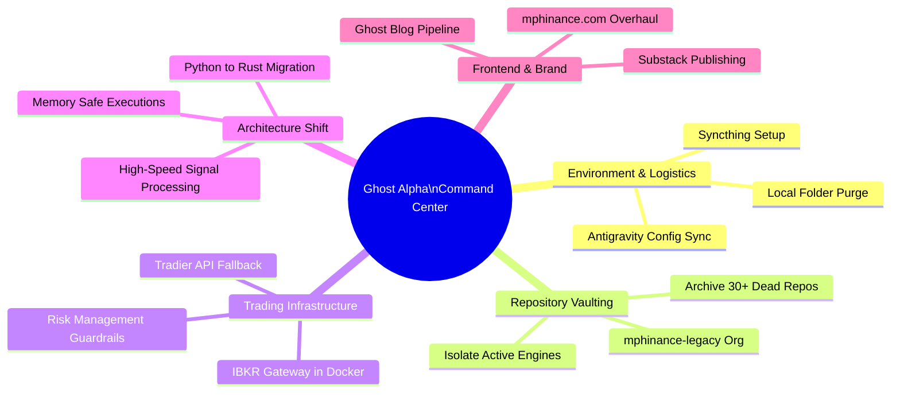
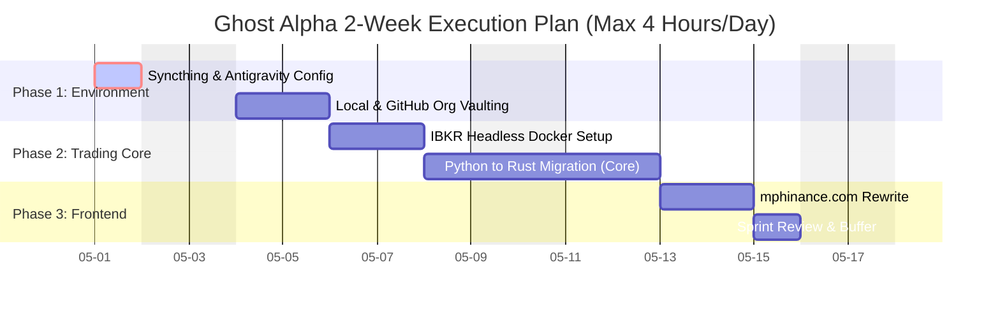

# Ghost Alpha Operations: The Great Migration & 2-Week Sprint

This document outlines the strategic overhaul of the Ghost Alpha trading infrastructure, workspace organization, and your daily operational cadence. 

> [!IMPORTANT]
> **The Golden Rule for this Sprint:** Maximum 4 hours of coding per day. Weekends are for writing, thinking, and recovery—NO coding. Burnout is the enemy of alpha.

---

## 1. Operational Mindmap

Here is the high-level breakdown of the moving parts. This visualizes how the different domains of your workflow connect.

---

## 2. The 2-Week Tactical Sprint Schedule

Below is the strict 2-week schedule. It is designed to be sequential. Do not start a new phase until the previous one is locked.

### 🗓️ Daily Cadence Breakdown

*   **08:00 - 09:00:** Morning Routine, Market Open, Coffee.
*   **09:00 - 11:00 (2 Hours):** Deep Work Block 1 (Architecture & Code).
*   **11:00 - 12:00:** Break / Lunch / Screenaway time.
*   **12:00 - 14:00 (2 Hours):** Deep Work Block 2 (Testing & Deployment).
*   **14:00 Onward:** Hard stop on coding. Review trades, write Substack drafts, live your life.

---

## 3. Workstream Details

### A. Environment & Syncthing Synchronization
Before moving any folders, ensure your devices are communicating.
*   **Task:** Install and configure Syncthing across your active machines.
*   **Target:** Sync the `/home/mph/.gemini/antigravity/` and essential dotfiles so your AI context, skills, and configuration travel with you flawlessly.
*   **Rule:** Keep the sync scope narrow. Do not sync `node_modules` or `venv` directories.

### B. The GitHub & Local Purge (Non-Destructive)
We are not deleting; we are vaulting.
*   **Task:** Create a new GitHub Organization (`mphinance-legacy` or `mphinance-vault`).
*   **Action:** Transfer the 30+ inactive/forked repositories (like `auto-blog-poster`, old bots) to this organization.
*   **Local Action:** Create an `/Archive/` folder locally and drag the dead projects out of your sightline. Clean desk, clean mind.

### C. The Python to Rust Migration 🦀
Python is great for prototyping (and we'll keep it for the Ghost Dossier AI generation), but the core trading execution engine needs memory safety and speed.
*   **Target Modules:** `AlphaClaw` signals, Risk Management Guardrails, and order execution logic.
*   **Why Rust?** Eliminates runtime crashes during critical 0DTE trades. No more "stupid Java things" or memory leaks taking down the system mid-trade.
*   **Approach:** Build small, isolated Rust binaries that the Python AI wrapper can call, rather than rewriting the entire AI stack. 

### D. IBKR Headless Implementation
*   **Task:** Deploy IB Gateway inside a Docker container on the `Venus` server.
*   **Libraries:** Connect the new Rust binaries (and existing Python scripts via `ib_insync`) to the Gateway.
*   **Goal:** A headless, silent trading engine that doesn't require a GUI, completely decoupled from your daily workspace.

### E. Frontend: `mphinance.com` Overhaul
*   **Task:** Rip out the bloated HTML/CSS and implement a clean, high-performance Vue/Tailwind (or vanilla CSS with a premium design system) landing page.
*   **Aesthetic:** Dark, synthwave, highly legible. Needs to look like a premium quantitative boutique, not a hobby blog.

---

> [!TIP]
> **Next Steps for You:** Print this out, put it on the physical whiteboard, or export it to the Supernote. Think on it this weekend. When Monday hits, we start with Phase 1.
