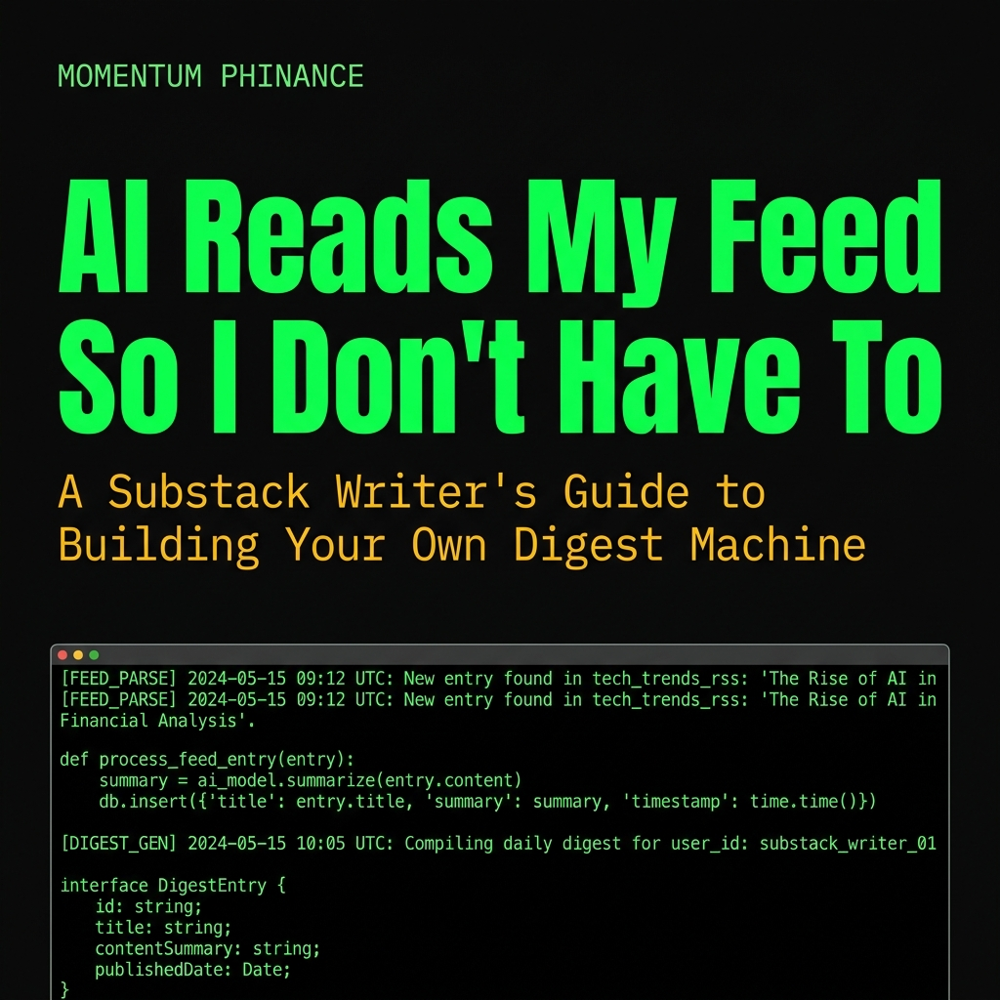
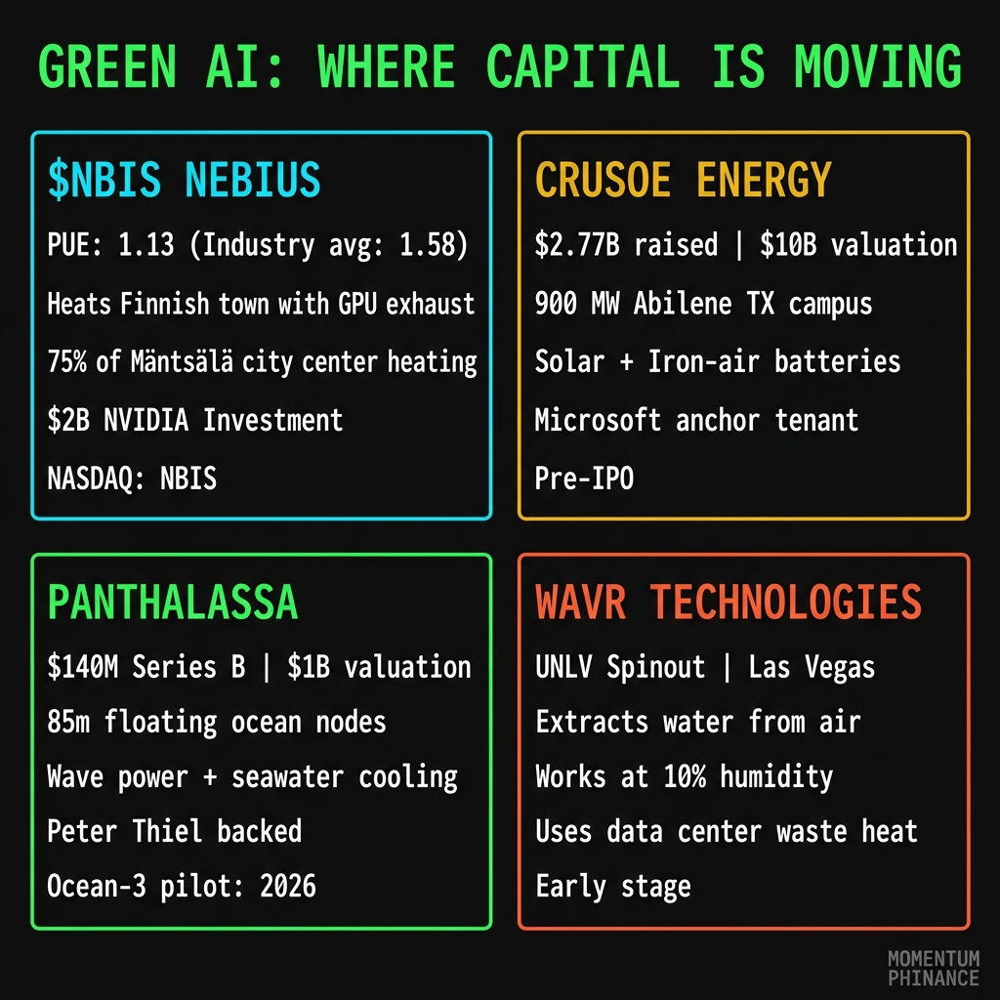
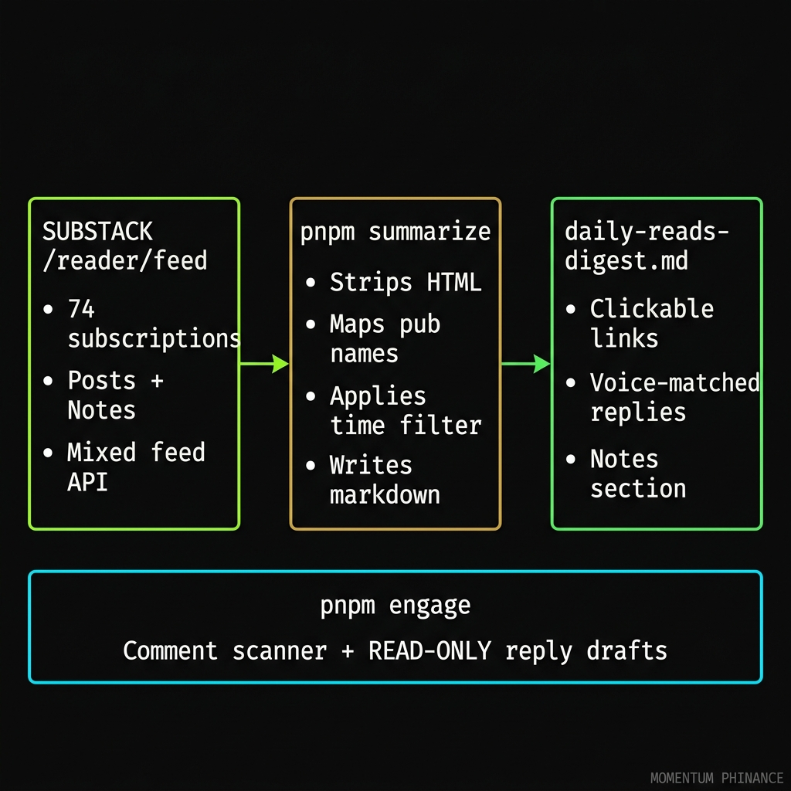

# AI Reads My Feed So I Don't Have To

---

## First, a Quick Detour for a Friend of Ours

We know someone who isn't against AI. They're against the water bill that comes with it. And after reading [this Tom's Hardware piece](https://www.tomshardware.com/tech-industry/georgia-data-center-used-29-million-gallons-of-water), that's a completely reasonable position.

Here's the short version: a data center campus in Fayette County, Georgia quietly used 29 million gallons of water without it being metered or billed. A "procedural mix-up" during a smart meter transition. Two industrial water connections just... missed. County officials discovered it after residents in a nearby neighborhood started complaining about low water pressure. While the county was actively asking residents to conserve water during a regional drought. The company eventually paid $147,474 in retroactive charges. No fines.

To be clear: 29 million gallons for construction prep, not ongoing operations. But that number lands differently when your neighborhood's taps are running low.

The water and energy concerns around AI infrastructure are real. A single large model training run can consume as much electricity as 100 American homes use in a full year. Data centers globally are tracking toward 1,000 terawatt-hours of annual consumption by 2026. AI alone could double global data center power demand by 2030.

If someone you know is skeptical of AI because of what it costs the planet, the right response isn't to wave it away. The right response is to show them where capital is already moving to solve it.

Here's what we found.

**$NBIS: Nebius Group — The Giant Space Heater**

This one is investable right now. Nebius Group (NASDAQ: $NBIS) built their flagship data center in Mäntsälä, Finland from the ground up for maximum thermal efficiency.

Their facility achieves a Power Usage Effectiveness of 1.13. The global industry average is 1.58. PUE measures how much total energy a facility uses versus how much goes directly to compute. At 1.13, almost everything going in is doing actual work.

The waste heat story is the piece that makes this genuinely different. Instead of venting all that server heat into the atmosphere, Nebius captures it and feeds it directly into Mäntsälä's municipal district heating network. They are literally heating a Finnish town with their GPU exhaust. Roughly 75% of the city center's heating demand. The building is a data center and a community utility at the same time.

In March 2026, NVIDIA dropped $2 billion into them. They're now planning a second Finnish facility in Lappeenranta at 310 MW, targeted for 2027. If you want publicly traded exposure to AI infrastructure done right, this is the cleanest on-ramp we've found.

**Crusoe Energy — From Stranded Gas to Renewable Campus**

Crusoe started clever: they took modular data centers to oil fields to run off flared natural gas that would otherwise just burn into the atmosphere for nothing. Capturing waste gas to run compute is still meaningfully better than letting it flare.

They've since gone all-in on renewables. In March 2025, they sold off their Digital Flare Mitigation and Bitcoin mining divisions entirely to focus on vertically integrated AI infrastructure.

Their campus in Abilene, Texas is one of the most interesting projects in the space. Multi-gigawatt scale, Microsoft as anchor tenant, solar backed by second-life EV batteries through a Redwood Materials partnership. In March 2026, they secured 12 gigawatt-hours of iron-air battery storage from Form Energy for sustained overnight power. NVIDIA is a Series E investor. Total funding: $2.77 billion at a $10 billion valuation. Not publicly traded yet, but one to watch for an IPO.

**Panthalassa — AI Data Centers in the Ocean**

This one sounds like a joke until you look at the specs.

Panthalassa is an Oregon startup building autonomous, 85-meter-long steel nodes that float in the open ocean. As they bob with the waves, they force water through internal turbines to generate electricity. That electricity runs AI chips on board. The surrounding seawater cools everything naturally. Starlink handles the data link. No cables to shore. No grid dependency whatsoever.

$140 million Series B led by Peter Thiel. $1 billion valuation. Their Ocean-3 series nodes are scheduled for pilot testing in the northern Pacific later in 2026, with commercial deployments targeted for 2027.

Is it speculative? Completely. Is it the most unhinged idea that might actually work? Also yes.

**WAVR Technologies — Turning Server Heat Into Drinking Water**

This one is the sleeper.

WAVR is a UNLV spinout based in Las Vegas. Their technology extracts liquid water directly from atmospheric air using a hybrid hydrogel and liquid desiccant system that works even in arid climates with humidity as low as 10%.

The data center connection is direct. Servers generate massive amounts of low-grade waste heat in the 30 to 70 degree Celsius range. WAVR's system uses that waste heat as an input, which increases efficiency and drives the cost of produced water toward municipal rates. Instead of a data center consuming freshwater for cooling and venting heat into the atmosphere, you get a facility that produces usable water as a byproduct.

Think about that relative to Fayette County.

Not publicly traded. Early stage. But if you're looking for a technology that directly converts AI's biggest environmental liability into a resource, this is the one to watch.

**The Pattern**

The story isn't "AI is bad for the planet." The story is "AI has an energy and water problem, and serious capital is moving hard at the people trying to solve it."

For the skeptical investor, that's where the asymmetric opportunities live. Early enough that most people aren't looking. Specific enough that the thesis is clear.

Worth watching: $NBIS for the public market play, Crusoe for the pre-IPO pipeline, Panthalassa for the moonshot, WAVR for the water arbitrage nobody has priced yet.

---

## Now Back to Our Regularly Scheduled Programming

I subscribe to 74 Substack writers. Seventy-four. I'm not gonna pretend I read them all every morning. I have a full-time obsession building a swarm intelligence trading system, a kid, a recovery program, and approximately zero extra hours. But I also can't afford to miss the good stuff.

So I built a machine to read it for me. And then I taught it to sound like me.

Here's the whole thing, soup to nuts. If you're a Substack writer who wants to stay plugged into your community without losing your entire morning to your inbox, this is for you.

---

## The Problem Every Substack Writer Has and Nobody Talks About

You follow people. Smart people. [Young Bull](https://youngbullinvests.substack.com) is breaking down why ARM is the layer beneath the layer. [SpotGamma](https://spotgamma.substack.com) is tracking vol compression going into NVDA earnings. [Henrik Zeberg](https://henrikzeberg.substack.com) is calling the terminal wave of this entire cycle. [The Disruptive Investor](https://wsissener.substack.com) is posting AAOI up 71% in 35 days with receipts.

And you're scrolling your inbox like it's a second job.

The real cost isn't the 45 minutes it takes. It's that you read everything passively. You have no record of what you read. You have no quick reference for "what was the thesis on ASTS again?" And you definitely don't have a curated one-liner ready to drop in as a comment that sounds like you, not a bot.

I fixed all three of those.

---

## What I Built (Plain English Version)

Three scripts. One session cookie. Here's the architecture:

**`pnpm summarize`** hits Substack's internal `/reader/feed` endpoint, the same mixed feed your inbox uses. It pulls Posts AND Notes, strips out the HTML, maps publication IDs to real names using my subscriptions list, applies a 24-hour time filter, and writes everything to a single markdown file: `daily-reads-digest.md`. Every entry gets a pre-filled one-liner comment in my voice.

**`pnpm analytics`** pulls my own post and note performance. Likes, comments, restacks. You look at this once a day and you know exactly which posts are gaining momentum.

**`pnpm engage`** is the fun one. It scans recent comments on my own posts, filters out my previous replies, and prints each comment with a suggested one-sentence response. It's read-only. The thing literally prints a banner at the top every single run that says "No posts. No comments. No likes. Ever." I built the guardrails in because AI writing as you without permission is how you end up with posts you didn't write and subscribers you didn't earn.

---

## Today's Digest (The Short Version)

Here's what the machine surfaced this morning. These are the five posts worth your time today, with my actual reaction to each one.

**[Holding ASTS Into Earnings: Part 1](https://youngbullinvests.substack.com/p/holding-asts-into-earnings-part-1) by [Young Bull](https://youngbullinvests.substack.com)**
Pre-earnings conviction post. He's holding. Part 2 lands after the print. This is how you build a following: show your work before the result, not after.
> 💬 The Phund is watching the ASTS print because narrating the outcome is easier than trading the volatility.

**[Weekly Market Outlook: CPI, OPEX, and a Crowded AI Rally](https://tanukitrade.substack.com/p/weekly-market-outlook-0511-cpi-opex) by [TanukiTrade](https://tanukitrade.substack.com)**
The real signal buried in this one: the rally is six weeks old, vol is compressed, and we're walking into CPI, PPI, OPEX, and NVDA earnings in the same week. [SpotGamma](https://spotgamma.substack.com) said it too: strong tape, crowded structure.
> 💬 The rally is narrow enough to walk a tightrope, so keep your risk gates tight.

**[The Deep Dive: The Dominant Supplier AI Cannot Function Without](https://wsissener.substack.com/p/the-deep-dive-the-dominant-supplier) by [The Disruptive Investor](https://wsissener.substack.com)**
Optical networking. Compound semiconductors. This is the bottleneck nobody is talking about because everyone is still arguing about which GPU wins. The physical substrate of AI infrastructure is a 40-year monopoly business sitting there unnoticed.
> 💬 Optical networking is the real bottleneck, and silicon is starting to look like a legacy asset.

**[Google Closes the Gap on NVIDIA](https://princetonchen.substack.com/p/google-closes-the-gap-on-nvidia-why) by [Tiger Capital Research](https://princetonchen.substack.com)**
$4.67T vs $4.79T. Google Cloud up 63% quarter-over-quarter, backlog nearly doubled to $460B. The thesis: full-stack integration beats raw model performance. TPUs as a commercial product competing with NVIDIA GPUs directly.
> 💬 Google is trying to build a vertical money glitch to rival NVIDIA's crown.

**[90% of Your Job is Relieving Anxiety](https://mrsicko.substack.com/p/90-of-your-job-is-relieving-anxiety-a30) by [The No-Stress Trader](https://mrsicko.substack.com)**
Not a trading post. A mental health post disguised as a trading post. "You can only gain clarity by execution." I've said this in different words in basically every AA meeting I've ever attended.
> 💬 Trading isn't about being right, it's about staying calm enough to not pull the trigger on your own foot.

---

## How You Build This Yourself

The whole thing lives on GitHub at [jakub-k-slys/substack-api](https://github.com/jakub-k-slys/substack-api). I forked it and extended it. You need:

- A Substack account with subscriptions
- Node.js and pnpm installed
- Your `SUBSTACK_SID` session cookie (grab it from browser dev tools while logged in)
- About 45 minutes to wire it up

The core credential is just a cookie. Substack doesn't have a public API, but their internal API is fully functional and the endpoints are consistent. The library handles auth, pagination, rate limiting, and validation.

Once it's running, `pnpm summarize` takes about 90 seconds to produce a complete markdown digest of everything published in the last 24 hours across all your subscriptions.

The piece I'm most proud of: the voice-matching. Instead of "Great post!" comments, the system generates one-liners that actually sound like me. Irreverent. Direct. Usually market-related even when the post isn't. That's not trivial. That's what differentiates authentic engagement from spam.

---

## Here's the Truth About Growing on Substack

The writers who grow aren't the ones posting the most.

They're the ones who show up consistently in the comments of other writers. Not with generic responses. With actual takes. A good comment on [KASM Capital's](https://kasmcapital.substack.com) options flow breakdown or a thoughtful reply to [VantagePoint's](https://vantagepointai.substack.com) sector analysis does more for your subscriber count than posting three times a week.

The automation gives you the raw material. The voice-matching gives you the quality bar. The read-only guardrail keeps you honest.

You still have to hit send. That's your job. The machine just makes sure you've done your reading first.

---

## Who Else is Doing This Right (My Reads List)

These are the writers who showed up in my digest this morning and are worth your follow:

[Young Bull](https://youngbullinvests.substack.com) / [KASM Capital](https://kasmcapital.substack.com) / [TanukiTrade](https://tanukitrade.substack.com) / [The No-Stress Trader](https://mrsicko.substack.com) / [The Disruptive Investor](https://wsissener.substack.com) / [Tiger Capital Research](https://princetonchen.substack.com) / [SpotGamma](https://spotgamma.substack.com) / [Henrik Zeberg](https://henrikzeberg.substack.com) / [VantagePoint AI](https://vantagepointai.substack.com) / [TradingWarz](https://tradingwarz.substack.com) / [Glitch SPX](https://glitchspx.substack.com) / [Cleaner to Consistent](https://kairostalentstrading.substack.com) / [The M&A Hunter](https://maandhunter.substack.com) / [BiggerPicture Trading](https://biggerpicturetrading.substack.com) / [Quant Enthusiasts](https://youngandcalculated.substack.com) / [Stats Edge](https://letters.statsedgetrading.com) / [Cassandra Unchained](https://michaeljburry.substack.com) / [Marlin Capital](https://marlincapital.substack.com)

Good people. Real content. Worth your time.

<!--paywall-->

## The Full Technical Breakdown (Paid)

What's above is the what. Below is the how. Every endpoint, every gotcha, every rate limit I hit before figuring out the right call intervals. Including:

- The exact session cookie format and how to extract it without touching a CLI
- The `/reader/feed` cursor pagination pattern (it's opaque base64, not offset-based)
- How to distinguish a Note from a Post from a Chat from the same API response
- Why `rawHtml` is completely broken for programmatic draft creation and what actually works
- The ProseMirror JSON structure Substack actually accepts
- How I'll eventually connect this to my `mphinance` Python pipeline to close the loop between research and publishing

If you're a writer who codes or a coder who writes, this is the gap-fill you've been looking for.

The repo is public. The pattern is yours. Subscribe if you want the full walkthrough.

---

"You can only gain clarity by execution."

That's from Mr. Sicko today. He's right. I've been sitting on this automation for weeks because I kept thinking it needed to be more polished. It didn't. It needed to ship.

So here it is. Shipped.

- Michael Hanko, Managing Partner, The Phund
